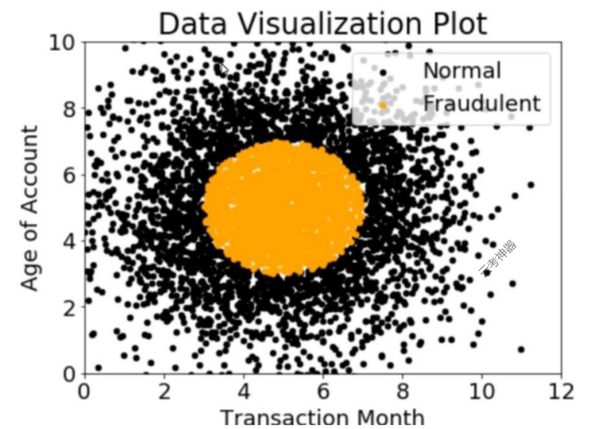
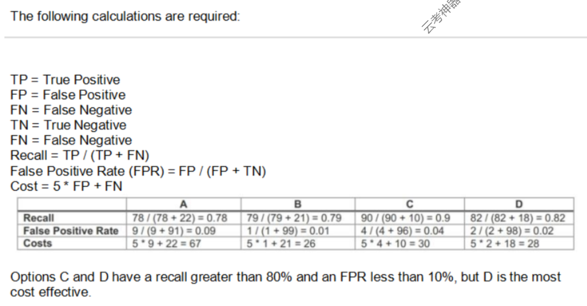

# AWS MLS 1-65

1. 一家互动式在线词典希望添加一个小部件，显示在类似语境中使用的单词。一位机器学习专家被要求为支持小工具的下游近邻模型提供单词特征。该专家应该怎样做才能满足这些要求？ An interactive online dictionary wants to add a widget that displays words used in similar contexts. A Machine Learning Specialist is asked to provide word features for the downstream nearest neighbor model powering the widget. What should the Specialist do to meet these requirements?
   - [ ] A. 创建单热词编码向量。Create one-hot word encoding vectors.
   - [ ] B. 使用Amazon Mechanical Turk为每个词制作一组同义词。 Produce a set of synonyms for every word using Amazon Mechanical Turk.
   - [ ] C. 创建单词嵌入向量，存储与每个其他单词的编辑距离。 Create word embedding vectors that store edit distance with every other word.
   - [ ] D. 下载在大型语料库中预先训练的词嵌入。 Download word embeddings pre-trained on a large corpus.

   

      
Answer

      答案D：因为不是专业的词典，需要去下载专业的语料库去训练模型。

   

2. 一家公司正在使用Amazon Polly将纯文本文件翻译成语音，用于自动发布公司公告。然而，在目前的文件中，公司的首字母缩写被误读了。机器学习专家应该如何为未来的文件解决这个问题？ A company is using Amazon Polly to translate plaintext documents to speech for automated company announcements. However, company acronyms are being mispronounced in the current documents. How should a Machine Learning Specialist address this issue for future documents?
   - [ ] A. 将目前的文件转换成带有发音标签的SSML。 Convert current documents to SSML with pronunciation tags.
   - [ ] B. 创建一个合适的发音词库。 Create an appropriate pronunciation lexicon.
   - [ ] C. 输出语音标记来指导发音。 Output speech marks to guide in pronunciation.
   - [ ] D. 使用Amazon Lex来预处理文本文件的发音。Use Amazon Lex to preprocess the text files for pronunciation.

   

      
Answer

      答案B：[ref](https://docs.aws.amazon.com/zh_cn/polly/latest/dg/managing-lexicons.html)

   

3. 一家保险公司正在开发一种用于车辆的新设备，该设备使用一个摄像头来观察司机的行为，并在他们出现分心时发出警报。该公司在一个受控环境中创建了大约10,000张训练图像，机器学习专家将用这些图像来训练和评估机器学习模型。在模型评估过程中，该专家注意到，随着历时数的增加，训练错误率降低得更快，而且该模型在未见过的测试图像上不能准确推断出来。以下哪种方法应该用来解决这个问题？（选择两项） An insurance company is developing a new device for vehicles that uses a camera to observe drivers’ behavior and alert them when they appear distracted. The company created approximately 10,000 training images in a controlled environment that a Machine Learning Specialist will use to train and evaluate machine learning models. During the model evaluation, the Specialist notices that the training error rate diminishes faster as the number of epochs increases, and the model is not accurately inferring on the unseen test images. Which of the following should be used to resolve this issue? (Choose TWO)
   - [ ] A. 在模型中加入消失的梯度。 Add vanishing gradient to the model.
   - [ ] B. 对训练数据进行数据增强。 Perform data augmentation on the training data.
   - [ ] C. 使神经网络结构复杂化。 Make the neural network architecture complex.
   - [ ] D. 在模型中使用梯度检查。 Use gradient checking in the model.
   - [ ] E. 在模型中加入L2正则化。 Add L2 regularization to the model.

   

      
Answer

      答案BE：该模型一定是过拟合了。正则化有助于解决机器学习中的过拟合问题以及数据增量。

   

4. 当使用内置算法提交Amazon SageMaker训练作业时，必须指定哪些常用参数？(选择三个)。 When submitting Amazon SageMaker training jobs using one of the built-in algorithms, which common parameters MUST be specified? (Choose three.)
   - [ ] A. 训练通道，确定训练数据在Amazon S3桶中的位置。 The training channel, identifying the location of training data on an Amazon S3 bucket.
   - [ ] B. 验证通道，确定验证数据在Amazon S3 bucket上的位置。 The validation channel identifying the location of validation data on an Amazon S3 bucket.
   - [ ] C. Amazon SageMaker可以承担的IAM角色，代表用户执行任务。 The IAM role that Amazon SageMaker can assume to perform tasks on behalf of the users.
   - [ ] D. 在JSON数组中的超参数，如所使用的算法的记录。 Hyperparameters in a JSON array as documented for the algorithm used.
   - [ ] E. 亚马逊EC2实例类，指定训练将使用CPU或GPU运行。 The Amazon EC2 instance class specifying whether training will be run using CPU or GPU.
   - [ ] F. 输出路径，指定训练后的模型在Amazon S3桶中的位置。 The output path specifying where on an Amazon S3 bucket the trained model wilt persist.

   

      
Answer

      答案CEF：[ref](https://docs.aws.amazon.com/zh_cn/sagemaker/latest/APIReference/API_CreateTrainingJob.html)
   

5. 一个监控服务每分钟产生1TB的规模指标记录数据。一个研究团队使用Amazon Athena对这些数据进行查询。由于大量的数据，查询运行缓慢，该团队需要更好的性能。这些记录应该如何存储在Amazon S3中以提高查询性能？ A monitoring service generates 1 TB of scale metrics record data ever minute. A Research team performs queries on this data using Amazon Athena. The Queries run slowly due to the large volume of data, and the team requires better performance. How should the records be stored in Amazon S3 to improve query performance?
   - [ ] A. CSV files
   - [ ] B. Parquet file
   - [ ] C. Compressed JSON
   - [ ] D. RecordIO

   

      
Answer

      答案B。

   

6. 机器学习专家正在与一家媒体公司合作，对该公司网站上的热门文章进行分类。该公司正在使用随机森林来对一篇文章在发表前的受欢迎程度进行分类。下表是正在使用的数据样本。考虑到这个数据集，专家想把"Day_Of_Week"列转换为二进制值。应该使用什么技术将这一列转换为二进制值？Machine Learning Specialist is working with a media company to perform classification on popular article from the company's website. The company is using random forests to classify how popular an article will be before it is published. A sample of the data being used is in the following table. Given the dataset, the Specialist wants to convert the Day_Of_Week column to binary values. What technique should be used to convert this column to binary values?

   |Article_Title|Author|Top_Keywords|Day_Of_Week|URL_of_Article|Page_Views|
   |-------------|------|------------|-----------|--------------|----------|
   |Building a Big Data Platform|Jane Doe|Big Data, Spark, Hadoop|Tuesday|<http://examplecorp.com/data_platform.html>|1300456|
   |Getting Started with Deep Learning|Jane Doe|Deep Learning, Machine Learning, Spark|Tuesday|<http://examplecorp.com/started_deep_learning.html>|1230661|
   |MXNet ML Guide|Jane Doe|Machine Learning, MXNet, Logistic Regression|Thursday|<http://examplecorp.com/mxnet_guide.html>|937291|
   |Intro NoSQL Databases|Mary Major|NoSQL, Operations, Database|Monday|<http://examplecorp.com/nosql_intro_guide.html>|407821|

   - [ ] A. Binarization
   - [ ] B. One-hot encoding
   - [ ] C. Tokenization
   - [ ] D. Normalization transformation

    

      
Answer

      答案B。

   

7. 一家游戏公司推出了一款网络游戏，人们可以免费开始玩，但如果他们选择使用某些功能就需要付费。该公司需要建立一个自动系统来预测一个新用户是否会在一年内成为付费用户。该公司已经收集了一个来自一百万用户的标记数据集。训练数据集包括1000个正样本（来自一年内最终付费的用户）和99.9万个负样本（来自没有使用任何付费功能的用户）。每个数据样本由200个特征组成，包括用户年龄、设备、位置和游戏模式。使用这个数据集进行训练，数据科学团队训练了一个随机森林模型，在训练集上收敛了99%以上的准确性。然而，测试数据集上的预测结果并不令人满意。数据科学团队应该采取以下哪种方法来缓解这个问题？(选择两个) A gaming company has launched an online game where people can start playing for free, but they need to pay if they choose to use certain features. The company needs to build an automated system to predict whether a new user will become a paid user within one year. The company has gathered a labeled dataset from one million users. The training dataset consists of 1,000 positive sample (from users who ended up paying within one year) and 999,000 negative samples (from users who did not use any paid features). Each data sample consists of 200 features including user age, device, location, and play patterns. Using this dataset for training, the Data Science team trained a random forest model that converged with over 99% accuracy on the training set. However, the prediction results on a test dataset were not satisfactory. Which of the following approaches should the Data Science team take to mitigate this issue? (Choose two)
   - [ ] A. 在随机森林中加入更多的深度树，使模型能够学习更多的特征。 Add more deep trees to the random forest to enable the model to learn more features.
   - [ ] B. 在训练数据集中包括一份测试数据集中的样本。 Include a copy of the samples in the test dataset in the training dataset.
   - [ ] C. 通过复制阳性样本并在复制的数据中加入少量的噪声，产生更多的阳性样本。 Generate more positive samples by duplicating the positive samples and adding a small amount of noise to the duplicated data.
   - [ ] D. 改变成本函数，使假阴性对成本值的影响高于假阳性。 Change the cost function so that false negatives have a higher impact on the cost value than false positives.
   - [ ] E. 改变成本函数，使假阳性对成本值的影响高于假阴性。 Change the cost function so that false, positives have a higher impact on the cost value than false negatives.

    

      
Answer

      答案CD：
      - C: 因为我们需要一个平衡的数据集。
      - D: 阳性样本的数量很大，所以模型倾向于对所有情况预测为0（阴性），导致假阴性问题。我们应该尽量减少这种情况。

   

8. 一位数据科学家正在开发一个机器学习模型，根据收集到的关于每个病人和他们的治疗计划的信息，预测未来病人的结果。该模型应该输出一个连续值作为其预测值。可用的数据包括一组4，000名患者的标记结果。研究的对象是一群65岁以上的人，他们患有一种已知会随着年龄增长而恶化的特殊疾病。最初的模型表现不佳。在审查基础数据时，数据科学家注意到，在4,000个病人观察中，有450个病人的年龄被输入为0。数据科学家应该如何纠正这个问题。 A Data Scientist is developing a machine learning model to predict future patient outcomes based on information collected about each patient and their treatment plans. The model should output a continuous value as its prediction. The data available includes labeled outcomes for a set of 4, 000 patients. The study was conducted on a group of individuals over the age of 65 who have a particular disease that is known to worsen with age. Initial models have performed poorly. While reviewing the underlying data, the Data Scientist notices that, out of 4,000 patient observations, there are 450 where the patient age has been input as 0. The other features for these observations appear normal compared to the rest of the sample population. How should the Data Scientist correct this issue?
   - [ ] A. 从数据集中删除所有年龄被设置为0的记录。 Drop all records from the dataset where age has been set to 0.
   - [ ] B. 用数据集中的平均值或中位数来替换年龄为0的记录的档案值。 Replace the age filed value for records with a value of 0 with the mean or median value from the dataset.
   - [ ] C. 从数据集中删除年龄特征，用其余的特征训练模型。 Drop the age feature from the dataset and train the model using the rest of the features.
   - [ ] D. 使用k-means聚类法来处理缺失的特征。 Use k-means clustering to handle missing features.

   

      
Answer

      答案D。

   

9. 一个数据科学团队正在设计一个数据集存储库，它将存储大量机器学习模型中常用的训练数据。由于数据科学家每天可能会创建任意数量的新数据集，该解决方案必须能够自动扩展，并具有成本效益。另外，必须能够使用SQL来探索数据。哪种存储方案最适合于这种情况？ A Data Science team is designing a dataset repository where it will store a large amount of training data commonly used in its machine learning models. As Data Scientists may create an arbitrary number of new datasets every day, the solution has to scale automatically and be cost-effective. Also, it must be possible to explore the data using SQL. Which storage scheme is MOST adapted to this scenario?
   - [ ] A. 将数据集作为文件存储在Amazon S3中。 Store datasets as files in Amazon S3.
   - [ ] B. 将数据集作为文件存储在连接到Amazon EC2实例的Amazon EBS卷中。 Store datasets as files in an Amazon EBS volume attached to an Amazon EC2 instance.
   - [ ] C. 将数据集作为表存储在一个多节点的Amazon Redshift集群中。 Store datasets as tables in a multi-node Amazon Redshift cluster.
   - [ ] D. 将数据集作为全局表存储在Amazon DynamoDB中。 Store datasets as global tables in Amazon DynamoDB.

   

      
Answer

      答案A。

   

10. 一位机器学习专家部署了一个模型，在一家公司的网站上提供产品推荐。起初，该模型表现非常好，导致客户平均购买更多产品。然而，在过去的几个月里，该专家注意到产品推荐的效果已经减弱，客户开始回到他们原来的习惯，减少消费。专家不确定发生了什么，因为该模型与一年多前的最初部署相比没有变化。专家应该尝试哪种方法来提高模型的性能？ A Machine Learning Specialist deployed a model that provides product recommendations on a company's website. Initially, the model was performing very well and resulted in customers buying more products on average. However, within the past few months the Specialist has noticed that the effect of product recommendations has diminished, and customers are starting to return to their original habits of spending less. The Specialist is unsure of what happened, as the model has not changed from its initial deployment over a year ago. Which method should the Specialist try to improve model performance?
    - [ ] A. 该模型需要完全重新设计，因为它无法处理产品库存变化。 The model needs to be completely re-engineered because it is unable to handle product inventory changes.
    - [ ] B. 应该对模型的超参数进行可预测的更新以防止漂移。 The model's hyperparameters should be predicably updated to prevent drift.
    - [ ] C. 该模型应定期使用原始数据从头开始训练，同时增加一个正则化项来处理产品库存变化。 The model should be periodically retrained from scratch using the original data while adding a regularization term to handle product inventory changes.
    - [ ] D. 该模型应定期使用原始训练数据和产品库存变化时的新数据进行重新训练。 The model should be periodically retrained using the original training data plus new data as product inventory changes.

    

       
Answer

       答案D。

    

11. 一位为一家在线时尚公司工作的机器学习专家希望为该公司基于Amazon S3的数据湖建立一个数据摄取解决方案。该专家希望创建一套摄取机制，以实现未来的能力，包括 -实时分析； -历史数据的互动分析； -点击流分析； -产品推荐。该专家应该使用哪些服务？ A Machine Learning Specialist working for an online fashion company wants to build a data ingestion solution for the company’s Amazon S3-based data lake. The Specialist wants to create a set of ingestion mechanisms that will enable future capabilities comprised of: -Real-time analytics; -Interactive analytics of historical data; -Clickstream analytics; -Product recommendations. Which services should the Specialist use?
    - [ ] A. AWS Glue作为数据目录；Amazon Kinesis Data Streams和Amazon Kinesis Data Analytics用于实时数据分析；Amazon Kinesis Data Firehose用于交付给Amazon ES进行点击流分析；Amazon EMR用于生成个性化的产品推荐。 AWS Glue as the data catalog; Amazon Kinesis Data Streams and Amazon Kinesis Data Analytics for real-time data insights; Amazon Kinesis Data Firehose for delivery to Amazon ES for clickstream analytics; Amazon EMR to generate personalized product recommendations.
    - [ ] B. Amazon Athena作为数据目录；Amazon Kinesis Data Streams和Amazon Kinesis Data Analytics用于近实时的数据洞察；Amazon Kinesis Data Firehose用于点击流分析；AWS Glue用于生成个性化产品推荐。 B. Amazon Athena as the data catalog; Amazon Kinesis Data Streams and Amazon Kinesis Data Analytics for near-real-time data insights; Amazon Kinesis Data Firehose for clickstream analytics; AWS Glue to generate personalize product recommendations.
    - [ ] C. AWS Glue作为数据目录；Amazon Kinesis Data Streams和Amazon Kinesis Data Analytics用于历史数据洞察；Amazon Kinesis Data Firehose用于交付给Amazon ES进行点击流分析；Amazon EMR用于生成个性化产品推荐。 AWS Glue as the data catalog; Amazon Kinesis Data Streams and Amazon Kinesis Data Analytics for historical data insights; Amazon Kinesis Data Firehose for delivery to Amazon ES for clickstream analytics; Amazon EMR to generate personalized product recommendations.
    - [ ] D. Amazon Athena作为数据目录。亚马逊Kinesis数据流和亚马逊Kinesis数据分析用于历史数据洞察；亚马逊DynamoDB流用于点击流分析；AWS Glue用于生成个性化的产品推荐。 Amazon Athena as the data catalog: Amazon Kinesis Data Streams and Amazon Kinesis Data Analytics for historical data insights; Amazon DynamoDB streams for clickstream analytics; AWS Glue to generate personalized product recommendations.

    

       
Answer

       答案A。

    

12. 一家公司在对Amazon SageMaker中默认的内置图像分类算法进行训练时观察到准确率很低。数据科学团队希望使用Inception神经网络架构而不是Resnet架构。以下哪种方法可以达到这个目的？(选择两个。) A company is observing low accuracy while training on the default built-in image classification algorithm in Amazon SageMaker. The Data Science team wants to use an Inception neural network architecture instead of a Resnet architecture. Which of the following will accomplish this? (Choose two.)
    - [ ] A. 定制内置的图像分类算法以使用Inception，并将其用于模型训练。 Customize the built-in image classification algorithm to use Inception and use this for model training.
    - [ ] B. 与SageMaker团队创建一个支持案例，将默认的图像分类算法改为Inception。 Create a support case with the SageMaker team to change the default image classification algorithm to Inception.
    - [ ] C. 将一个Docker容器与加载了Inception网络的TensorFlow Estimator捆绑在一起，并使用它进行模型训练。 Bundle a Docker container with TensorFlow Estimator loaded with an Inception network and use this for model training.
    - [ ] D. 在Amazon SageMaker中使用自定义代码，用TensorFlow Estimator来加载带有Inception网络的模型，并使用它来进行模型训练。 Use custom code in Amazon SageMaker with TensorFlow Estimator to load the model with an Inception network, and use this for model training,
    - [ ] E. 下载和apt-get安装inception网络代码到Amazon EC2实例中，并在Amazon SageMaker中使用该实例作为Jupyter笔记本。 Download and apt-get install the inception network code into an Amazon EC2 instance and use this instance as a Jupyter notebook in Amazon SageMaker.

    

       
Answer

       答案CD。

    

13. 一位机器学习专家建立了一个图像分类深度学习模型。然而，该专家遇到了一个过拟合问题，训练和测试的准确率分别为99%和75%。该专家应该如何解决这个问题，其背后的原因是什么？ A Machine Learning Specialist built an image classification deep learning model. However, the Specialist ran into an overfitting problem in which the training and testing accuracies were 99% and 75%, respectively. How should the Specialist address this issue and what is the reason behind it?
    - [ ] A. 应该提高学习率，因为优化过程被困于局部最小值。 The learning rate should be increased because the optimization process was trapped at a local minimum.
    - [ ] B. 应该提高平坦层的dropout率，因为模型的泛化程度不够高。 The dropout rate at the flatten layer should be increased because the model is not generalized enough.
    - [ ] C. 挨着扁平层的密集层的维度应该增加，因为模型不够复杂。 The dimensionality of dense layer next to the flatten layer should be increased because the model is not complex enough.
    - [ ] D. 应增加历时数，因为优化过程在达到全局最小值之前就被终止了。 The epoch number should be increased because the optimization process was terminated before it reached the global minimum.

    

       
Answer

       答案B。

    

14. 一个机器学习团队使用Amazon SageMaker来训练一个Apache MXNet手写数字分类器模型，使用的是一个研究数据集。该团队希望在模型过拟合时收到通知。审计人员希望查看Amazon SageMaker的日志活动报告，以确保没有未经授权的API调用。机器学习团队应该怎么做，才能以最少的代码和最少的步骤来解决这些要求？ A Machine Learning team uses Amazon SageMaker to train an Apache MXNet handwritten digit classifier model using a research dataset. The team wants to receive a notification when the model is overfitting. Auditors want to view the Amazon SageMaker log activity report to ensure there are no unauthorized API calls. What should the Machine learning team do to address the requirements with the least amount of code and fewest steps?
    - [ ] A. 实施一个AWS Lambda函数，将Amazon SageMaker API调用记录到Amazon S3。添加代码，将自定义指标推送到Amazon CloudWatch。在CloudWatch中创建一个警报与Amazon SNS创建一个警报，以便在模型过拟合时收到通知。 Implement an AWS Lambda function to log Amazon SageMaker API calls to Amazon S3. Add code to push a custom metric to Amazon CloudWatch. Create an alarm in CloudWatch with Amazon SNS to receive a notification when the model is overfitting.
    - [ ] B. B 使用AWS CloudTrail来记录Amazon SageMaker API调用到Amazon S3。添加代码来推送自定义指标到Amazon CloudWatch。在CloudWatch中用Amazon SNS创建一个警报，以便在模型过拟合时收到通知。 Use AWS CloudTrail to log Amazon SageMaker API calls to Amazon S3. Add code to push a custom metric to Amazon CloudWatch. Create an alarm in CloudWatch with Amazon SNS to receive a notification when the model is overfitting.
    - [ ] C. 实现一个AWS Lambda函数，将Amazon SageMaker API调用记录到AWS CloudTrail。添加代码以推送自定义指标到Amazon CloudWatch。在CloudWatch中用Amazon SNS创建一个警报，以便在模型过拟合时收到通知。 Implement an AWS Lambda function to log Amazon SageMaker API calls to AWS CloudTrail. Add code to push a custom metric to Amazon CloudWatch. Create an alarm in CloudWatch with Amazon SNS to receive a notification when the model is overfitting.
    - [ ] D. 使用AWS CloudTrail将Amazon SageMaker API调用记录到Amazon S3.设置Amazon SNS以在模型过拟合时接收通知。 Use AWS CloudTrail to log Amazon SageMaker API calls to Amazon S3. Set up Amazon SNS to receive a notification when the model is overfitting.

    

       
Answer

       答案B。

    

15. 一位机器学习专家正在使用线性模型，如线性回归和逻辑回归，为大量的特征建立预测模型。在探索性的数据分析过程中，专家观察到许多特征是高度相关的。这可能使模型不稳定。应该怎样做才能减少有这么多特征的影响？ A Machine Learning Specialist is building a prediction model for a large number of features using linear models, such as linear regression and logistic regression. During exploratory data analysis, the Specialist observes that many features are highly correlated with each other. This may make the model unstable. What should be done to reduce the impact of having such a large number of features?
    - [ ] A. 对高度相关的特征进行一次编码。 Perform one-hot encoding on highly correlated features.
    - [ ] B. 在高度相关的特征上使用矩阵乘法。 Use matrix multiplication on highly correlated features.
    - [ ] C. 使用主成分分析（PCA）创建一个新的特征空间。 Create a new feature space using principal component analysis (PCA).
    - [ ] D. 应用皮尔逊相关系数。 Apply the Pearson correlation coefficient.

    

       
Answer

       答案C。

    

16. 一位机器学习专家正在对描述纽约市公共交通的数据集实施一个完整的贝叶斯网络。其中一个随机变量是离散的，它代表了纽约人等待公交车的分钟数，因为公交车每10分钟循环一次，平均为3分钟。对于这个变量，ML专家应该使用哪个先验概率分布？ A Machine Learning Specialist is implementing a full Bayesian network on a dataset that describes public transit in New York City. One of the random variables is discrete, and represents the number of minutes New Yorkers wait for a bus given that the buses cycle every 10 minutes, with a mean of 3 minutes. Which prior probability distribution should the ML Specialist use for this variable?
    - [ ] A. 泊松分布 Poisson distribution
    - [ ] B. 均匀分布 Uniform distribution
    - [ ] C. 正态分布 Normal distribution
    - [ ] D. 二项分布 Binomial distribution

    

       
Answer

       答案A。

    

17. 一家大公司的数据科学团队使用Amazon SageMaker笔记本来访问存储在Amazon S3桶中的数据。IT安全团队担心支持互联网的笔记本实例会产生安全漏洞，在实例上运行的恶意代码可能会破坏数据隐私。公司规定，所有的实例都在一个安全的VPC内，没有互联网接入，数据通信流量必须留在AWS网络内。数据科学团队应该如何配置笔记本实例的位置以满足这些要求？ A Data Science team within a large company uses Amazon SageMaker notebooks to access data stored in Amazon S3 buckets. The IT Security team is concerned that internet-enabled notebook instances create a security vulnerability where malicious code running on the instances could compromise data privacy. The company mandates that all instances stay within a secured VPC with no internet access and data communication traffic must stay within the AWS network. How should the Data Science team configure the notebook instance placement to meet these requirements?
    - [ ] A. 将Amazon SageMaker笔记本与VPC中的一个私有子网联系起来。将Amazon SageMaker终端和S3桶放在同一个VPC内。 Associate the Amazon SageMaker notebook with a private subnet in a VPC. Place the Amazon SageMaker endpoint and S3 buckets within the same VPC.
    - [ ] B. 将Amazon SageMaker笔记本与VPC中的一个私有子网联系起来。使用IAM策略来授予对 Amazon S3 和 Amazon SageMaker 的访问权。 Associate the Amazon SageMaker notebook with a private subnet in a VPC. Use IAM policies to grant access to Amazon S3 and Amazon SageMaker
    - [ ] C. 将Amazon SageMaker笔记本与VPC中的一个私有子网联系起来。确保VPC有S3 VPC端点和Amazon SageMaker VPC端点连接到它。 Associate the Amazon SageMaker notebook with a private subnet in a VPC. Ensure the VPC has S3 VPC endpoints and Amazon SageMaker VPC endpoints attached to it.
    - [ ] D. 将Amazon SageMaker笔记本与VPC中的一个私有子网联系起来。确保VPC有一个NAT网关和一个相关的安全组，只允许向外连接Amazon S3和Amazon SageMaker。 Associate the Amazon SageMaker notebook with a private subnet in a VPC. Ensure the VPC has a NAT gateway and an associated security group allowing only outbound connections to Amazon S3 and Amazon SageMaker.

    

       
Answer

       简单题，答案C。

    

18. 一位机器学习专家创建了一个深度学习神经网络模型，在训练数据上表现良好，但在测试数据上表现不佳。该专家应该考虑使用以下哪种方法来纠正这种情况？(选择三个) A Machine Learning Specialist has created a deep learning neural network model that performs well on the training data but performs poorly on the test data. Which of the following methods should the Specialist consider using to correct this? (Choose three)
    - [ ] A. 降低正则化程度 Decrease regularization
    - [ ] B. 增加正规化 Increase regularization
    - [ ] C. 增加dropout Increase dropout
    - [ ] D. 减少dropout Decrease dropout
    - [ ] E. 增加特征组合 Increase feature combinations
    - [ ] F. 减少特征组合 Decrease feature combinations

    

       
Answer

       答案BCF。

    

19. 一位数据科学家需要为高速、实时流数据创建一个无服务器的摄取和分析解决方案。摄取过程必须缓冲并将传入的记录从JSON转换为查询优化的柱状格式，而不会有数据损失。输出的数据存储必须是高度可用的，分析师必须能够对数据运行SQL查询，并连接到现有的商业智能仪表板。数据科学家应该建立哪种解决方案来满足这些要求？ A Data Scientist needs to create a serverless ingestion and analytics solution for high-velocity, real-time streaming data. The ingestion process must buffer and convert incoming records from JSON to a query optimized, columnar format without data loss. The output datastore must be highly available, and Analysts must be able to run SQL queries against the data and connect to existing business intelligence dashboards. Which solution should the Data Scientist build to satisfy the requirements?
    - [ ] A. 在AWS Glue数据目录中创建一个传入数据格式的模式。使用Amazon Kinesis Data Firehose交付流来流化数据，并在交付到Amazon S3之前使用AWS Glue Data Catalog将数据转换为Apache Parquet或ORC格式。让分析师使用Amazon Athena直接从Amazon S3查询数据，并使用Athena Java数据库连接（JDBC）连接器连接到BI工具。 Create a schema in the AWS Glue Data Catalog of the incoming data format. Use an Amazon Kinesis Data Firehose delivery stream to stream the data and transform the data to Apache Parquet or ORC format using the AWS Glue Data Catalog before delivering to Amazon S3. Have the Analysts query the data directly from Amazon S3 using Amazon Athena and connect to BI tools using the Athena Java Database Connectivity (JDBC) connector.
    - [ ] B. 将每个JSON记录写到Amazon S3的一个暂存位置。使用S3 Put事件触发AWS Lambda函数，将数据转换为Apache Parquet或ORC格式，并将数据写入Amazon S3的处理数据位置。让分析师使用Amazon Athena直接从Amazon S3查询数据，并使用Athena Java数据库连接（JDBC）连接器连接到BI工具。 Write each JSON record to a staging location in Amazon S3. Use the S3 Put event to trigger an AWS Lambda function that transforms the data into Apache Parquet or ORC format and writes the data to a processed data location in Amazon S3. Have the Analysts query the data directly from Amazon S3 using Amazon Athena and connect to Bl tools using the Athena Java Database Connectivity (JDBC) connector.
    - [ ] C. 将每条JSON记录写到Amazon S3的一个暂存位置。使用S3 Put事件触发AWS Lambda函数，将数据转换为Apache Parquet或ORC格式，并将其插入到Amazon RDS PostgreSQL数据库。让分析师从RDS数据库中查询和运行仪表盘。 Write each JSON record to a staging location in Amazon S3. Use the S3 Put event to trigger an AWS Lambda function that transforms the data into Apache Parquet or ORC format and inserts it into an Amazon RDS PostgreSQL database. Have the Analysts query and run dashboards from the RDS database.
    - [ ] D. 使用Amazon Kinesis Data Analytics来摄取流媒体数据，并执行实时SQL查询，将记录转换为Apache Parquet，然后交付给Amazon S3。让分析师使用Amazon Athena直接从Amazon S3查询数据，并使用Athena Java数据库连接（JDBC）连接器连接到BI工具。 Use Amazon Kinesis Data Analytics to ingest the streaming data and perform real-time SQL queries to convert the records to Apache Parquet before delivering to Amazon S3. Have the Analysts query the data directly from Amazon S3 using Amazon Athena and connect to Bl tools using the Athena Java Database Connectivity (JDBC) connector.

    

       
Answer

       答案A。

    

20. 一个在线经销商有一个大型的、多列的数据集，其中有一列缺少30%的数据。一位机器学习专家认为，数据集中的某些列可以用来重建丢失的数据。该专家应该使用哪种重建方法来保持数据集的完整性？ An online reseller has a large, multi-column dataset with one column missing 30% of its data. A Machine Learning Specialist believes that certain columns in the dataset could be used to reconstruct the missing data. Which reconstruction approach should the Specialist use to preserve the integrity of the dataset?
    - [ ] A. 列表式删除 Listwise deletion
    - [ ] B. 最后的观察结果向前推进 Last observation carried forward
    - [ ] C. 多重填补法 Multiple imputation
    - [ ] D. 均值填补法 Mean substitution

    

       
Answer

       答案C。

    

21. 一家公司正在建立一个Amazon SageMaker环境。公司的数据安全政策不允许通过互联网进行通信。该公司如何启用Amazon SageMaker服务，而不启用对Amazon SageMaker笔记本实例的直接互联网访问？ A company is setting up an Amazon SageMaker environment. The corporate data security policy does not allow communication over the internet. How can the company enable the Amazon SageMaker service without enabling direct internet access to Amazon SageMaker notebook instances?
    - [ ] A. 在公司VPC内创建一个NAT网关。 Create a NAT gateway within the corporate VPC.
    - [ ] B. 将Amazon SageMaker的流量通过企业内部的网络进行路由。 Route Amazon SageMaker traffic through an on-premises network.
    - [ ] C. 在企业内部创建Amazon SageMaker VPC接口端点。 Create Amazon SageMaker VPC interface endpoints within the corporate.
    - [ ] D. 与托管Amazon SageMaker的Amazon VPC建立VPC对等关系。 Create VPC peering with Amazon VPC hosting Amazon SageMaker.

    

       
Answer

       答案A：SageMaker需要互联往链接才能训练了，所以需要添加NAT。

    

22. 机器学习专家正在训练一个模型来识别图像中的车辆品牌和型号。专家希望使用转移学习和一个在一般物体的图像上训练的现有模型。专家整理了一个包含不同车辆品牌和型号的大型自定义图片数据集。专家应该如何初始化模型，以便用自定义数据重新训练它？ Machine Learning Specialist is training a model to identify the make and model of vehicles in images. The Specialist wants to use transfer learning and an existing model trained on images of general objects. The Specialist collated a large custom dataset of pictures containing different vehicle makes and models. What should the Specialist do to initialize the model to re-train it with the custom data?
    - [ ] A. 在所有层中用随机权重初始化模型，包括最后的全连接层。 Initialize the model with random weights in all layers including the last fully connected layer
    - [ ] B. 用所有层的预训练权重初始化模型，并替换最后一个全连接层。 Initialize the model with pre-trained weights in all layers and replace the last fully connected layer.
    - [ ] C. 在所有层中用随机权重初始化模型，并替换最后一个全连接层。 Initialize the model with random weights in all layers and replace the last fully connected layer.
    - [ ] D. 用所有层的预训练权重初始化模型，包括最后一个全连接层。 Initialize the model with pre-trained weights in all layers including the last fully connected layer.
  
    

       
Answer

       答案B。

    

23. 一家办公室安全机构使用安装在主要办公室内关键位置的100个摄像头进行了一次成功的试点。摄像机的图像被上传到Amazon S3，并使用Amazon Rekognition进行标记，结果被储存在Amazon ES中。该机构现在希望将试点扩大到一个完整的生产系统，在全球的办公地点使用数以千计的视频摄像头。其目标是实时识别非雇员的活动。该机构应该考虑哪种解决方案？ An office security agency conducted a successful pilot using 100 cameras installed at key locations within the main office. Images from the cameras were uploaded to Amazon S3 and tagged using Amazon Rekognition, and the results were stored in Amazon ES. The agency is now looking to expand the pilot into a full production system using thousands of video cameras in its office locations globally. The goal is to identify activities performed by non -employees in real time. Which solution should the agency consider?
    - [ ] A. 在每个地方办公室和每个摄像头使用一个代理服务器，将RTSP馈送流向一个独特的亚马逊Kinesis视频流视频流。在每个流中，使用Amazon Rekognition Video，并创建一个流处理器，从已知员工的集合中检测人脸，并在检测到非员工时发出警报。 Use a proxy server at each local office and for each camera and stream the RTSP feed to a unique Amazon Kinesis Video Streams video stream. On each stream, use Amazon Rekognition Video and create a stream processor to detect faces from a collection of known employees, and alert when non-employees are detected.
    - [ ] B. 在每个本地办公室和每个摄像头使用一个代理服务器，并将RTSP馈送流向一个独特的亚马逊Kinesis视频流视频流。在每个流中，使用Amazon Rekognition Image从已知员工的集合中检测人脸，并在检测到非员工时发出警报。 Use a proxy server at each local office and for each camera and stream the RTSP feed to a unique Amazon Kinesis Video Streams video stream. On each stream, use Amazon Rekognition Image to detect faces from a collection of known employees and alert when non-employees are detected.
    - [ ] C. 安装AWS DeepLens摄像头，并使用DeepLens Kinesis Video模块将每个摄像头的视频流传到Amazon Kinesis Video Streams。在每个流中，使用Amazon Rekognition Video并创建一个流处理器，从每个流的集合中检测人脸，并在检测到非雇员时发出警报。 Install AWS DeepLens cameras and use the DeepLens Kinesis Video module to stream video to Amazon Kinesis Video Streams for each camera. On each stream, use Amazon Rekognition Video and create a stream processor to detect faces from a collection on each stream, and alert when non-employees are detected.
    - [ ] D. 安装AWS DeepLens摄像机，并使用DeepLens Kinesis Video模块将每个摄像机的视频流转到Amazon Kinesis Video Streams。在每个流中，运行AWS Lambda函数来捕获图像片段，然后调用Amazon Rekognition Image来从已知员工的集合中检测人脸，并在检测到非员工时发出警报。 Install AWS DeepLens cameras and use the DeepLens Kinesis Video module to stream video to Amazon Kinesis Video Streams for each camera. On each stream, run an AWS Lambda function to capture image fragments and then call Amazon Rekognition Image to detect faces from a collection of known employees, and alert when non-employees are detected.

    

       
Answer

       答案C。

    

24. 一家宠物保险公司的营销经理计划在社交媒体上发起一个有针对性的营销活动，以获取新客户。目前，该公司在Amazon Aurora有以下数据： -所有过去和现有客户的档案。-所有过去和现有的被保险宠物的档案。-保单级别信息 -收到的保费 -已支付的索赔。应该采取什么步骤来实现机器学习模型，以识别社交媒体上的潜在新客户？ A Marketing Manager at a pet insurance company plans to launch a targeted marketing campaign on social media to acquire new customers. Currently, the company has the following data in Amazon Aurora: -Profiles for all past and existing customers. -Profiles for all past and existing insured pets. -Policy level information -Premiums received -Claims paid. What steps should be taken to implement a machine learning model to identify potential new customers on social media?
    - [ ] A. 对客户资料数据进行回归，了解消费者群体的关键特征。在社交媒体上寻找类似的资料。 Use regression on customer profile data to understand key characteristics of consumer segments. Find similar profiles on social media.
    - [ ] B. 在客户资料数据上使用聚类，以了解消费者群体的关键特征。在社交媒体上寻找类似的资料。 Use clustering on customer profile data to understand key characteristics of consumer segments. Find similar profiles on social media.
    - [ ] C. 在客户资料数据上使用推荐引擎来了解消费者群体的主要特征。在社交媒体上寻找类似的资料。 Use a recommendation engine on customer profile data to understand key characteristics of consumer segments. Find similar profiles on social media.
    - [ ] D. 在客户资料数据上使用决策树分类器引擎来了解消费者群体的主要特征。在社交媒体上寻找类似的资料。 Use a decision tree classifier engine on customer profile data to understand key characteristics of consumer segments. Find similar profiles on social media.

    

       
Answer

       答案B：前面例子中的所有问题都依赖于拥有包括答案的例子数据。有的时候，你不需要，或者无法得到包含答案的例子数据。对于那些答案确定为群体的问题来说，情况就是如此。比如说。"我想把现有的和潜在的客户根据他们的属性分成10组。我应该如何分组？"你可能会选择将邮件发送给现有客户比例最高的组中的客户。也就是说，基于相同的属性，与现有客户最相似的潜在客户。对于这种类型的问题，Amazon SageMaker提供了K-Means算法。聚类算法是无监督的。在无监督学习中，可能与训练数据集中的对象有关的标签没有被使用。

    

25. 一家制造公司有一大组带标签的历史销售数据。该制造商想预测每个季度应该生产多少个特定的零件。应该用哪种机器学习方法来解决这个问题？ A manufacturing company has a large set of labeled historical sales data. The manufacturer would like to predict how many units of a particular part should be produced each quarter. Which machine learning approach should be used to solve this problem?
    - [ ] A. Logistic回归 Logistic regression
    - [ ] B. 随机切割森林(RCF) Random Cut Forest (RCF)
    - [ ] C. 主成分分析（PCA） Principal component analysis (PCA)
    - [ ] D. 线性回归 Linear regression

    

       
Answer

       答案D：HOW MANY/MUCH, THOSE ARE REGRESSION TOPIC, LOGISTIC FOR 0/1,YES/NO

    

26. 一家金融服务公司正在Amazon S3上构建一个强大的无服务器数据湖。该数据湖应该是灵活的，并满足以下要求。-支持通过Amazon Athena和Amazon Redshift Spectrum查询Amazon S3上的旧数据和新数据。-支持事件驱动的ETL管道。-提供快速和简单的方法来理解元数据。哪种方法符合这些要求？ A financial services company is building a robust serverless data lake on Amazon S3. The data lake should be flexible and meet the following requirements: -Support querying old and new data on Amazon S3 through Amazon Athena and Amazon Redshift Spectrum. -Support event-driven ETL pipelines. -Provide a quick and easy way to understand metadata. Which approach meets these requirements?
    - [ ] A. 使用AWS Glue爬虫来抓取S3数据，使用AWS Lambda函数来触发AWS Glue ETL作业，以及使用AWS Glue数据目录来搜索和发现元数据。 Use an AWS Glue crawler to crawl S3 data, an AWS Lambda function to trigger an AWS Glue ETL job, and an AWS Glue Data catalog to search and discover metadata.
    - [ ] B. 使用AWS Glue爬虫来抓取S3数据，使用AWS Lambda函数来触发AWS Batch作业，并使用外部Apache Hive元存储来搜索和发现元数据。 Use an AWS Glue crawler to crawl S3 data, an AWS Lambda function to trigger an AWS Batch job, and an external Apache Hive metastore to search and discover metadata.
    - [ ] C. 使用AWS Glue爬虫来抓取S3数据，使用Amazon Cloud Watch警报来触发AWS Batch作业，并使用AWS Glue数据目录来搜索和发现元数据。 Use an AWS Glue crawler to crawl S3 data, an Amazon Cloud Watch alarm to trigger an AWS Batch job, and an AWS Glue Data Catalog to search and discover metadata.
    - [ ] D. 使用AWS Glue爬虫来抓取S3数据，使用Amazon Cloud Watch报警来触发AWS Glue ETL作业，使用外部Apache Hive元存储来搜索和发现元数据。 Use an AWS Glue crawler to crawl S3 data, an Amazon Cloud watch alarm to trigger an AWS Glue ETL job, and an external Apache Hive metastore to search and discover metadata.

    

       
Answer

       答案A。

    

27. 某公司的机器学习专家需要提高使用TensorFlow的时间序列预测模型的训练速度。训练目前是在单GPU机器上实现的，大约需要23小时才能完成。训练需要每天运行。模型的准确性是可以接受的，但该公司预计训练数据的规模会不断增加，需要每小时而不是每天更新模型。该公司还希望尽量减少编码工作和基础设施的变化。机器学习专家应该对训练方案做什么，以使其能够根据未来的需求进行扩展？ A company’s Machine Learning Specialist needs to improve the training speed of a time-series forecasting model using TensorFlow. The training is currently implemented on a single-GPU machine and takes approximately 23 hours to complete. The training needs to be run daily. The model accuracy is acceptable, but the company anticipates a continuous increase in the size of the training data and a need to update the model on an hourly, rather than a daily, basis. The company also wants to minimize coding effort and infrastructure changes. What should the Machine Learning Specialist do to the training solution to allow it to scale for future demand?
    - [ ] A. 不要改变TensorFlow的代码。把机器换成一个有更强大的GPU的机器，以加快训练速度。 Do not change the TensorFlow code. Change the machine to one with a more powerful GPU to speed up the training.
    - [ ] B. 改变TensorFlow代码以实现由Amazon SageMaker支持的Horovod分布式框架。将训练平行化到所需的机器上，以实现业务目标。 Change the TensorFlow code to implement a Horovod distributed framework supported by Amazon SageMaker. Parallelize the training to as many machines as needed to achieve the business goals.
    - [ ] C. 改为使用内置的AWS SageMaker DeepAR模型。根据实现业务目标的需要，将训练平行化到尽可能多的机器上。 Switch to using a built-in AWS SageMaker DEEPAR model. Parallelize the training to as many machines as needed to achieve the business goals.
    - [ ] D. 将训练转移到亚马逊EMR，并将工作负载分配到所需的机器上，以实现业务目标。 Move the training to Amazon EMR and distribute the workload to as many machines as needed to achieve the business goals.

    

       
Answer

       答案B：Horovod需要修改的代码最少。

    

28. 机器学习专家一般应使用以下哪种指标来对机器学习分类模型进行相互比较/评价？ Which of the following metrics should a Machine Learning Specialist generally use to compare/evaluate machine learning classification models against each other?
    - [ ] A. 召回率 Recall
    - [ ] B. 错误分类率 Misclassification rate
    - [ ] C. 平均绝对百分比误差（MAPE） Mean absolute percentage error (MAPE)
    - [ ] D. ROC曲线下的面积（AUC） Area Under the ROC Curve (AUC)

    

       
Answer

       答案D。

    

29. 一位机器学习专家正在与一家大型网络安全公司合作，为世界各地的公司实时管理安全事件。这家网络安全公司希望设计一个解决方案，使其能够在数据输入时，使用机器学习对恶意事件进行评分，作为数据的异常情况。该公司还希望能够将结果保存在其数据湖中，供以后处理和分析。完成这些任务的最有效方法是什么？ A Machine Learning Specialist is working with a large cybersecurity company that manages security events in real time for companies around the world. The cybersecurity company wants to design a solution that will allow It to use machine learning to score malicious events as anomalies on the data as it is being ingested. The company also wants to be able to save the results in its data lake for later processing and analysis. What is the MOST efficient way to accomplish these tasks?
    - [ ] A. 使用Amazon Kinesis Data Firehose摄取数据，并使用Amazon Kinesis Data Analytics Random Cut Forest（RCF）进行异常检测。然后使用Kinesis Data Firehose将结果流向Amazon S3。 Ingest the data using Amazon Kinesis Data Firehose, and use Amazon Kinesis Data Analytics Random Cut Forest (RCF) for anomaly detection. Then use Kinesis Data Firehose to stream the results to Amazon S3.
    - [ ] B. 使用Amazon EMR将数据输入Apache Spark Streaming，并使用Spark MLlib与k-means来进行异常检测。然后使用Amazon EMR将结果存储在Apache Hadoop分布式文件系统（HDFS）中，复制系数为3，作为数据湖。 Ingest the data into Apache Spark Streaming using Amazon EMR and use Spark MLlib with k-means to perform anomaly detection. Then store the results in an Apache Hadoop Distributed File System (HDFS) using Amazon EMR with a replication factor of three as the data lake.
    - [ ] C. 摄取数据并将其存储在Amazon S3中。使用AWS Batch和AWS深度学习AMI，在Amazon S3的数据上使用TensorFlow训练一个k-means模型。 Ingest the data and store it in Amazon S3. Use AWS Batch along with the AWS Deep Learning AMIs to train a k-means model using TensorFlow on the data in Amazon S3.
    - [ ] D. 摄取数据并将其存储在Amazon S3中。让AWS的Glue作业按需触发，转换新数据。然后在Amazon SageMaker中使用内置的随机切割森林（RCF）模型来检测数据中的异常情况。 Ingest the data and store it in Amazon S3. Have an AWS Glue job that is triggered on demand transform the new data. Then use the built-in Random Cut Forest (RCF) model within Amazon SageMaker to detect anomalies in the data.

    

       
Answer

       答案A：[ref](https://aws.amazon.com/tw/blogs/machine-learning/use-the-built-in-amazon-sagemaker-random-cut-forest-algorithm-for-anomaly-detection/)。

    

30. 一位数据科学家希望获得对GZIP文件数据流的实时洞察力。哪种解决方案允许使用SQL来查询延迟最小的数据流？ A Data Scientist wants to gain real-time insights into a data stream of GZIP files. Which solution would allow the use of SQL to query the stream with the LEAST latency?
    - [ ] A. 亚马逊Kinesis数据分析与AWS Lambda函数来转换数据。 Amazon Kinesis Data Analytics with an AWS Lambda function to transform the data.
    - [ ] B. AWS Glue和一个自定义ETL脚本来转换数据。 AWS Glue with a custom ETL script to transform the data.
    - [ ] C. 亚马逊Kinesis客户端库来转换数据并保存到亚马逊ES集群中。 An Amazon Kinesis Client Library to transform the data and save into an Amazon ES cluster.
    - [ ] D. Amazon Kinesis Data Firehose来转换数据，并将其放入Amazon S3桶中。 Amazon Kinesis Data Firehose to transform the data and put it into an Amazon S3 bucket.

    

       
Answer

       答案A：[ref](https://aws.amazon.com/cn/about-aws/whats-new/2017/10/amazon-kinesis-analytics-can-now-pre-process-data-prior-to-running-sql-queries/)。

    

31. 一家零售公司打算使用机器学习来对新产品进行分类。向数据科学团队提供了一个当前产品的标记数据集。该数据集包括1,200种产品。标记的数据集对每个产品有15个特征，如标题尺寸、重量和价格。每个产品都被标记为属于六个类别中的一个，如书籍、游戏、电子产品和电影。使用所提供的数据集进行训练，哪种模型应该被用来对新产品进行分类？ A retail company intends to use machine learning to categorize new products. A labeled dataset of current products was provided to the Data Science team. The dataset includes 1,200 products. The labeled dataset has 15 features for each product such as title dimensions, weight, and price. Each product is labeled as belonging to one of six categories such as books, games, electronics, and movies. Which model should be used for categorizing new products using the provided dataset for training?
    - [ ] A. 一个XGBboost模型，目标参数被设置为`multi:softmax`。 An XGBboost model where the objective parameter is set to `multi:softmax`.
    - [ ] B. 一个深度卷积神经网络（CNN），最后一层有一个softmax激活函数A deep convolutional neural network (CNN) with a softmax activation function for the last layer
    - [ ] C. 一个回归森林，树的数量被设置为等于产品类别的数量。 A regression forest where the number of trees is set equal to the number of product categories.
    - [ ] D. 一个基于循环神经网络（RNN）的DeepAR预测模型。 A DeepAR forecasting model based on a recurrent neural network (RNN).
  
    

       
Answer

       答案A。

    

32. 一位数据科学家正在开发一个执行情感分析的应用程序。验证准确率很低，数据科学家认为原因可能是数据集中有丰富的词汇和低的平均词频。应该使用哪种工具来提高验证的准确性？ A Data Scientist is working on an application that performs sentiment analysis. The validation accuracy is poor, and the Data Scientist thinks that the cause may be a rich vocabulary and a low average frequency of words in the dataset. Which tool should be used to Improve the validation accuracy?
    - [ ] A. Amazon Comprehend 语法分析和实体检测。 Amazon Comprehend syntax analysis and entity detection.
    - [ ] B. Amazon SageMaker Blazing Text CBOW模式。 Amazon SageMaker Blazing Text CBOW mode.
    - [ ] C. 自然语言工具箱（NLTK）的词干和停止词的去除。 Natural Language Toolkit (NLTK) stemming and stop word removal.
    - [ ] D. Scikit-learn术语频率-反向文档频率（TF-IDF）向量器。 Scikit-learn term frequency-inverse document frequency (TF-IDF) vectorizer.
  
    

       
Answer

       答案D：[ref](https://blog.csdn.net/weixin_30477293/article/details/96674133)。

    

33. 一位数据科学家需要将一个现有的企业内部ETL流程迁移到云端。目前的流程以固定的时间间隔运行，并使用PySpark将多个大型数据源合并和格式化为一个单一的综合输出，供下游处理。数据科学家对云解决方案有以下要求： -合并多个数据源。-重用现有的PySpark逻辑。-在现有的时间表上运行该解决方案。-最大限度地减少需要管理的服务器的数量。该数据科学家应该使用哪种架构来建立这个解决方案？ A Data Scientist needs to migrate an existing on-premises ETL process to the cloud. The current process runs at regular time intervals and uses PySpark to combine and format multiple large data sources into a single consolidated output for downstream processing. The Data Scientist has been given the following requirements to the cloud solution: -Combine multiple data sources. -Reuse existing PySpark logic. -Run the solution on the existing schedule. -Minimize the number of servers that will need to be managed. Which architecture should the Data Scientist use to build this solution?
    - [ ] A. 把原始数据写到Amazon S3。安排一个AWS Lambda函数，根据现有的时间表向一个持久的亚马逊EMR集群提交Spark步骤。使用现有的PySpark逻辑，在EMR集群上运行ETL工作。将结果输出到Amazon S3中的 "处理过的 "位置，供下游使用。 Write the raw data to Amazon S3. Schedule an AWS Lambda function to submit a Spark step to a persistent Amazon EMR cluster based on the existing schedule. Use the existing PySpark logic to run the ETL job on the EMR cluster. Output the results to a `processed` location in Amazon S3 that is accessible for downstream use.
    - [ ] B. 把原始数据写到Amazon S3。创建一个AWS Glue EL作业，对输入数据进行ETL处理。在PySpark中编写ETL工作，以利用现有的逻辑。创建一个新的AWS Glue触发器，根据现有的时间表触发ETL工作。配置ETL工作的输出目标，将其写入Amazon S3中的 "处理 "位置，供下游使用。 Write the raw data to Amazon S3. Create an AWS Glue EL job to perform the ETL processing against the input data. Write the ETL job in PySpark to leverage the existing logic. Create a new AWS Glue trigger to trigger the ETL job based on the existing schedule. Configure the output target of the ETL job to write to a `processed` location in Amazon S3 that is accessible for downstream use.
    - [ ] C. 把原始数据写到Amazon S3。安排一个AWS Lambda函数在现有的时间表上运行，并处理来自Amazon S3的输入数据。用Python编写Lambda逻辑，并实现现有的PySpark逻辑，以执行ETL过程 让Lambda函数将结果输出到Amazon S3中的`processed`位置，供下游使用。 Write the raw data to Amazon S3. Schedule an AWS Lambda function to run on the existing schedule and process the input data from Amazon S3. Write the Lambda logic in Python and implement the existing PySpark logic to perform the ETL process Have the Lambda function output the results to a `processed` location in Amazon S3 that is accessible for downstream use.
    - [ ] D. 使用Amazon Kinesis Data Analytics来流化输入数据，并对流进行实时SQL查询，以在流中进行所需的转换。将输出结果交付给Amazon S3中的`处理`位置，供下游使用。 Use Amazon Kinesis Data Analytics to stream the input data and perform real-time SQL queries against the stream to carry out the required transformations within the stream. Deliver the output results to a `processed` location in Amazon S3 that is accessible for downstream use.
  
    

       
Answer

       答案B：无服务的。

    

34. 一个机器学习团队在Amazon S3中拥有几个大型CSV数据集。历史上，用Amazon SageMaker Linear Learner算法建立的模型在类似大小的数据集上训练需要花费数小时。该团队的领导需要加快训练过程。机器学习专家可以做些什么来解决这个问题？ A Machine Learning team has several large CSV datasets in Amazon S3. Historically, models built with the Amazon SageMaker Linear Learner algorithm have taken hours to train on similar-sized datasets. The team’s leaders need to accelerate the training process. What can a Machine Learning Specialist do to address this concern?
    - [ ] A. 使用Amazon SageMaker Pipe模式。 Use Amazon SageMaker Pipe mode.
    - [ ] B. 使用亚马逊机器学习来训练模型。 Use Amazon Machine Learning to train the models.
    - [ ] C. 使用Amazon Kinesis将数据流到Amazon SageMaker。 Use Amazon Kinesis to stream the data to Amazon SageMaker.
    - [ ] D. 使用AWS Glue将CSV数据集转换为JSON格式。 Use AWS Glue to transform the CSV dataset to the JSON format.

    

       
Answer

       答案A。

    

35. 从由以下两个句子组成的文本语料库中，建立了一个使用单字和大字的术语频率-逆文档频率（tf-idf）矩阵。1 `Please call the number below` 2 `Please do not call us` tf-idf矩阵的尺寸是多少？ A term frequency-inverse document frequency (tf-idf) matrix using both unigrams and bigrams is built from a text corpus consisting of the following two sentences: 1 Please call the number below. 2 Please do not call us. What are the dimensions of the tf-idf matrix?
    - [ ] A. (2, 16)
    - [ ] B. (2, 8)
    - [ ] C. (2, 10)
    - [ ] D. (8, 10)

    

       
Answer

       答案A。

    

36. 一家大型移动网络运营公司正在建立一个机器学习模型，以预测那些有可能退订服务的客户。该公司计划为这些客户提供奖励，因为客户流失的成本远远大于奖励的成本。在对100个客户的测试数据集进行评估后，该模型产生了以下混淆矩阵。根据模型的评估结果，为什么说这是一个可行的生产模型？ A large mobile network operating company is building a machine learning model to predict customers who are likely to unsubscribe from the service. The company plans to offer an incentive for these customers as the cost of churn is far greater than the cost of the incentive. The model produces the following confusion matrix after evaluating on a test dataset of 100 customers. Based on the model evaluation results, why is this a viable model for production?

    |n=100|PREDICTED: Yes|PREDICTED: No|
    |----|-------------|--------------|
    |Actual: Yes|10|4|
    |Actual: No|10|76|

    - [ ] A. 该模型的精确度为86%，公司因假阴性而产生的成本小于假阳性。 The model is 86 accurate and the cost incurred by the company as a result of false negatives is less than the false positives.
    - [ ] B. 该模型的精确度为86%o，小于该模型的精确度。 The precision of the model is 86%o, which is less than the accuracy of the model.
    - [ ] C. 该模型的准确度为86%，公司因假阳性而产生的成本小于假阴性。 The model is 86% accurate and the cost incurred by the company as a result of false positives is less than the false negatives.
    - [ ] D. 该模型的精确度为86%，大于模型的精确度。 The precision of the model is 86%, which is greater than the accuracy of the model.

    

       
Answer

       答案C
       TP=10, TN=76, FP=10, FN=4
       准确度=（TP+TN）/（TP+TN+FP+FN）=（10+76）/（10+76+10+4）=86
      - 所以现在可以是A或C
      - 现在公司可以支付奖励，但不能失去一个客户。
      - 这意味着如果你错误地预测一个客户将离开并给他奖励，公司是可以接受的。
      - 但是反过来说，如果你错误地预测一个客户不会离开（即使他会离开），这将给公司带来很大的损失，所以你不应该把客户退订的阳性案例预测为没有退订，这意味着你不应该错误地预测阳性退订并把它标记为阴性。
      - 假阳性比假阴性对公司的损失要小。

    

37. 一位机器学习专家正在为一家公司设计一个改善销售的系统。目标是利用该公司拥有的大量关于用户行为和产品偏好的信息，根据用户与其他用户的相似性来预测用户会喜欢哪些产品。专家应该怎样做才能达到这个目标？ A Machine Learning Specialist is designing a system for improving sales for a company. The objective is to use the large amount of information the company has on users' behavior and product preferences to predict which products users would like based on the users' similarity to other users. What should the Specialist do to meet this objective?
    - [ ] A. 在Amazon EMR上用Apache Spark ML构建一个基于内容的过滤推荐引擎。 Build a content-based filtering recommendation engine with Apache Spark ML on Amazon EMR
    - [ ] B. 在Amazon EMR上用Apache Spark ML建立一个协作过滤推荐引擎。 Build a collaborative filtering recommendation engine with Apache Spark ML on Amazon EMR
    - [ ] C. 在Amazon EMR上用Apache Spark AIL建立一个基于模型的过滤推荐引擎。 Build a model-based filtering recommendation engine with Apache Spark AIL on Amazon EMR
    - [ ] D. 在Amazon EMR上用Apache Spark ML建立一个组合式过滤推荐引擎。 Build a combinative filtering recommendation engine with Apache Spark ML on Amazon EMR

    

       
Answer

       答案B。

    

38. 一家移动网络运营商正在建立一个分析平台，使用Amazon Athena和Amazon S3来分析和优化公司的运营。源系统实时发送CSV格式的数据。数据工程团队希望在将数据存储到Amazon S3之前将其转换为Apache Parquet格式，哪种解决方案的实施工作量最小？ A Mobile Network Operator is building an analytics platform to analyze and optimize a company‘’s operations using Amazon Athena and Amazon S3. The source systems send data in CSV format in real time. The Data Engineering team wants to transform the data to the Apache Parquet format before storing it on Amazon S3 Which solution takes the LEAST effort to implement?
    - [ ] A. 使用Apache Kafka Streams在Amazon EC2实例上摄取CSV数据，并使用Kafka Connect S3将数据序列化为Parquet。 Ingest CSV data using Apache Kafka Streams on Amazon EC2 instances and use Kafka Connect S3 to serialize data as Parquet.
    - [ ] B. 从Amazon Kinesis数据流摄取CSV数据，并使用Amazon Glue将数据转换为Parquet。 Ingest CSV data from Amazon Kinesis Data Streams and use Amazon Glue to convert data into Parquet.
    - [ ] C. 在Amazon MR集群中使用Apache Spark结构化流摄取CSV数据，并使用Apache Spark将数据转换为Parquet。 Ingest CSV data using Apache Spark Structured Streaming in an Amazon MR cluster and use Apache Spark to convert data into Parquet.
    - [ ] D. 从Amazon Kinesis数据流摄取CSV数据，并使用Amazon Kinesis Data Firehose将数据转换为Parquet。 Ingest CSV data from Amazon Kinesis Data Streams and use Amazon Kinesis Data Firehose to convert data into Parquet.

    

       
Answer

       答案B。

    

39. 一个城市希望监测其空气质量，以解决空气污染的后果。一位机器学习专家需要预测该城市未来2天的空气质量，单位为百万分之一的污染物。由于这是一个原型，只有过去一年的每日数据可用，哪个模型最有可能在Amazon SageMaker中提供最佳结果？ A city wants to monitor its air quality to address the consequences of air pollution. A Machine Learning Specialist needs to forecast the air quality in parts per million of contaminates for the next 2 days in the city. As this is a prototype, only daily data from the last year is available Which model is MOST likely to provide the best results in Amazon SageMaker?
    - [ ] A. 在由全年数据组成的单一时间序列上使用Amazon SageMaker的K-Nearest-Neighbors（KNN）算法，并使用预测器类型的回归器。 Use the Amazon SageMaker K-Nearest-Neighbors (KNN) algorithm on the single time series consisting of the full year of data with a predictor type of regressor.
    - [ ] B. 在由全年数据组成的单一时间序列上使用Amazon SageMaker随机切割森林（RCF）。 Use Amazon SageMaker Random Cut Forest (RCF) on the single time series consisting of the full year of data.
    - [ ] C. 在由全年数据组成的单一时间序列上使用Amazon SageMaker Linear Learner算法，其预测器类型为regressor。Use the Amazon SageMaker Linear Learner algorithm on the single fire series consisting of the full year of data with a predictor type of regressor.
    - [ ] D. 在由全年数据组成的单一时间序列上使用Amazon SageMaker Linear Learner算法，预测器类型为分类器。 Use the Amazon SageMaker Linear Learner algorithm on the single time series consisting of the full year of data with a predictor type of classifier.

    

       
Answer

       答案C。

    

40. 一位数据工程师需要使用包含客户信用卡信息的数据集建立一个模型。数据工程师如何确保数据的加密和信用卡信息的安全？ A Data Engineer needs to build a model using a dataset containing customer credit card information. How can the Data Engineer ensure the data remains encrypted and the credit card information is secure?
    - [ ] A. 使用自定义的加密算法对数据进行加密，并将数据存储在VPC中的Amazon SageMaker实例上。使用SageMaker DeepAR算法来随机化信用卡号码。 Use a custom encryption algorithm to encrypt the data and store the data on an Amazon SageMaker instance in a VPC. Use the SageMaker DeepAR algorithm to randomize the credit card numbers.
    - [ ] B. 使用IAM策略来加密Amazon S3桶上的数据，Amazon Kinesis自动丢弃信用卡号码，并插入假的信用卡号码。 Use an IAM policy to encrypt the data on the Amazon S3 bucket and Amazon Kinesis to automatically discard credit card numbers and insert fake credit card numbers.
    - [ ] C. 使用Amazon SageMaker启动配置，一旦数据被复制到VPC中的SageMaker实例，就对其进行加密。使用SageMaker主成分分析（PCA）算法来减少信用卡号码的长度。 Use an Amazon SageMaker launch configuration to encrypt the data once it is copied to the SageMaker instance in a VPC. Use the SageMaker principal component analysis (PCA) algorithm to reduce the length of the credit card numbers.
    - [ ] D. 使用AWS KMS对Amazon S3和Amazon SageMaker上的数据进行加密，并使用AWS Glue对客户数据中的信用卡号码进行编辑。 Use AWS KMS to encrypt the data on Amazon S3 and Amazon SageMaker and redact the credit card numbers from the customer data with AWS Glue.

    

       
Answer

       答案D：当在S3上加密的数据和SageMaker使用相同的AWS KMS密钥时，它可以在那里使用加密的数据。

    

41. 一位机器学习专家在企业VPC的一个私有子网中使用Amazon SageMaker笔记本实例。ML专家的重要数据存储在Amazon SageMaker笔记本实例的Amazon EBS卷上，需要对该EBS卷进行快照。然而，ML专家在VPC中找不到Amazon SageMaker笔记本实例的EBS卷或Amazon EC2实例。为什么ML专家在VPC中看不到该实例？ A Machine Learning Specialist is using an Amazon SageMaker notebook instance in a private subnet of a corporate VPC. The ML Specialist has important data stored on the Amazon SageMaker notebook instance’s Amazon EBS volume and needs to take a snapshot of that EBS volume. However, the ML Specialist cannot find the Amazon SageMaker notebook instance’s EBS volume or Amazon EC2 instance within the VPC. Why Is the ML Specialist not seeing the instance visible in the VPC?
    - [ ] A. Amazon SageMaker 笔记本实例是基于客户账户内的 EC2 实例，但它们在 VPC 之外运行。 Amazon SageMaker notebook instances are based on the EC2 instances within the customer account, but they run outside of VPCs.
    - [ ] B. Amazon SageMaker 笔记本实例是基于客户账户内的 Amazon ECS 服务。 Amazon SageMaker notebook instances are based on the Amazon ECS service within customer accounts.
    - [ ] C. Amazon SageMaker笔记本实例是基于AWS服务账户内运行的EC2实例。 Amazon SageMaker notebook instances are based on EC2 instances running within AWS service accounts.
    - [ ] D. Amazon SageMaker笔记本实例是基于在AWS服务账户内运行的AWS ECS实例。 Amazon SageMaker notebook instances are based on AWS ECS instances running within AWS service accounts.

    

       
Answer

       答案C：[ref](https://docs.aws.amazon.com/zh_cn/sagemaker/latest/dg/gs-setup-working-env.html)。

    

42. 一位机器学习专家正在建立一个模型，将使用Amazon SageMaker执行时间序列预测。专家已经完成了模型的训练，现在计划在端点上进行负载测试，以便他们能够为模型变体配置自动扩展。哪种方法可以让专家在负载测试期间审查延迟、内存利用率和CPU利用率？ A Machine Learning Specialist is building a model that will perform time series forecasting using Amazon SageMaker. The Specialist has finished training the model and is now planning to perform load testing on the endpoint so they can configure Auto Scaling for the model variant. Which approach will allow the Specialist to review the latency, memory utilization, and CPU utilization during the load test?
    - [ ] A. 通过利用Amazon Athena和Amazon QuickSight来查看已经写入Amazon S3的SageMaker日志，以便在产生日志的时候进行可视化。 Review SageMaker logs that have been written to Amazon S3 by leveraging Amazon Athena and Amazon QuickSight to visualize logs as they are being produced.
    - [ ] B. 生成一个Amazon CloudWatch仪表盘，为Amazon SageMaker输出的延迟、内存利用率和CPU利用率指标创建一个单一的视图。 Generate an Amazon CloudWatch dashboard to create a single view for the latency, memory utilization, and CPU utilization metrics that are outputted by Amazon SageMaker.
    - [ ] C. 建立自定义的Amazon CloudWatch日志，然后利用Amazon ES和Kibana来查询和可视化由Amazon SageMaker生成的日志数据。 Build custom Amazon CloudWatch Logs and then leverage Amazon ES and Kibana to query and visualize the log data as it is generated by Amazon SageMaker.
    - [ ] D. 将Amazon SageMaker生成的Amazon Cloud Watch Logs发送到Amazon ES，并使用Kibana查询和可视化日志数据。 Send Amazon CloudWatch Logs that were generated by Amazon SageMaker to Amazon ES and use Kibana to query and visualize the log data.

    

       
Answer

       答案B：[ref](https://docs.aws.amazon.com/zh_cn/sagemaker/latest/dg/monitoring-cloudwatch.html)。

    

43. 一家制造公司有结构化和非结构化的数据存储在Amazon S3桶中。一位机器学习专家希望使用SQL对这些数据进行查询，哪种解决方案需要最少的努力才能查询这些数据？ A manufacturing company has structured and unstructured data stored in an Amazon S3 bucket. A Machine Learning Specialist wants to use SQL to run queries on this data Which solution requires the LEAST effort to be able to query this data?
    - [ ] A. 使用AWS Data Pipeline来转换数据，并使用Amazon RDS来运行查询。 Use AWS Data Pipeline to transform the data and Amazon RDS to run queries.
    - [ ] B. 使用AWS Glue对数据进行编目，并使用Amazon Athena来运行查询。 Use AWS Glue to catalogue the data and Amazon Athena to run queries.
    - [ ] C. 使用AWS Batch在数据上运行ETL和Amazon Aurora运行查询。 Use AWS Batch to run ETL on the data and Amazon Aurora to run the queries.
    - [ ] D. 使用AWS Lambda来转换数据，使用Amazon Kinesis Data Analytics来运行查询。 Use AWS Lambda to transform the data and Amazon Kinesis Data Analytics to run queries.

    

       
Answer

       答案B：使用AWS Glue对数据进行编目，Amazon Athena对S3上的数据运行查询，是这些服务非常典型的用例。

    

44. 一位机器学习专家正在为一个应用程序开发一个定制的视频推荐模型。用于训练这个模型的数据集非常大，有数百万个数据点，托管在一个Amazon S3桶中。专家希望避免将所有这些数据加载到Amazon SageMaker笔记本实例上，因为移动这些数据需要几个小时，而且会超过笔记本实例上附加的5GB Amazon EBS卷。哪种方法允许专家使用所有的数据来训练模型？ A Machine Learning Specialist is developing a custom video recommendation model for an application. The dataset used to train this model is very large with millions of data points and is hosted in an Amazon S3 bucket. The Specialist wants to avoid loading all of this data onto an Amazon SageMaker notebook instance because it would take hours to move and will exceed the attached 5 GB Amazon EBS volume on the notebook instance. Which approach allows the Specialist to use all the data to train the model?
    - [ ] A. 将一个较小的数据子集加载到SageMaker笔记本中，并在本地进行训练。确认训练代码正在执行，并且模式参数看起来很合理。使用S3桶中的完整数据集，使用管道输入模式启动SageMaker训练作业。 Load a smaller subset of the data into the SageMaker notebook and train locally. Confirm that the training code is executing, and the mode parameters seem reasonable. Initiate a SageMaker training job using the full dataset from the S3 bucket using Pipe input mode.
    - [ ] B. 用AWS深度学习AMI启动一个亚马逊EC2实例，并将S3桶连接到该实例。在少量的数据上进行训练，以验证训练代码和超参数。回到亚马逊Speaker，使用完整的数据集进行训练。 Launch an Amazon EC2 instance with an AWS Deep Learning AMI and attach the S3 bucket to the instance. Train on a small amount of the data to verify the training code and hyperparameters. Go back to Amazon Speaker and train using the full dataset.
    - [ ] C. 使用AWS Glue来训练一个模型，使用一小部分数据来确认数据与Amazon SageMaker兼容。使用S3桶中的完整数据集，使用管道输入模式启动SageMaker训练作业。 Use AWS Glue to train a model using a small subset of the data to confirm that the data will be compatible with Amazon SageMaker. Initiate a SageMaker training job using the full dataset from the S3 bucket using Pipe input mode.
    - [ ] D. 将一个较小的数据子集加载到SageMaker笔记本中，并在本地进行训练。确认训练代码正在执行，并且模型参数看起来很合理。启动一个带有AWS深度学习AMI的亚马逊EC2实例，并附加S3桶来训练完整的数据集。 Load a smaller subset of the data into the SageMaker notebook and train locally. Confirm that the training code is executing, and the model parameters seem reasonable. Launch an Amazon EC2 instance with an AWS Deep Learning AMI and attach the S3 bucket to train the full dataset.

    

       
Answer

       答案A：使用pipe模式，答案在AC，Glue不能用作训练。

    

45. 一家公司正在建立一个系统来管理它存储在Amazon S3中的所有数据集。该公司希望能自动运行数据的转换工作，并维护有关数据集的元数据目录。该解决方案应该需要最少的设置和维护。哪种解决方案可以让该公司实现其目标？ A company is setting up a system to manage all of the datasets it stores in Amazon S3. The company would like to automate running transformation jobs on the data and maintaining a catalog of the metadata concerning the datasets. The solution should require the least amount of setup and maintenance. Which solution will allow the company to achieve Its goals?
    - [ ] A.  创建一个安装了Apache Hive的Amazon EMR集群。然后，创建一个Hive元存储和一个脚本，按计划运行转换工作。 Create an Amazon EMR cluster with Apache Hive installed. Then, create a Hive metastore and a script to run transformation jobs on a schedule.
    - [ ] B. 创建一个AWS Glue爬虫来填充AWS Glue数据目录。然后，编写一个AWS Glue ETL作业，并为数据转换作业设置一个时间表。 Create an AWS Glue crawler to populate the AWS Glue Data Catalog. Then, author an AWS Glue ETL job, and set up a schedule for data transformation jobs.
    - [ ] C. 创建一个安装有Apache Spark的Amazon EMR集群。然后，命一个Apache Hive元存储和一个脚本，在时间表上运行转换工作。 Create an Amazon EMR cluster with Apache Spark installed. Then, fate an Apache Hive metastore and a script to run transformation jobs on a schedule.
    - [ ] D. 创建一个AWS数据管道，对数据进行转换。然后，创建一个Apache Hive元存储和一个脚本，在时间表上运行转换工作。 Create an AWS Data Pipeline that transforms the data. Then, create an Apache Hive metastore and a script to run transformation jobs on a schedule.

    

       
Answer

       答案B：AWS Glue是正确的答案，因为这个选项需要最少的设置和维护，因为它是无服务器的，而且它不需要管理基础设施。A、C和D都是可以解决问题的方案，但需要更多的配置步骤，并且需要更高的运行和维护开销。

    

46. 一位数据科学家在训练过程中通过改变多个参数来优化一个模型。该数据科学家观察到，在参数相同的多次运行中，损失函数收敛到不同的、但稳定的值。数据科学家应该怎么做来改善训练过程？ A Data Scientist is working on optimizing a model during the training process by varying multiple parameters. The Data Scientist observes that during multiple runs with identical parameters, the loss function converges to different, yet stable, values. What should the Data Scientist do to improve the training process?
    - [ ] A. 增加学习率。保持批次大小不变。 Increase the learning rate. Keep the batch size the same.
    - [ ] B. 减少批次大小。降低学习率。Reduce the batch size. Decrease the learning rate.
    - [ ] C. 保持批次大小不变。降低学习率。 Keep the batch size the same. Decrease the learning rate.
    - [ ] D. 不要改变学习率。增加批量大小。 Do not change the learning rate. Increase the batch size.

    

       
Answer

       答案B：最有可能的是，损失函数是非常弯曲的，并且有多个局部最小值，在那里训练会被卡住。减少批量大小将帮助数据科学家随机地走出局部最小值的障碍。降低学习率可以防止过度地处理全局损失函数的最小值。

    

47. 一位机器学习专家正在配置Amazon SageMaker，以便多个数据科学家能够访问笔记本、训练模型和部署端点。为了确保最佳的操作性能，专家需要能够跟踪科学家部署模型的频率，部署的SageMaker端点的GPU和CPU利用率，以及调用端点时产生的所有错误。哪些服务与Amazon SageMaker集成，以跟踪这些信息？(选择两个) A Machine Learning Specialist is configuring Amazon SageMaker so multiple Data Scientists can access notebooks, train models, and deploy endpoints. To ensure the best operational performance, the Specialist needs to be able to track how often the Scientists are deploying models, GPU and CPU utilization on the deployed SageMaker endpoints, and all errors that are generated when an endpoint is invoked. Which services are integrated with Amazon SageMaker to track this information? (Choose two)
    - [ ] A. AWS CloudTrail
    - [ ] B. AWS Health
    - [ ] C. AWS Trusted Advisor
    - [ ] D. Amazon CloudWatch
    - [ ] E. AWS Config

    

       
Answer

       答案AD：CloudTrail用于跟踪科学家部署模型的频率。CloudWatch用于监控GPU和CPU。

    

48. 一家零售连锁店一直在使用Amazon Kinesis Data Firehose将采购记录从其20,000家商店的网络中摄入到Amazon S3。为了支持训练一个改进的机器学习模型，训练记录将需要新的但简单的转换，一些属性将被合并。该模型需要每天重新训练。考虑到大量的存储和传统的数据摄取，哪个变化需要最少的开发工作？ A retail chain has been ingesting purchasing records from its network of 20,000 stores to Amazon S3 using Amazon Kinesis Data Firehose. To support training an improved machine learning model, training records will require new but simple transformations, and some attributes will be combined. The model needs to be retrained daily. Given the large number of stores and the legacy data ingestion, which change will require the LEAST amount of development effort?
    - [ ] A. 要求商店切换到在AWS存储网关上捕获他们的本地数据，以加载到Amazon S3，然后使用AWS Glue来进行转换。 Require that the stores to switch to capturing their data locally on AWS Storage Gateway for loading into Amazon S3, then use AWS Glue to de the transformation.
    - [ ] B. 部署一个运行Apache Spark和转换逻辑的Amazon EMR集群，并让该集群每天在Amazon S3的累积记录上运行，将新的/转换的记录输出到Amazon S3。 Deploy an Amazon EMR cluster running Apache Spark with the transformation logic, and have the cluster run each day on the accumulating records in Amazon S3, outputting new/transformed records to Amazon S3.
    - [ ] C. 建立一个具有转换逻辑的亚马逊EC2实例群，让它们转换亚马逊S3上积累的数据记录，并将转换后的记录输出到亚马逊S3。 Spin up a fleet of Amazon EC2 instances with the transformation logic, have them transform the data records accumulating on Amazon S3, and output the transformed records to Amazon S3.
    - [ ] D. 在Kinesis Data Firehose流的下游插入一个Amazon Kinesis Data Analytics流，使用SQL将原始记录属性转化为简单的转化值。 Insert an Amazon Kinesis Data Analytics stream downstream of the Kinesis Data Firehose stream that transforms raw record attributes into simple transformed values using SQL.

    

       
Answer

       答案D：问题有"简单的转换，一些属性将被合并"和最小的开发努力。Kinesis分析可以从Firehose获取数据，转换并写入S3。

    

49. 一位机器学习专家正在构建一个卷积神经网络（CNN），它将对10种类型的动物进行分类。该专家在一个神经网络中建立了一系列的层，它将接收一个动物的输入图像，通过一系列的卷积层和池化层，最后再通过一个有10个节点的密集全连接层。专家希望从神经网络中得到一个输出，这个输出是输入图像属于10个类别中每个类别的概率分布，哪个函数会产生所需的输出？ A Machine Learning Specialist is building a convolutional neural network (CNN) that will classify 10 types of animals. The Specialist has built a series of layers in a neural network that will take an input image of an animal, pass it through a series of convolutional and pooling layers, and then finally pass it through a dense and fully connected layer with 10 nodes. The Specialist would like to get an output from the neural network that is a probability distribution of how likely it is that the input image belongs to each of the 10 classes Which function will produce the desired output?
    - [ ] A. Dropout
    - [ ] B. Smooth L1 loss
    - [ ] C. Softmax
    - [ ] D. Rectified linear units (ReLU)

    

       
Answer

       答案C： softmax是将数字变成概率。

    

50. 一位机器学习专家训练了一个回归模型，但第一个迭代需要优化。专家需要了解该模型是更频繁地高估还是低估了目标值。专家可以使用什么选项来确定它是否高估或低估了目标值？ A Machine Learning Specialist trained a regression model, but the first iteration needs optimizing. The Specialist needs to understand whether the model is more frequently overestimating or underestimating the target. What option can the Specialist use to determine whether it is overestimating underestimating the target value?
    - [ ] A. 均方根误差(RMSE) Root Mean Square Error (RMSE)
    - [ ] B. 残差图 Residual plots
    - [ ] C. 曲线下面积 Area under the curve
    - [ ] D. 混淆矩阵 Confusion matrix

    

       
Answer

       答案B：残差图的分布表明了高估或低估的情况，AUC和混淆矩阵用于分类问题，而不是回归。RMSE说的是误差值，而不是误差的符号。

    

51. 一家公司希望将用户行为分类为欺诈行为或正常行为。根据内部研究，一位机器学习专家希望建立一个基于两个特征的二进制分类器：账户年龄和交易月份。这些特征的类别分布如图所示。基于这些信息，哪个模型对欺诈类的召回率最高？ A company wants to classify user behavior as either fraudulent or normal. Based on internal research, a Machine Learning Specialist would like to build a binary classifier based on two features: age of account and transaction month. The class distribution for these features is illustrated in the figure provided. Based on this information, which model would have the HIGHEST recall with respect to the fraudulent class?

    

    - [ ] A. 决策树 Decision tree
    - [ ] B. 线性支持向量机(SVM) Linear support vector machine (SVM)
    - [ ] C. 奈何贝叶斯分类器 Naive Bayesian classifier
    - [ ] D. 带有西格玛激活函数的单感知器 Single Perceptron with sigmoidal activation function
  
    

       
Answer

       答案A。

    

52. 一位机器学习专家使用Amazon SageMaker，以ROC曲线下面积（AU）为目标指标，为一个基于树的集合模型启动了超参数调整工作。这个工作流程最终将被部署在一个管道中，每天晚上重新训练和调整超参数，为每4小时变质的数据建立点击模型。为了减少训练这些模型所需的时间，并最终降低成本，专家希望重新配置输入的超参数范围，哪种可视化方法可以实现这一目标？ A Machine Learning Specialist kicks off a hyperparameter tuning job for a tree-based ensemble model using Amazon SageMaker with Area Under the ROC Curve (AU) as the objective metric. This workflow will eventually be deployed in a pipeline that retrains and tunes hyperparameters each night to model click-through on data that goes stale every 4 hours. With the goal of decreasing the amount of me it takes to train these models, and ultimately to decrease costs, the Specialist wants to reconfigure the input hyperparameter range(s) Which visualization will accomplish this?
    - [ ] A. 显示最重要的输入特征是否为高斯的直方图。 A histogram showing whether the most important input feature is Gaussian.
    - [ ] B. 使用t分布的随机邻接嵌入（t-SNE）的散点图，将大量的输入变量在一个更容易阅读的维度上可视化。 A scatter plot with points colored by target variable that uses t-distributed Stochastic Neighbor Embedding (t-SNE) to visualize the large number of input variables in an easier-to-read dimension.
    - [ ] C. 显示每个训练迭代中目标指标性能的散点图。 A scatter plot showing the performance of the objective metric over each training iteration
    - [ ] D. 显示最大树深和目标度量之间的相关性的散点图。 A scatter plot showing the correlation between maximum tree depth and the objective metric.
  
    

       
Answer

       答案D：这是一个非常棘手的问题。我们的想法是重新配置超参数的范围。A指的是一个特征，而不是一个超参数。A出局了。C指的是训练模型，而不是优化超参数的范围。C不适用。现在变得很棘手了。D会让你找到确定近似最佳树的深度。这很好。这就是你要做的，但它只是众多超参数中的一个。这是目前最好的选择。B很棘手。t-SNE确实能帮助你将多维数据可视化，但选项B指的是输入变量，而不是超参数。对于这个非常棘手的问题，我会选择D。它是唯一一个能完成限制超参数范围的任务的，即使它只是其中之一。

    

53. 一位机器学习专家正在创建一个新的自然语言处理应用程序，处理一个由一百万句子组成的数据集。其目的是运行Word2Vec来生成句子的嵌入，并实现不同类型的预测。下面是数据集中的一个例子。`The quck BROWN FOX jumps over the lazy dog.`。以下哪些是专家需要执行的操作，以正确消毒和准备数据的可重复方式？(选择三个) A Machine Learning Specialist is creatin a new natural language processing application that processes a dataset comprised of one million sentences. The aim is to then run Word2Vec to generate embeddings of the sentences and enable different types of predictions. Here is an example from the dataset: `The quck BROWN FOX jumps over the lazy dog.` Which of the following are the operations the specialist needs to perform to correctly sanitize and prepare the data a repeatable manner? (Choose three)
    - [ ] A. 进行语义部分标记，只保留动作动词和名词。 Perform part-of-speech tagging and keep the action verb and the nouns only.
    - [ ] B. 通过使句子小写来规范所有单词。 Normalize all words by making the sentence lowercase.
    - [ ] C. 使用英语停止词词典删除停止词。 Remove stop words using an English stop word dictionary.
    - [ ] D. 将 "quck "的排版修改为 "quick"。 Correct the typography on "quck" to "quick.
    - [ ] E. 对句子中的所有单词进行单热编码。 One-hot encode all words in the sentence.
    - [ ] F. 将该句子标记为单词。 Tokenize the sentence into words.

    

       
Answer

       答案BCF。

    

54. 一位数据科学家正在评估不同的二进制分类模型。一个错误的阳性结果比一个错误的阴性结果要昂贵5倍（从商业角度来看）。应该根据以下标准来评估这些模型。1）必须有至少80%的召回率。2) 必须有10%或更少的假阳性率。3）必须使商业成本最小化。在创建每个二元分类模型后，数据科学家会生成相应的混淆矩阵。哪个混淆矩阵代表满足要求的模型？ A Data Scientist is evaluating different binary classification models. A false positive result is 5 times more expensive (from a business perspective) than a false negative result. The models should be evaluated based on the following criteria: 1) Must have a recall rate of at least 80%. 2) Must have a false positive rate of 10% or less. 3) Must minimize business costs. After creating each binary classification model, the Data Scientist generates the corresponding confusion matrix. Which confusion matrix represents the model that satisfies the requirements?
    - [ ] A.TN=91, FP=9, FN=22, TP=78
    - [ ] B.TN=99, FP=1, FN=21, TP=79
    - [ ] C.TN=96, FP=4, FN=10, TP=90
    - [ ] D.TN=98, FP=2, FN=18, TP=82

    

       
Answer

       答案D。

       

    

55. 一位数据科学家使用逻辑回归来建立一个欺诈检测模型。虽然模型的准确率为99%，但90%的欺诈案件没有被模型发现。什么行动可以明确地帮助模型检测出10%以上的欺诈案件？ A Data Scientist uses logistic regression to build a fraud detection model. While the model accuracy is 99%, 90% of the fraud cases are not detected by the model. What action will definitively help the model detect more than 10% of fraud cases?
    - [ ] A. 使用不足的采样来平衡数据集 Using under sampling to balance the dataset
    - [ ] B. 降低类别概率阈值 Decreasing the class probability threshold
    - [ ] C. 使用正则化来减少过度拟合 Using regularization to reduce overfitting
    - [ ] D. 使用过量取样来平衡数据集 Using oversampling to balance the dataset

    

       
Answer

       答案B：降低类别概率阈值使模型更加敏感，因此，将更多的案例标记为阳性类别，在这种情况下就是欺诈。这将增加欺诈检测的可能性。然而，它是以降低精确度为代价的。

    

56. 机器学习专家正在建立一个模型，以预测基于广泛的经济行为者的未来就业率，同时探索数据，专家注意到输入特征的大小差异很大。专家不希望幅度较大的变量在模型中占主导地位。专家应该做什么来准备模型训练的数据？ Machine Learning specialist is building a model to predict future employment rates based on a wide range of economic actors while exploring the data, the Specialist notices that the magnitude of the input features vary greatly. The Specialist does not want variables with a larger magnitude to dominate the model. What should the Specialist do to prepare the data for model training?
    - [ ] A. 应用量化分档法，将数据分为分类分档，通过用分布代替幅度来保持数据中的任何关系。 Apply quantile binning to group the data into categorical bins to keep any relationships in the data by replacing the magnitude with distribution.
    - [ ] B. 应用笛卡尔乘积转换，创建独立于幅度的新组合字段。 Apply the Cartesian product transformation to create new combinations of fields that are independent of the magnitude.
    - [ ] C. 应用标准化，确保每个字段的平均值为0，方差为1，以消除任何重要的幅度。 Apply normalization to ensure each field will have a mean of 0 and a variance of I to remove any significant magnitude.
    - [ ] D. 应用正交稀疏大图（OSB）变换，应用固定大小的滑动窗口来产生类似幅度的新特征。 Apply the orthogonal sparse bigram (OSB) transformation to apply a fixed-size sliding window to generate new features of a similar magnitude.

    

       
Answer

       答案C。

    

57. 一位机器学习专家必须建立一个流程，使用Amazon Athena查询Amazon S3上的数据集。该数据集包含超过800.000条记录，以纯文本CSV文件形式存储。每条记录包含200列，大小约为1.5MB。大多数查询将只跨越5到10列。机器学习专家应该如何转换数据集以减少查询的运行时间？ A Machine Learning Specialist must build out a process to query a dataset on Amazon S3 using Amazon Athena. The dataset contains more than 800.000 records stored as plaintext CSV files. Each record contains 200 columns and is approximately 1. 5 MB in size. Most queries will span 5 to 10 columns only. How should the Machine Learning Specialist transform the dataset to minimize query runtime?
    - [ ] A. Convert the records to Apache Parquet format
    - [ ] B. Convert the records to JSON format
    - [ ] C. Convert the records to GZIP CSV format
    - [ ] D. Convert the records to XML format

    

       
Answer

       答案A。

    

58. 一位机器学习专家正在开发一个包含多个ETL工作的日常ETL工作流程。该工作流程由以下过程组成。1）一旦数据被上传到Amazon S3，立即启动工作流程。2) 当所有的数据集在Amazon S3中可用时，启动ETL作业，将上传的数据集与已经存储在Amazon S3中的多个TB级的数据集连接起来。3) 将连接数据集的结果存储在Amazon S3中。4) 如果其中一个作业失败，向管理员发送一个通知。哪种配置可以满足这些要求？ A Machine Learning Specialist is developing a daily ETL workflow containing multiple ETL jobs. The workflow consists of the following processes: 1) Start the workflow as soon as data is uploaded to Amazon S3. 2) When all the datasets are available in Amazon S3, start an ETL job to join the uploaded datasets with multiple terabyte-sized datasets already stored n Amazon S3. 3) Store the results of joining datasets in Amazon S3. 4) If one of the jobs fails, send a notification to the Administrator. Which configuration will meet these requirements?
    - [ ] A. 使用AWS Lambda来触发AWS Step Functions工作流，以等待数据集在Amazon S3中完成上传。使用AWS Glue来连接数据集。使用Amazon CloudWatch警报，在失败的情况下向管理员发送SNS通知。 Use AWS Lambda to trigger an AWS Step Functions workflow to wait for dataset uploads to complete in Amazon S3. Use AWS Glue to join the datasets. Use an Amazon CloudWatch alarm to send an SNS notification to the Administrator in the case of a failure.
    - [ ] B. 使用AWS Lambda开发ETL工作流程，启动Amazon SageMaker笔记本实例。使用生命周期配置脚本来连接数据集并将结果持久化在Amazon S3中。使用Amazon Cloud Watch警报，在发生故障时向管理员发送SNS通知。 Develop the ETL workflow using AWS Lambda to start an Amazon SageMaker notebook instance. Use a lifecycle configuration script to join the datasets and persist the results in Amazon S3. Use an Amazon CloudWatch alarm to send an SNS notification to the Administrator in the case of a failure
    - [ ] C. 使用AWS Batch开发ETL工作流程，当数据上传到Amazon S3时触发ETL工作的开始。使用AWS Glue在Amazon S3的数据集上。使用Amazon Cloud Watch警报，在发生故障时向管理员发送SNS通知。 Develop the ETL workflow using AWS Batch to trigger the start of ETL jobs when data is uploaded to Amazon S3. Use AWS Glue to on the datasets in Amazon S3. Use an Amazon Cloud Watch alarm to send an SNS notification to the Administrator in the case of a failure.
    - [ ] D. 使用AWS Lambda连锁其他Lambda函数，在数据上传到Amazon S3后立即读取和加入Amazon S3中的数据集。使用Amazon CloudWatch警报，在发生故障时向管理员发送SNS通知。 Use AWS Lambda to chain other Lambda functions to read and join the datasets in Amazon S3 as soon as the data is uploaded to Amazon S3. Use an Amazon CloudWatch alarm to send an SNS notification to the Administrator in the case of a failure.

    

       
Answer

       - A: 正确。S3事件可以触发AWS Lambda函数。
       - B: 错了。在提供的上下文中，与SageMaker没有任何关系。
       - C: 错了。AWS Batch 不能直接接收来自 S3 的事件。
       - D: 错了。将不会满足要求。"当所有的数据集在Amazon S3中可用时..."

    

59. 一个机构在一个国家内收集人口普查信息，以确定各省市的医疗保健和社会项目需求。普查表收集了每个公民对大约500个问题的回答。哪种算法组合可以提供适当的洞察力？(选择两个) An agency collects census information within a country to determine healthcare and social program needs by province and city. The census form collects response for approximately 500 questions from each citizen. Which combination of algorithms would provide the appropriate insights? (Select TWO)
    - [ ] A. 因式分解机（FM）算法。 The factorization machines (FM) algorithm.
    - [ ] B. Latent Dirichlet Allocation（LDA）算法。 The Latent Dirichlet Allocation (LDA) algorithm.
    - [ ] C. 主成分分析（PCA）算法。 The principal component analysis (PCA)algorithm.
    - [ ] D. k-means算法。 The k-means algorithm.
    - [ ] E. 随机切割森林（RCF）算法。 The Random Cut Forest (RCF) algorithm.

    

       
Answer

       - C：正确。使用PCA来减少变量的数量。每个公民的回答应该有500个问题的答案，所以它应该有500个变量。
       - D: 正确。使用K-means聚类法
       - A: 错误。因子化机器算法通常用于处理高维稀疏数据集的任务。
       - B: 错误。Latent Dirichlet Allocation（LDA）算法应该用于处理NLP中的主题建模任务。
       - E: 错误。随机切割森林应该用于检测数据中的异常情况。

    

60. 一家消费品制造商有以下产品在销售。1）34种不同的牙膏品种。2) 48种不同的牙刷。3) 48种不同的漱口水。所有这些产品的整个销售历史都可以在Amazon S3中找到。目前，该公司正在使用定制的自回归综合移动平均模型（ARIMA）来预测这些产品的需求。该公司希望预测即将推出的新产品的需求。机器学习专家应该应用哪种解决方案？ A are consumer goods manufacturer has the following products on sale: 1) 34 different toothpaste variants. 2) 48 different toothbrush variants. 3) 48 different mouthwash variants. The entire sales history of all these products is available in Amazon S3. Currently, the company is using custom-built autoregressive integrated moving average (ARIMA) models to forecast demand for these products. The company wants to predict the demand for a new product that will soon be launched. Which solution should a Machine Learning Specialist apply?
    - [ ] A. 训练一个自定义的ARIMA模型来预测新产品的需求。 Train a custom ARIMA model to forecast demand for the new product.
    - [ ] B. 训练一个Amazon SageMaker DeepAR算法来预测新产品的需求。 Train an Amazon SageMaker DeepAR algorithm to forecast demand for the new product.
    - [ ] C. 训练一个Amazon SageMaker k-means聚类算法来预测新产品的需求。Train an Amazon SageMaker k-means clustering algorithm to forecast demand for the new product.
    - [ ] D. 训练一个自定义的XGBboost模型来预测新产品的需求。 Train a custom XGBboost model to forecast demand for the new product.

    

       
Answer

       答案B：Amazon SageMaker DeepAR预测算法是一种监督学习算法，用于使用循环神经网络（RNN）预测标量（一维）时间序列。经典的预测方法，如自回归综合移动平均法（ARIMA）或指数平滑法（ETS），对每个单独的时间序列拟合一个模型。然后他们使用该模型将时间序列推断到未来。

    

61. 一位机器学习专家将一个数据集上传到Amazon S3桶中，并使用AWS KMS进行服务器端加密保护。ML专家应该如何定义Amazon SageMaker笔记本实例，以便它可以从Amazon S3读取相同的数据集？ A Machine Learning Specialist uploads a dataset to an Amazon S3 bucket protected with server-side encryption using AWS KMS. How should the ML Specialist define the Amazon SageMaker notebook instance so it can read the same dataset from Amazon S3?
    - [ ] A. 定义安全组，允许所有HTTP入站/出站流量，并将这些安全组分配给Amazon SageMaker笔记本实例。 Define security group(s) to allow all HTTP inbound/outbound traffic and assign those security group(s) to the Amazon SageMaker notebook instance.
    - [ ] B. 配置Amazon SageMaker笔记本实例，使其能够访问VPC。在KMS密钥策略中为笔记本的KMS角色授予权限。 Configure the Amazon SageMaker notebook instance to have access to the VPC. Grant permission in the KMS key policy to the notebooks KMS role.
    - [ ] C. 为Amazon SageMaker笔记本分配一个IAM角色，使其具有对数据集的S3读取权限。在KMS密钥策略中为该角色授予权限。 Assign an IAM role to the Amazon SageMaker notebook with S3 read access to the dataset. Grant permission in the KMS key policy to that role.
    - [ ] D. 将用于在Amazon S3中加密数据的相同KMS密钥分配给Amazon SageMaker笔记本实例。 Assign the same KMS key used to encrypt data in Amazon S3 to the Amazon SageMaker notebook instance.

    

       
Answer

       答案C。

    

62. 一家公司对建立一个欺诈检测模型感兴趣。目前，由于欺诈案件的数量很少，数据科学家没有足够的信息量。哪种方法最可能检测到最多数量的有效欺诈案件？ A company is interested in building a fraud detection model. Currently the Data Scientist does not have a sufficient amount of information due to the low number of fraud cases. Which method is MOST likely to detect the GREATEST number of valid fraud cases?
    - [ ] A. 使用引导法进行过度取样 Oversampling using bootstrapping
    - [ ] B. 低度取样 Undersampling
    - [ ] C. 使用SMOTE的过度取样 Oversampling using SMOTE
    - [ ] D. 类别权重调整 Class weight adjustment

    

       
Answer

       答案C：对于没有完全填充的数据集，SMOTE通过向少数类添加合成数据点来增加新的信息。在这种情况下，这种技术将是最有效的。

    

63. 一位机器学习工程师正在准备一个数据框架，用于使用Amazon SageMaker近似学习者算法的监督学习请求。该ML工程师注意到目标标签类是高度不平衡的，并且多个特征列包含缺失值。在整个数据框架中，缺失值的比例小于5%。ML工程师应该怎么做才能将缺失值造成的偏差降到最低？ A Machine Learning Engineer is preparing a data frame for a supervised learning ask with the Amazon SageMaker near Learner algorithm. The ML Engineer notices the target label classes are highly imbalanced and multiple feature columns contain missing values. The proportion of missing values across the entire data frame is less than 5%. What should the ML Engineer do to minimize bias due to missing values?
    - [ ] A. 用同一行中非缺失值的平均数或中位数来替换每个缺失值。 Replace each missing value by the mean or median across non-missing values in same row.
    - [ ] B. 删除包含缺失值的观察值，因为这些观察值只占数据的50％以下。 Delete observations that contain missing values because these represent less than 50 of the data.
    - [ ] C. 用同一列中非缺失值的平均数或中位数替换每个缺失值。 Replace each missing value by the mean or median across non-missing values in the same column.
    - [ ] D. 对于每个特征，使用基于其他特征的监督学习来近似计算缺失值。 For each feature, approximate the missing values using supervised learning based on other features.

    

       
Answer

       答案D：使用监督学习来预测基于其他特征值的缺失值。不同的监督学习方法可能有不同的表现，但任何正确实施的监督学习方法都应该提供与平均数或中位数近似相同或更好的近似，如回答A和C中提出的监督学习应用于缺失值的推算是一个活跃的研究领域。

    

64. 一位机器学习专家使用少量的数据样本为一家公司完成了概念验证，现在专家准备使用Amazon SageMaker在AWS中实施一个端到端的解决方案，历史训练数据存储在Amazon RDS中。专家应该使用哪种方法来训练使用该数据的模型？ A Machine Learning Specialist has completed a proof of concept for a company using a small data sample, and now the Specialist is ready to implement an end-to-end solution in AWS using Amazon SageMaker The historical training data is stored in Amazon RDS. Which approach should the Specialist use for training a model using that data?
    - [ ] A. 在笔记本内写一个与SQL数据库的直接连接，把数据拉进来。 Write a direct connection to the SQL database within the notebook and pull data in.
    - [ ] B. 使用AWS数据管道将数据从Microsoft SQL Server推送到Amazon S3，并在笔记本中提供S3位置。 Push the data from Microsoft SQL Server to Amazon S3 using an AWS Data Pipeline and provide the S3 location within the notebook.
    - [ ] C. 将数据移到亚马逊DynamoDB，并在笔记本内设置与DynamoDB的连接，以拉入数据。 Move the data to Amazon DynamoDB and set up a connection to DynamoDB within the notebook to pull data in.
    - [ ] D. 使用AWS DMS将数据移到Amazon ElastiCache，并在笔记本内设置一个连接，以拉入数据，实现快速访问。 Move the data to Amazon ElastiCache using AWS DMS and set up a connection within the notebook to pull data in for fast access.

    

       
Answer

       答案B。

    

65. 一位机器学习专家为一个在线购物网站接收客户数据。这些数据包括人口统计学，过去的访问，和地区信息。专家必须开发一种机器学习方法来识别客户的购物模式、偏好和趋势，以加强网站的服务和智能推荐。该专家应该推荐哪种解决方案？ A Machine Learning Specialist receives customer data for an online shopping website. The data includes demographics, past visits, and locality information. The Specialist must develop a machine learning approach to identify the customer shopping patterns, preferences, and trends to enhance the website-for better service and smart recommendations. Which solution should the Specialist recommend?
    - [ ] A. 对于给定的离散数据集合，采用Latent Dirichlet Allocation（LDA）来识别客户数据库中的模式。 Latent Dirichlet Allocation (LDA) for the given collection of discrete data to identify patterns in the customer database.
    - [ ] B. 一个至少有三层和随机初始权重的神经网络来识别客户数据库中的模式。 A neural network with a minimum of three layers and random initial weights to identify patterns in the customer database.
    - [ ] C. 基于用户互动和相关关系的协同过滤，以识别客户数据库中的模式。 Collaborative filtering based on user interactions and correlations to identify patterns in the customer database.
    - [ ] D. 通过随机子样本的随机切割森林（RCF）来识别客户数据库中的模式。 Random Cut Forest (RCF) over random subsamples to identify patterns in the customer database.

    

       
Answer

       答案C。

    

66. 一家公司希望使用自动机器学习（ML）的随机切割森林（RCF）算法来可视化复杂的实词场景，例如检测季节性和趋势，排除外在因素，以及估算缺失值。从事这个项目的团队是非技术性的，他们正在寻找一个开箱即用的解决方案，需要最少的管理开销。哪种解决方案可以满足这些要求？ A company wants to use an automatic machine learning (ML) Random Cut Forest (RCF) algorithm to visualize complex real-word scenarios, such as detecting seasonality and trends, excluding outers, and imputing missing values. The team working on this project is non-technical and is looking for an out-of-the-box solution that will require the LEAST amount of management overhead. Which solution will meet these requirements?
    - [ ] A. 使用AWS Glue ML转换来创建一个预测，然后使用Amazon QuickSight来可视化数据。 Use an AWS Glue ML transform to create a forecast and then use Amazon QuickSight to visualize the data.
    - [ ] B. 使用亚马逊QuickSight来可视化数据，然后使用ML驱动的预测来预测关键业务指标。 Use Amazon QuickSight to visualize the data and then use ML-powered forecasting to forecast the key business metrics.
    - [ ] C. 使用来自AWS市场的预构建ML AMI来创建预测，然后使用Amazon QuickSight来可视化数据。 Use a pre-build ML AMI from the AWS Marketplace to create forecasts and then use Amazon QuickSight to visualize the data.
    - [ ] D. 使用计算字段来创建一个新的预测，然后使用Amazon QuickSight来可视化数据。 Use calculated fields to create a new forecast and then use Amazon QuickSight to visualize the data.

    

       
Answer

       答案B：[ref](https://docs.aws.amazon.com/zh_cn/quicksight/latest/user/making-data-driven-decisions-with-ml-in-quicksight.html)。

    

67. 一家在线快递公司希望在下订单的时候为每次送货选择最快的快递员。该公司希望为其应用程序的现有用户和新用户实现这一功能。数据科学家为此用XGBoost训练了不同的模型，这些模型被存储在Amazon S3中。该公司运营的每个城市都有一个模型。运营工程师将这些模型托管在亚马逊EC2中，用于响应网络客户端的请求，每个模型有一个实例，但这些实例的CPU和内存利用率只有5%。运营工程师希望避免管理不必要的资源。哪种解决方案可以使该公司以最少的运营开销实现其目标？ An online delivery company wants to choose the fastest courier for each delivery at the moment an order is placed. The company wants to implement this feature for existing users and new users of its application. Data scientists have trained separate models with XGBoost for this purpose, and the models are stored in Amazon S3. There is one model for each city where the company operates. Operation engineers are hosting these models in Amazon EC2 for responding to the web client requests, with one instance for each model, but the instances have only a 5% utilization in CPU and memory. The operation engineers want to avoid managing unnecessary resources. Which solution will enable the company to achieve its goal with the LEAST operational overhead?
    - [ ] A. 创建一个Amazon SageMaker笔记本实例，使用boto3库从Amazon S3提取所有模型。删除现有的实例，并使用笔记本来执行SageMaker批量转换，为所有城市的所有可能的用户进行离线推断。将结果存储在Amazon S3的不同文件中。将网络客户端指向这些文件。 Create an Amazon SageMaker notebook instance for pulling all the models from Amazon S3 using the boto3 library. Remove the existing instances and use the notebook to perform a SageMaker batch transform for performing, inferences offline for all the possible users in all the cities. Store the results in different files in Amazon S3. Point the web client to the files.
    - [ ] B. 准备一个基于开源多模型服务器的Amazon SageMaker Docker容器。删除现有的实例，在SageMaker中创建一个多模型端点，指向包含所有模型的S3桶。在运行时从 Web 客户端调用该端点，根据每个请求的城市指定目标模型参数。 Prepare an Amazon SageMaker Docker container based on the open-source multi-model server. Remove the existing instances and create a multi-model endpoint in SageMaker instead, pointing to the S3 bucket containing all the models. Invoke the endpoint from the web client at runtime, specifying the Target Model parameter according to the city of each request.
    - [ ] C. 只保留一个EC2实例来托管所有模型。在该实例中安装一个模型服务器，并通过从亚马逊S3中提取模型来加载每个模型。使用亚马逊API网关将该实例与Web客户端集成，以实时响应请求，根据每个请求的城市指定目标资源。 Keep only a single EC2 instance for hosting all the models. Install a model server in the instance and load each model by pulling it from Amazon S3. Integrate the instance with the web client using Amazon API Gateway for responding to the requests in real time, specifying the target resource according to the city of each request.
    - [ ] D. 根据Amazon SageMaker中预先构建的图像准备一个Docker容器。用单独的SageMaker端点替换现有的实例，公司运营的每个城市都有一个端点，从Web客户端调用端点，根据每个请求的城市指定URL和端点名称参数。 Prepare a Docker container based on the prebuilt images in Amazon SageMaker. Replace the existing instances with separate SageMaker endpoints, one for each city where the company operates invoke the endpoints from the web client, specifying the URL and Endpoint Name parameter according to the city of each request.

    

       
Answer

       答案B。

    

68. 一家零售公司希望将其客户订单与产品目录中的产品描述数据结合起来。每个数据集中的记录的结构和格式是不同的。一个数据分析员试图使用电子表格来合并数据集，但这一努力导致了重复的记录和没有被正确合并的记录。该公司需要一个解决方案，它可以用来合并两个数据集中的类似记录并删除任何重复的记录。哪种解决方案可以满足这些要求？ A retail company wants to combine its customer orders with the product description data from its product catalog. The structure and format of the records in each dataset is different. A data analyst tried to use a spreadsheet to combine the datasets, but the effort resulted in duplicate records and records that were not properly combined. The company needs a solution that it can use to combine similar records from the two datasets and remove any duplicates. Which solution will meet these requirements?
    - [ ] A. 使用一个AWS Lambda函数来处理数据。使用两个数组来比较两个数据集中的字段的相等字符串，并删除任何重复的内容。 Use an AWS Lambda function to process the data. Use two arrays to compare equal strings in the fields from the two datasets and remove any duplicate.
    - [ ] B. 创建AWS Glue爬虫，用于读取和填充AWS Glue数据目录。调用AWS Glue Search Tables API操作，对这两个数据集进行模糊匹配搜索，并对数据进行相应的清理。 Create AWS Glue crawlers for reading and populating the AWS Glue Data Catalog. Call the AWS Glue Search Tables API operation to perform a fuzzy-matching search on the two datasets and cleanse the data accordingly.
    - [ ] C. 创建AWS Glue爬虫，用于读取和填充AWS Glue数据目录。使用查找匹配转换来清理数据。 Create AWS Glue crawlers for reading and populating the AWS Glue Data catalog. Use the Find matches transform to cleanse the data.
    - [ ] D. 创建一个AWS Lake Formation自定义转换。从Lake Formation控制台运行匹配产品的转换，以自动清理数据。 Create an AWS Lake Formation custom transform. Run a transformation for matching products from the Lake Formation console to cleanse the data automatically.

    

       
Answer

       答案C。

    

69. 一家电信公司正在为其客户开发一个移动应用程序。该公司正在使用Amazon SageMaker托管端点进行机器学习模型推断。开发人员希望为订阅了应用程序预览功能的有限数量的用户引入一个新版本的模型。在新版模型作为预览版被测试后，开发者将评估其准确性。如果新版本的模型有更好的准确性，开发者需要能够在固定的时间内逐步为所有用户发布新版本。公司怎样才能以最少的操作开销来实施测试模型？ A telecommunications company is developing a mobile app for its customers. The company is using an Amazon SageMaker hosted endpoint for machine learning model inferences. Developers want to introduce a new version of the model for a limited number of users who subscribed to a preview feature of the app. After the new version of the model is tested as a preview, developers will evaluate its accuracy. If a new version of the model has better accuracy developers need to be able to gradually release the new version for all users over a fixed period of me. How can the company implement the testing model with the LEAST amount of operational overhead?
    - [ ] A. 通过使用`CreateEndpointConfig`操作，用新版本的模型更新`ProductionVariant`数据类型，初始的八个参数设置为0。 为订阅预览功能的用户指定`InvokeEndpoint`调用的`TargetVariant`参数。当新版本的模型准备发布时，逐渐增加`InitialVariantWeight`，直到所有用户都有更新的版本。 Update the `ProductionVariant` data type with the new version of the model by using the `CreateEndpointConfig` operation with the initial eight parameter set to 0. Specify the `TargetVariant` parameter for `InvokeEndpoint` calls for users who subscribed to the preview feature. When the new version of the model is ready for release, gradually increase `InitialVariantWeight` until all users have the updated version.
    - [ ] B. 配置两个SageMaker托管端点，为不同版本的模式服务。创建一个应用程序负载平衡器（ALB），根据`TargetVariant`查询字符串参数将流量发送到端点。重新配置应用程序，为订阅预览功能的用户发送`TargetVariant`查询字符串参数。当新版本的模型准备发布时，将ALBs路由算法改为加权算法，直到所有用户都有更新的版本。 Configure two SageMaker hosted endpoints that serve the different versions of the mode. Create an Application Load Balancer (ALB) to route traffic to endpoint based on the `TargetVariant` query string parameter. Reconfigure the app to send the `TargetVariant` query string parameter for users who subbed o the preview feature. When the new version of the model is ready for release change the ALBs routing algorithm to weighted until all users have the updated version.
    - [ ] C. 通过使用`UpdateEndpointWeighsAndCapacies`操作，用新版本的模型更新期望权重和容量数据类型，期望的8个参数设置为0，为订阅预览功能的用户指定 "InvokeEndpoint "调用的 "TargetVariant "参数。当模型的新版本准备发布时，逐渐增加Desired weight，直到所有用户都有更新的版本。 Update the Desired Weights and Capacity data type with the new version of the model by using the `UpdateEndpointWeighsAndCapacies` operation with the Desired eight parameter set to 0, Specify the `TargetVariant` parameter for `InvokeEndpoint` calls for users who subscribed to the preview feature. When the new version of the model is ready for release, gradually increase Desired weight until all users have the updated version.
    - [ ] D. 配置两个SageMaker托管端点，为模型的不同版本提供服务。创建一个亚马逊Route53记录，该记录配置了一个简单的路由策略，并指向模型的当前版本 配置移动应用程序，为订阅了预览功能的用户使用端点URL，为其他用户使用Route53记录。当模型的新版本准备发布时，向 Route 53 添加一个新的模式。版本端点，并将策略切换为加权，直到所有用户拥有更新的版本。 Configure two SageMaker hosted endpoints that serve the different versions of the model. Create an Amazon Route53 record that is configured with a simple routing policy and that points to the current version of the model Configure the mobile app to use the end point URL for users who subscribed to the preview feature and to use the Route 53 record for other users. When the new version of the model is ready for release, add a new mode. version endpoint to Route 53, and switch the policy to weighted until all users have the updated version.

    

       
Answer

       答案B。

    

70. 一家公司向其客户提供在线购物服务。该公司希望通过在客户从不同于其正常位置的地方访问网站时要求提供额外的信息来加强网站的安全性。该公司希望更新流程，调用机器学习（ML）模型来确定何时应要求提供额外信息。该公司拥有来自其现有电子商务网络服务器的数TB数据，其中包含向网络服务器提出的每个请求的源IP地址。对于认证的请求，这些记录还包含请求用户的登录名。ML专家应该采取哪种方法来实现网络应用程序中的新安全功能？ A company offers an online shopping service to its customers. The company wants to enhance the sites security by requesting additional information when customers access the site from locations that are different from their normal location. The company wants to update the process to call a machine learning (ML) model to determine when additional information should be requested. The company has several terabytes of data from its existing ecommerce web servers containing the source IP addresses for each request made to the web server. For authenticated requests, the records also contain the login name of the requesting user. Which approach should an ML specialist take to implement the new security feature in the web application?
    - [ ] A. 使用Amazon SageMaker Ground Truth将每个记录标记为成功或失败的访问尝试。使用Amazon SageMaker，使用因子化机器（FM）算法训练一个二进制分类模型。 Use Amazon SageMaker Ground Truth to label each record as either a successful or failed access attempt. Use Amazon SageMaker to train a binary classification model using the factorization machines (FM) algorithm.
    - [ ] B. 使用Amazon SageMaker训练一个使用IP Insights算法的模型。每晚使用新的日志数据安排模型的更新和再训练。 Use Amazon SageMaker to train a model using the IP Insights algorithm. Schedule updates and retraining of the model using new log data nightly.
    - [ ] C. 使用Amazon SageMaker Ground Truth将每个记录标记为成功或失败的访问尝试。使用Amazon SageMaker来训练一个使用IP Insights算法的二进制分类模型。 Use Amazon SageMaker Ground Truth to label each record as either a successful or failed access attempt. Use Amazon SageMaker to train a binary classification model using the IP Insights algorithm.
    - [ ] D. 使用Amazon SageMaker训练一个使用Objective算法的模型。每晚使用新的日志数据安排模型的更新和再训练。 Use Amazon SageMaker to train a model using the Objective algorithm. Schedule updates and retraining of the model using new log data nightly.

    

       
Answer

       答案C。

    

71. 一家公司正在使用Amazon SageMaker为一项在线服务部署一个新版本的分类模型。服务利用率接近24/7，而且没有定义维护窗口来部署和测试新模型。公司高管担心，如果新模型在生产中表现得不尽如人意，可能会对用户体验产生影响。在Amazon SageMaker上部署新模型的最简单的方法是什么，以减少对用户体验的潜在影响？ A company is deploying a new version of a classification model for an online service using Amazon SageMaker. Service utilization is close to 24/7, and there are no maintenance windows defined to deploy and test the new model. Company executives are concerned about the potential impact on user experience if the new model does not behave as expected in production. What is the SIMPLEST way to deploy the new model on Amazon SageMaker to reduce the potential impact on user experience?
    - [ ] A. 将新模型作为生产变体部署在与现有模型相同的端点上，假定初始流量为50%，然后逐渐减少流量。 Deploy the new model as a production variant on the same endpoint as the existing model conure an initial traffic flow of 50%, and then gradually decrease the traffic flow.
    - [ ] B. 在一个端点上部署新模型，用弹性负载平衡器分配用户请求。 Deploy the new model on an endpoint and distribute user requests with an Elastic Load Balancer.
    - [ ] C. 将新模型作为生产变体部署在与现有模型相同的端点上，确定初始流量为10%，然后逐渐增加流量。 Deploy the new model as a production variant on the same endpoint as the existing model, conure an initial traffic low of 10%, and then gradually increase the traffic flow.
    - [ ] D. 在一个端点上部署新模型，用Amazon CloudFront分配用户请求。 Deploy the new model on an endpoint and distribute user requests with Amazon CloudFront.

    

       
Answer

       答案D。

    

72. 对于给定的混淆矩阵，该模型的召回率和精确度是多少？ For the given confusion matrix, what is the recall and precision of the model?

    ||Yes|No|
    |-|--|---|
    |Yes|12|3|
    |No|1|9|

    - [ ] A. Recall=0.92, Precision=0.84
    - [ ] B. Recall=0.84, Precision=0.8
    - [ ] C. Recall=0.92, Precision=0.8
    - [ ] D. Recall=0.8, Precision=0.92

    

       
Answer

       答案C。

    

73. 一位机器学习专家正在为一项计算机视觉任务在亚马逊EC2 P3实例集群上训练卷积神经网络（CNN）。然而，训练的时间比预期的长。该专家试图降低图像的分辨率以加快训练速度，但准确率下降到可接受的水平以下。哪种技术可以在不明显降低准确性的情况下加快训练速度？(选择两个 A machine learning specialist is raining a convolutional neural network (CNN) on a cluster of Amazon EC2 P3 instances for a computer vision task. However, training is taking longer than expected. The specialist tried reducing the resolution of images to speed up training, but the accuracy dropped below an acceptable level. Which technique may speed up training without significantly degrading accuracy? (Select Two)
    - [ ] A. 使用混合精度。 Use mixed precision.
    - [ ] B. 用全连接层取代卷积层。 Replace convolutional layers with fully connected layers.
    - [ ] C. 从预训练的CNN开始，在训练期间冻结大多数层。 Start with a pretrained CNN and freeze most layers during training.
    - [ ] D. 用G3实例替换P3实例。 Replace the P3 instances with G3 instances.
    - [ ] E. 对每一类的训练数据进行降样，同时保持类的比例平衡。 Downsample training data for each class while keeping the class ratios balanced.

    

       
Answer

       答案AC。

    

74. 一位数据科学家正在为一个分类建立逻辑回归模型，但一直无法达到可接受的准确度。科学家认为，特征空间不是线性可分离的。有一个强烈的业务需求，即建立一个可解释的模型，其中每个特征在分类中的贡献必须被充分理解。推论必须尽可能快地产生。数据科学家应该采取哪些措施来实现这些目标，并使之付出最少的努力？ A data scientist is building a logistic regression model for a classification but has not been able to achieve acceptable accuracy. The scientist feels that the feature space is not linearly separable. There is a strong business need to build an interpretable model where the contribution of each feature in the classification must be well understood. The inference must be generated as quickly as possible. Which measures should the data scientist take to achieve these goals with the LEAST amount of effort?
    - [ ] A. 对现有的特征进行非线性转换。 Apply nonlinear transformations to the existing features.
    - [ ] B. 使用递归特征消除法，每次从模型中删除一个特征。 Remove features from the model one at a time using recursive feature elimination.
    - [ ] C. 创建一个具有一个或多个隐藏层的多层感知器（MLP）。 Create a multilayer perceptron (MLP) with one or more hidden layers.
    - [ ] D. 创建一个线性回归模型。 Create a linear regression model.

    

       
Answer

       答案B。

    

75. 一位数据科学家正在分析一个制造数据集，以确定在不同工厂地点组装的产品是否会通过或不通过质量检查。每个观察结果都包括一个工厂的ID，产品的各个方面，以及它是否通过或未通过质量检查。30%的观察值缺少工厂ID，这是有问题的，因为不同的工厂似乎有不同的失败率。数据科学家希望预测产品是否会通过检验，以实现检验过程的自动化。哪种方法可以管理缺少工厂ID的观察结果？ A data scientist is analyzing a manufacturing dataset to determine whether a product assembled a various factory location will pass or fail quality inspections. Each observation includes a factory ID, various aspects of the product and whether it passed or failed the quality inspection. Thirty percent of the observations are missing the factory ID, which is problematic because different factories appear to have different failure rates. The data scientist wants to predict whether the product will pass inspection to automate the inspection process. Which approach can manage observations that are missing the factory ID?
    - [ ] A. 删除与缺失的工厂ID对应的数据集行。 Drop the dataset rows corresponding to the missing factory IDs.
    - [ ] B. 将工厂ID作为工厂ID值的模式来计算。 Impute the factory ID as the mode of the factory ID values.
    - [ ] C. 将工厂ID作为工厂ID值的平均值来计算。 Impute the factory ID as the mean of the factory ID values.
    - [ ] D. 将缺失的工厂ID作为一个分类或替代属性的值来模拟。 Model the missing factory ID as a value of a categorical or substitute attribute.

    

       
Answer

       答案C。

    

76. 一家经营在线图书馆的公司正在使用Amazon Lex实现一个聊天机器人，以提供基于类别的图书推荐。这个意图是由一个AWS Lambda函数实现的，该函数在给定一个特定类别的情况下，查询一个Amazon DynamoDB表，以获得一个书名列表。为了测试，只有三个类别作为自定义插槽类型实现。喜剧"、"冒险 "和 "纪录片"。一个机器学习（ML）专家注意到，有时请求不能被满足，因为Amazon Lex不能理解用户所说的类别，如`funny`、`fun`和`humor`。ML专家需要在不改变Lambda代码或DynamoDB中数据的情况下解决这个问题。该ML专家应该如何解决这个问题？ A company that runs an online library is implementing a chatbot using Amazon Lex to provide book recommendations based on category. This intent is fulfilled by an AWS Lambda function that queries an Amazon DynamoDB table for a list of book titles, given a particular category. For testing, there are only three categories implemented as the custom slot types: `comedy`, `adventure`, and `documentary`. A machine learning (ML) specialist notices that sometimes the request cannot be fulfilled because Amazon Lex cannot understand the category spoken by users with utterances such as `funny`, `fun`, and `humor`. The ML specialist needs to fix the problem without changing the Lambda code or data in DynamoDB. How should the ML specialist fix the problem?
    - [ ] A. 在枚举值列表中添加未被识别的词，作为槽类型中的新值。 Add the unrecognized words in the enumeration values list as new values in the slot type.
    - [ ] B. 创建一个新的自定义槽类型，将未被识别的词作为枚举值添加到这个槽类型中，并将这个槽类型用于槽。 Create a new custom slot type, add the unrecognized words to this slot type as enumeration values, and use this slot type for the slot.
    - [ ] C. 在数据库中使用亚马逊SearchQuery内置的槽类型进行自定义搜索。 Use the Amazon SearchQuery built-in slot types for custom searches in the database.
    - [ ] D. 在自定义槽类型中添加未被识别的词作为同义词。 Add the unrecognized words as synonyms in the custom slot type.

    

       
Answer

       答案C。

    

