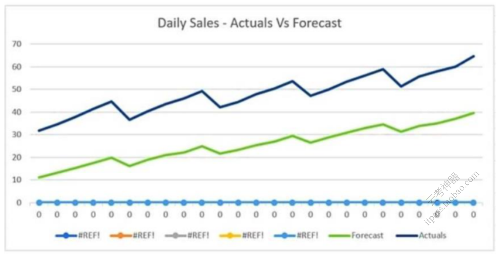
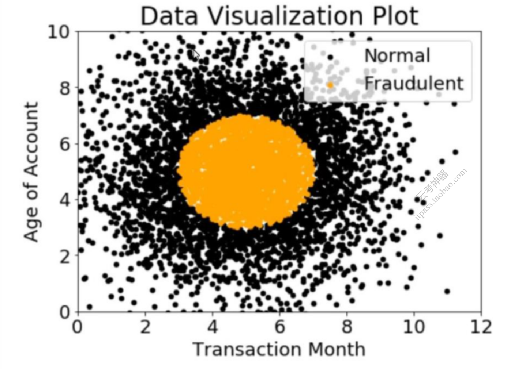
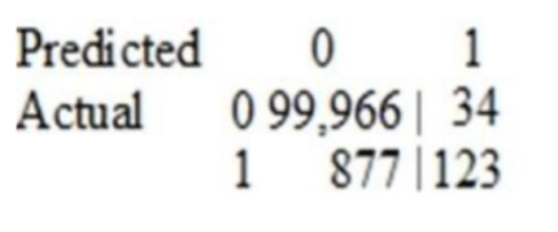
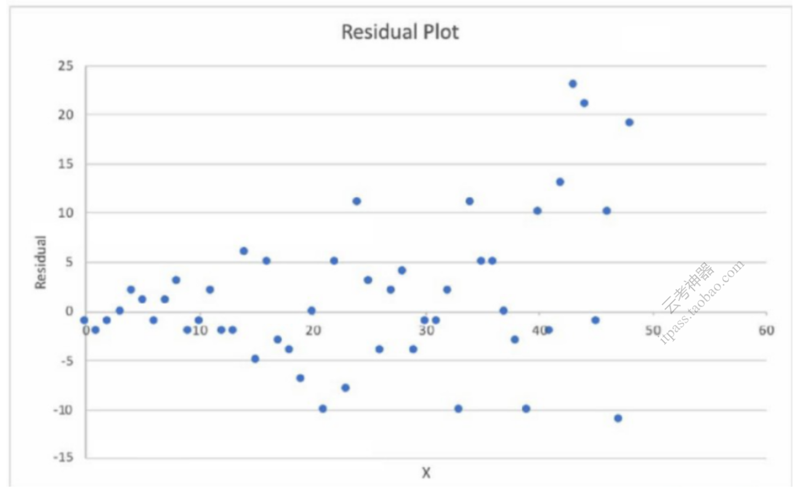
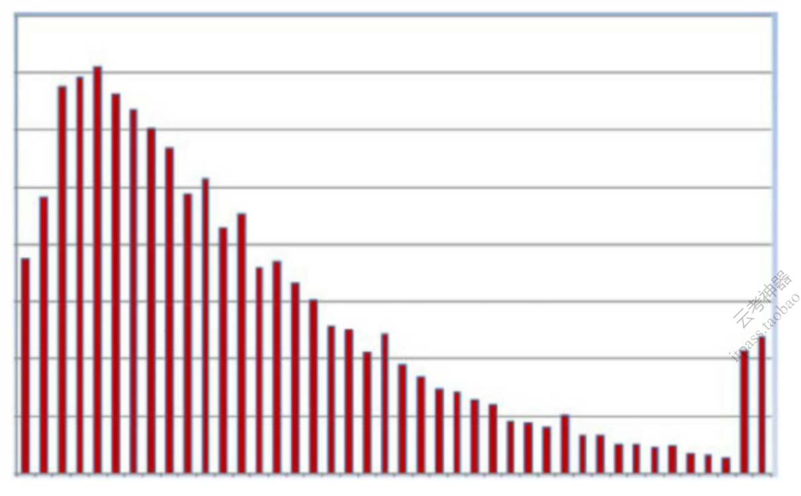
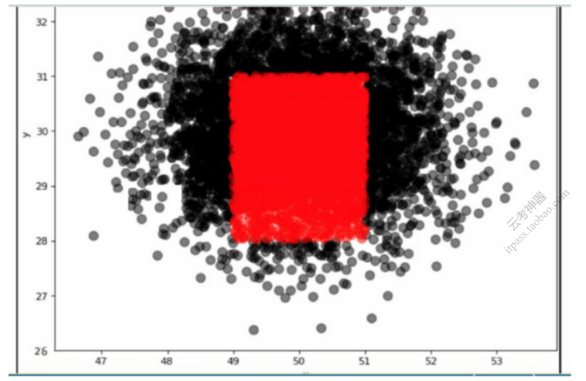
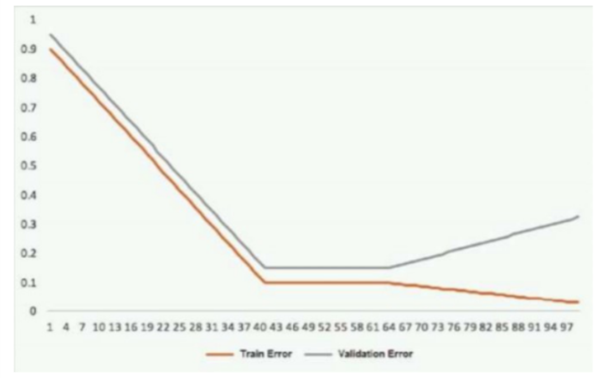

# AWS MLS 66-130

1. 一位机器学习专家正在与一家大公司合作，在其产品中利用机器学习。该公司希望根据哪些客户在未来6个月内会或不会流失，将其客户分成几类。该公司已将数据标记给专家，专家应使用哪种机器学习模型类型来完成这项任务？ A Machine Learning Specialist is working with a large company to leverage machine learning within its products. The company wants to group its customers into categories based on which customers will and will not churn within the next six months. The company has labeled the data available to the Specialist Which machine learning model type should the Specialist use to accomplish this task?
   - [ ] A. 线性回归 Linear regression
   - [ ] B. 分类 Classification
   - [ ] C. 聚类 Clustering
   - [ ] D. 强化学习 Reinforcement learning

   

      
Answer

      答案B：分类的目标是确定一个数据点（在我们的例子中是客户）属于哪个类别或类别。对于分类问题，数据科学家将使用具有预定义目标变量的历史数据，即标签（流失者/非流失者）答案，需要对其进行预测以训练算法。通过分类，企业可以回答以下问题。这个客户会不会流失。客户是否会续订？一个用户会不会降低定价计划的等级？是否有任何不寻常的客户行为的迹象？

   

2. 显示的图表来自一个测试时间序列的预测模型。仅仅考虑该图，机器学习专家应该对该模式的行为做出哪个结论？ The displayed graph is from a forecasting model for testing a time series. Considering the graph only, which conclusion should a Machine Learning Specialist make about the behavior of the mode?

   

   - [ ] A. 该模型对趋势和季节性的预测都很好。 The model predicts both the trend and the seasonality well.
   - [ ] B. 该模型很好地预测了趋势，但没有预测季节性。 The model predicts the trend well, but not the seasonality.
   - [ ] C. 该模型很好地预测了季节性，但没有预测趋势。 The model predicts the seasonality well, but not the trend.
   - [ ] D. 该模型不能很好地预测趋势或季节性。 The model does not predict the trend or the seasonality well.

   

      
Answer

      答案A。

   

3. 一家公司希望将用户行为分类为欺诈行为或正常行为。根据内部研究，一位机器学习专家希望建立一个基于两个特征的二进制分类器：账户年龄和交易月份。这些特征的类别分布如图所示。基于这些信息，哪个模型的准确率最高？ A company wants to classify user behavior as either fraudulent or normal. Based on internal research, a Machine Learning Specialist would like to build a binary classifier based on two features: age of account and transaction month. The class distribution for these features is illustrated in the figure provided. Based on this information, which model would have the HIGHEST accuracy?

   

   - [ ] A. 长短时记忆(LSTM)模型与缩放指数线性单元(SELU) Long short-term memory(LSTM)model with scaled exponential linear unit (SELU)
   - [ ] B. Logistic回归 Logistic regression
   - [ ] C. 支持向量机（SVM）与非线性核 Support vector machine(SVM) with non-linear kernel
   - [ ] D. 具有tanh激活函数的单感知器 Single perceptron with tanh activation function

   

      
Answer

      答案C。

   

4. 一家公司使用决策树收集了客户对其产品的评论，将其评为安全或不安全。训练数据集有以下特征：ID、日期、完整评论、完整评论摘要和一个二进制安全/不安全标签。在训练过程中，任何缺少特征的数据样本都会被剔除。在少数情况下，测试集被发现缺少完整的评论文本字段。对于这个用例，哪一个是解决有缺失特征的测试数据样本的最有效行动方案？ A company has collected customer comments on its products, rating them as safe or unsafe, using decision trees. The training dataset has the following features id, date, full review, full review summary, and a binary safe/unsafe tag. During training, any data sample with missing features was dropped. In a few instances, the test set was found to be missing the full review text field. For this use case, which is the most effective course of action to address test data samples with missing features?
   - [ ] A. 丢掉缺少完整评论文本字段的测试样本，然后再运行测试集。 Drop the test samples with missing full review text fields, and then run through the test set.
   - [ ] B. 复制摘要文本字段，用它们来填补缺失的完整评论文本字段，然后通过测试集运行。 Copy the summary text fields and use them to fill in the missing full review text fields, and then run through the test set.
   - [ ] C. 使用一种比决策树更好的处理缺失数据的算法。 Use an algorithm that handles missing data better than decision trees.
   - [ ] D. 生成合成数据来填补缺失数据的字段，然后通过测试集运行。 Generate synthetic data to fill in the fields that are missing data, and then run through the test set.

   

      
Answer

      答案B：在这种情况下，完整的评论摘要通常包含整个评论中最具描述性的短语，是缺失的完整评论文本字段的有效替身。

   

5. 一家保险公司需要将索赔合规性审查自动化，因为人工审查成本高且容易出错。该公司有一大批索赔和每个索赔的合规标签。每个索赔由几个英文句子组成，其中许多包含复杂的相关信息。管理层希望使用Amazon SageMaker的内置算法来设计一个机器学习的监督模型，该模型可以被训练来阅读每一个索赔，并预测索赔是否合规。应该使用哪种方法从索赔中提取特征，作为下游监督任务的输入？ An insurance company needs to automate claim compliance reviews because human reviews are expensive and error prone. The company has a large set of claims and a compliance label for each. Each claim consists of a few sentences in English, many of which contain complex related information. Management would like to use Amazon SageMaker built-in algorithms to design a machine learning supervised model that can be trained to read each claim and predict if the claim is compliant or not. Which approach should be used to extract features from the claims to be used as inputs for the downstream supervised task?
   - [ ] A. 从整个数据集中的目标中得出一个标记词典。对在训练集的每项要求中发现的标记进行一次编码。将导出的特征步伐作为输入发送到Amazon SageMaker内置的监督学习算法。 Derive a dictionary of tokens from aims in the entire dataset. Apply one-hot encoding to tokens found in each claim of the training set. Send the derived features pace as inputs to an Amazon SageMaker built in supervised learning algorithm.
   - [ ] B. 将Amazon SageMaker Blazing Text以Word2Vec模式应用于训练集的索赔。将导出的特征空间作为下游监督任务的输入。 Apply Amazon SageMaker Blazing Text in Word2Vec mode to claims in the training set. Send the derived features space as inputs for the downstream supervised task.
   - [ ] C. 在分类模式下将Amazon SageMaker Blazing Text应用于训练集中已标记的索赔，以得出索赔的特征，分别对应于合规和不合规的标签。 Apply Amazon SageMaker Blazing Text in classification mode to labeled claims in the training set to derive features for the claims that correspond to the compliant and non-compliant labels, respectively.
   - [ ] D. 将Amazon SageMaker Object2Vec应用于训练集中的索赔。将导出的特征空间作为下游监督任务的输入。 Apply Amazon SageMaker Object2Vec to claims in the training set. Send the derived features space as inputs for the downstream supervised task.

   

      
Answer

      答案D：Amazon SageMaker Object2Vec将单词的Word2Vec嵌入技术推广到更复杂的对象，如句子和段落。由于监督学习任务是在有标签的整个索赔水平上进行的，而在单词水平上没有标签，因此需要使用Object2Vec而不是Word2Vec。

   

6. 一家公司正在运行一个机器学习预测服务，每天产生100TB的预测数据。一个机器学习专家必须从预测中生成一个每日精度-召回曲线的可视化，并将一个只读的版本转发给业务团队。哪个解决方案需要最少的编码工作？ A company is running a machine learning prediction service that generates 100 TB of predictions every day. A Machine learning Specialist must generate a visualization of the daily precision-recall curve from the predictions and forward a read-only version to the Business team. Which solution requires the LEAST coding effort?
   - [ ] A. 运行每天的亚马逊EMR工作流来生成精确召回数据并将结果保存在亚马逊S3中。给予业务团队对S3的只读访问权。 Run daily Amazon EMR workflow to generate precision-recall data and save the results in Amazon S3. Give the Business team read-only access to S3.
   - [ ] B. 在Amazon QuickSight中生成每天的精确呼叫数据，并在与业务团队共享的仪表板中发布结果。 Generate daily precision-recall data in Amazon QuickSight and publish the results in a dashboard shared with the Business team.
   - [ ] C. 运行每天的亚马逊EMR工作流来生成精确召回数据并将结果保存在亚马逊S3中。在Amazon QuickSight中对阵列进行可视化，并将其发布在与业务团队共享的仪表盘中。 Run a daily Amazon EMR workflow to generate precision-recall data and save the results in Amazon S3. Visualize the arrays in Amazon QuickSight and publish them in a dashboard shared with the Business team.
   - [ ] D. 在Amazon ES中生成每天的精确召回数据，并在与业务团队共享的仪表板中发布结果。 Generate daily precision-recall data in Amazon ES and publish the results in a dashboard shared with the Business team.

    

      
Answer

      答案C。

   

7. 机器学习专家正在准备数据，以便在Amazon SageMaker上进行训练。专家正在使用Shoemaker的一个内置算法进行训练。数据集是以CSV格式存储的，并被转换为NumPy数组，这似乎对训练的速度产生了负面影响。专家应该做什么来优化数据，以便在SageMaker上进行训练？ A Machine Learning Specialist is preparing data for raining on Amazon SageMaker. The Specialist is using one of the Shoemaker built-in algorithms for the training. The dataset is stored in CSV format and is transformed into a NumPy array, which appears to be negatively affecting the speed of the training. What should the Specialist do to optimize the data for training on SageMaker?
   - [ ] A. 使用SageMaker的批量转换功能，将训练数据转换为一个数据框架。 Use the SageMaker batch transform feature to transform the training data into a Data frame.
   - [ ] B. 使用AWS Glue将数据压缩成Apache Parquet格式。 Use AWS Glue to compress the data into the Apache Parquet format.
   - [ ] C. 将数据集转换成RecordIO protobuf格式。 Transform the dataset into the RecordIO protobuf format
   - [ ] D. 使用SageMaker超参数优化功能，自动优化数据。Use the SageMaker hyperparameter optimization feature to automatically optimize the data.

    

      
Answer

      答案C：许多Amazon SageMaker内置算法对protobuf格式的RecordIO数据优化都非常好。

   

8. 一位机器学习专家被要求建立一个有监督的图像识别模型来识别一只猫。ML专家进行了一些测试，并为一个基于神经网络的图像分类器记录了以下结果。可用图像总数=1,000；测试集图像=100（恒定测试集）。ML专家注意到，在超过75%的错误分类的图像中，猫被它们的主人倒提着。ML专家可以使用哪些技术来改善这个特定的测试错误？ A Machine Learning Specialist is required to build a supervised image-recognition model to identify a cat. The ML Specialist performs some tests and records the following results for a neural network-based image classifier: Total number of images available =1,000; Test set images=100 (constant test set). The ML Specialist notices that, in over 75% of the misclassified images, the cats were held upside down by their owners. Which techniques can be used by the ML Specialist to improve this specific test error?
   - [ ] A. 通过增加训练图像的旋转变化来增加训练数据。 Increase the training data by adding variation in rotation for training images.
   - [ ] B. 增加模型训练的epochs数量。Increase the number of epochs for model training.
   - [ ] C. 增加神经网络的层数。Increase the number of layers for the neural network.
   - [ ] D. 增加倒数第二层的辍学率。 Increase the dropout rate for the second-to-last layer.

   

      
Answer

      答案A。

   

9. 机器学习专家需要能够摄取流媒体数据并将其存储在Apache Parquet文件中，以便进行探索和分析。以下哪项服务能够以正确的格式摄取和存储这些数据？ Machine Learning Specialist needs to be able to ingest streaming data and store it in Apache Parquet files for exploration and analysis. Which of the following services would both ingest and store this data in the correct format?
   - [ ] A. AWS DMS
   - [ ] B. Amazon Kinesis Data Streams
   - [ ] C. Amazon Kinesis Data Firehose
   - [ ] D. Amazon Kinesis Data Analytics

   

      
Answer

      答案C。

   

10. 一位数据科学家正在开发一个机器学习模型，以对一项金融交易是否是欺诈性的进行分类。可供训练的标记数据包括100,000个非欺诈性的观察值和1,000个欺诈性的观察值。数据科学家将XGBboost算法应用于数据，当训练好的模型应用于之前未见过的验证数据集时，会产生以下混淆矩阵。该模型的准确率为99.1%，但数据科学家被要求减少假阴性的数量。数据科学家应该采取哪种步骤组合来减少该模型的假阳性预测的数量？(选择两个) A Data Scientist is developing a machine learning model to classify whether a financial transaction is fraudulent. The labeled data available for raining consists of 100,000 non-fraudulent observations and 1.000 fraudulent observations. The Data Scientist applies the XGBboost algorithm o the data, resulting in the following confusion matrix when the trained model is applied to a previously unseen validation dataset. The accuracy of the model is 99.1%, but the Data Scientist has been asked to reduce the number of false negatives. Which combination of steps should the Data Scientist take to reduce the number of false positive predictions by the model? (Choose two)

    

    - [ ] A. 改变XGBboost`eval_metric`参数，根据RMSE而不是误差进行优化。 Change the XGBboost `eval_metric` parameter to optimize based on RMSE instead of error.
    - [ ] B. 增加XGBboost `scale_pos_weight`参数来调整正负权重的平衡。 Increase the XGBboost `scale_pos_weight` parameter to adjust the balance of positive and negative weights.
    - [ ] C. 增加XGBboost `max_depth`参数，因为模型目前对数据的拟合不足。 Increase the XGBboost `max_depth` parameter because the model is currently underfitting the data.
    - [ ] D. 改变XGBOOST `eval_metric`参数，根据AUC而不是误差来优化。 Change the XGBOOST `eval_metric` parameter to optimize based on AUC instead of error.
    - [ ] E. 减少XGBOOST `max_depth`参数，因为该模型目前过度拟合数据。 Decrease the XGBOOST `max_depth` parameter because the model is currently overfitting the data.

    

       
Answer

       答案BD。

    

11. 一位机器学习专家被分配到一个TensorFlow项目唱Amazon SageMaker进行训练，并需要在没有WI-FI接入的情况下继续工作很长一段时间。该专家应该使用哪种方法来继续工作？ A Machine Learning Specialist is assigned a TensorFlow project sing Amazon SageMaker for training and needs to continue working for an extended period with no WI-FI access. Which approach should the Specialist use to continue working?
    - [ ] A. 在他们的笔记本电脑上安装Python 3和boto3，并使用该环境继续进行代码开发。 Install Python 3 and boto3 on their laptop and continue the code development using that environment
    - [ ] B. 从GitHub下载Amazon SageMaker中使用的TensorFlow Docker容器到他们的本地环境，并使用Amazon SageMaker Python SDK来测试代码。 Download the TensorFlow Docker container used in Amazon SageMaker from GitHub to their local environment and use the Amazon SageMaker Python SDK to test the code.
    - [ ] C. 从tensorflow.org下载TensorFlow，在SageMaker环境中模拟TensorFlow内核。 Download TensorFlow from tensorflow.org to emulate the TensorFlow kernel in the SageMaker environment.
    - [ ] D. 将SageMaker笔记本下载到他们的本地环境，然后在他们的笔记本电脑上安装Jupyter笔记本，在本地笔记本中继续开发。 Download the SageMaker notebook to their local environment, then install Jupyter Notebooks on their laptop and continue the development in a local notebook.

    

       
Answer

       答案B。

    

12. 一家对安全敏感的公司的机器学习专家正在准备一个数据集进行模型训练。该数据集存储在Amazon S3中，包含个人身份信息（P）。该数据集必须只能从VPC中访问。-不能穿越公共互联网。怎样才能满足这些要求？ A Machine Learning Specialist at a company sensitive to security is preparing a dataset for model training. The dataset is stored in Amazon S3 and contains Personally Identifiable Information(P). The dataset -Must be accessible from a VPC only. -Must not traverse the public internet. How can these requirements be satisfied?
    - [ ] A. 创建一个VPC端点，应用一个桶访问策略，限制对给定的VPC端点和VPC的访问。 Create a VPC endpoint and apply a bucket access policy that restricts access to the given VPC endpoint and the VPC.
    - [ ] B. 创建一个VPC端点，并应用一个桶访问策略，允许从给定的VPC端点和Amazon EC2实例访问。 Create a VPC endpoint and apply a bucket access policy that allows access from the given VPC endpoint and an Amazon EC2 instance.
    - [ ] C. 创建一个VPC端点，并使用网络访问控制列表（NACLS），只允许指定的VPC端点和Amazon EC2实例之间的流量。 Create a VPC endpoint and use Network Access Control Lists (NACLS) to allow traffic between only the given VPC endpoint and an Amazon EC2 instance.
    - [ ] D. 创建一个VPC端点，并使用安全组来限制对指定的VPC端点和亚马逊EC2实例的访问。 Create a VPC endpoint and use security groups to restrict access to the given VPC endpoint and an Amazon EC2 instance.

    

       
Answer

       答案A。

    

13. 在对一个分类问题的神经网络进行小批量训练时，一位数据科学家注意到训练的准确性出现了震荡。这个问题最可能的原因是什么？ During mini-batch training of a neural network for a classification problem, a Data Scientist notices that training accuracy oscillates. What is the MOST likely cause of this issue?
    - [ ] A. 数据集中的类别分布是不平衡的 The class distribution in the dataset is imbalanced
    - [ ] B. 数据集洗牌被禁用 Dataset shuffling is disabled
    - [ ] C. 批量大小太大 The batch size is too big
    - [ ] D. 学习率非常高 The learning rate is very high

    

       
Answer

       答案D。

    

14. 一名员工在一家公司的社交媒体上发现了一个带有音频的视频片段。视频中使用的语言是西班牙语。英语是该员工的第一语言，而他们不懂西班牙语。该员工想做一个情感分析。哪种服务的组合对完成这项任务最有效？ An employee found a video clip with audio on a company’s social media feed. The language used in the video is Spanish. English is the employee’s first language, and they do not understand Spanish. The employee wants to do a sentiment analysis. What combination of services is the MOST efficient to accomplish the task?
    - [ ] A. Amazon Transcribe, Amazon Translate, and Amazon Comprehend.
    - [ ] B. Amazon Transcribe, Amazon Comprehend, and Amazon SageMaker seq2seq.
    - [ ] C. Amazon Transcribe, Amazon Translate, and Amazon SageMaker Neural Topic Model (NTM).
    - [ ] D. Amazon Transcribe, Amazon Translate and Amazon SageMaker Blazing Text.

    

       
Answer

       答案A。

    

15. 一位机器学习专家正在将一个定制的Resnet模型打包成一个Docker容器，以便公司能够利用Amazon SageMaker进行训练。该专家正在使用亚马逊EC2 P3实例来训练该模型，并需要正确配置Docker容器以利用英伟达GPUS。该专家需要做什么？ A Machine Learning Specialist is packaging a custom Resnet model into a Docker container so the company can leverage Amazon SageMaker for training. The Specialist is using Amazon EC2 P3 instances to train the model and needs to properly configure the Docker container to leverage the NVIDIA GPUS. What does the Specialist need to do?
    - [ ] A. 将NVIDIA驱动程序与Docker镜像捆绑在一起。 Bundle the NVIDIA drivers with the Docker image.
    - [ ] B. 构建Docker容器，使其与NVIDIA-Docker兼容。 Build the Docker container to be NVIDIA-Docker compatible.
    - [ ] C. 组织Docker容器的文件结构，以便在GPU实例上执行。 Organize the Docker containers file structure to execute on GPU instances.
    - [ ] D. 在Amazon SageMaker中设置GPU标志。创建TrainingJob请求体。 Set the GPU flag in the Amazon SageMaker. Create TrainingJob request body.

    

       
Answer

       答案B。如果你计划使用GPU设备，请确保我们的容器与nvidia-docker兼容，只有CUDA工具包应该被包含在容器上。不要在镜像中捆绑NVIDIA驱动程序。关于nvidia-docker的更多信息，请参见NVIDIA/nvidia-docker。

    

16. 一位机器学习专家正在建立一个逻辑回归模型，预测一个人是否会订购比萨饼。该专家正试图建立一个具有理想分类阈值的最佳模型。该专家应该使用什么模型评估技术来了解不同的分类阈值将如何影响模型的性能？ A Machine Learning Specialist is building a logistic regression model that will predict whether or not a person will order a pizza. The Specialist is trying to build the optimal model with an ideal classification threshold. What model evaluation technique should the Specialist use to understand how different classification thresholds will impact the model’s performance?
    - [ ] A. 接收者操作特征（ROC）曲线 Receiver operating characteristic (ROC) curve
    - [ ] B. 错误分类率 Misclassification rate
    - [ ] C. 均方根误差(RMSE) Root Mean Square Error (RMSE)
    - [ ] D. L1准则 L1 norm

    

       
Answer

       答案A：[ref](https://docs.aws.amazon.com/zh_cn/machine-learning/latest/dg/binary-model-insights.html)

    

17. 一位机器学习专家正在开发一个回归模型，以预测出租房源的租金。一个名为Wall_Color的变量代表了该房产最突出的外墙颜色。以下是样本数据。排除所有其他变量。Propery_ID Wall_Color: 1000 Red, 1001 White, 1002 Green. 专家选择了一个需要数字输入数据的模式。专家应该使用哪些特征工程师的方法来让回归模型从墙壁颜色数据中学习？(选择两个) A Machine Learning Specialist is developing a regression model to predict rental rates from rental listings. A variable named Wall_Color represents the most prominent exterior wall color of the property. The following is the sample data. excluding all other variables: Propery_ID Wall_Color: 1000 Red, 1001 White, 1002 Green. The specialist chose a mode that needs numerical input data. Which feature engineer approaches should the Specialist use to allow the regression model to learn from the Wall Color data? (Select TWO)
    - [ ] A. 应用整数转换，设置红=1，白=5，绿=10。 Apply integer transformation and set Red=1, White=5, and Green=10.
    - [ ] B. 增加新的列，存储颜色的一热表示。 Add new columns that store one-hot representation of colors.
    - [ ] C. 用颜色名称字符串的长度替换它。 Replace the color name string by its length.
    - [ ] D. 创建三列，以RGB格式对颜色进行编码。 Create three columns to encode the color in RGB format.
    - [ ] E. 用它的训练集频率替换每个颜色名称。 Replace each color name by its training set frequency.

    

       
Answer

       答案BD。

    

18. 一家大公司开发了一个BI应用，利用从各种运营指标中收集的数据生成报告和仪表盘。该公司希望为高管提供增强的体验，使他们能够使用自然语言从报告中获得数据。该公司希望高管们能够通过书面和口语界面来提问。哪种服务组合可以用来建立这种对话式界面？(选择三个) A large company has developed a BI application that aerates reports and dashboards using data collected from various operational metrics. The company wants to provide executives with an enhanced experience so they can use natural language to get data from the reports. The company wants the executives to be able to ask questions sin written and spoken interfaces. Which combination of services can be used to build this conversational interface? (Select THREE)
    - [ ] A. Alexa for Business
    - [ ] B. Amazon Connect
    - [ ] C. Amazon Lex
    - [ ] D. Amazon Polly
    - [ ] E. Amazon Comprehend
    - [ ] F. Amazon Transcribe

    

       
Answer

       答案CEF。

    

19. 一位数据科学家正在开发一个管道，以嵌套流式网络流量数据。该数据科学家需要实现一个过程，以识别通常的网络流量模式，作为管道的一部分。该模式将被用于下游的警报和事件响应。如果需要，数据科学家可以访问未标记的历史数据来使用。该解决方案需要做以下工作。为每个网络流量条目计算一个异常分数。使异常事件的识别适应随时间变化的网络模式。该数据科学家应该实施哪种方法来满足这些要求？ A data scientist is developing a pipeline to nest streaming web traffic data. The data scientist needs to implement a process to identify usual web traffic patterns as part of the pipeline. The pattern will be used downstream for alerting and incident response. The data scientist has access to unlabeled historic data to use, if needed. The solution needs to do the following: Calculate an anomaly score for each web traffic entry. Adapt unusual event identification to changing web patterns over time. Which approach should the data scientist implement to meet these requirements?
    - [ ] A. 使用历史网络流量数据，使用Amazon SageMaker随机切割森林（RCF）内置模型训练异常检测模型。使用Amazon Kinesis数据流来处理传入的网络流量数据。附加一个预处理的AWS Lambda函数，通过调用RCF模型计算每条记录的异常分数来执行数据丰富化。 Use historic web traffic data to train an anomaly detection model using the Amazon SageMaker Random Cut Forest (RCF) Built-in model. Use an Amazon Kinesis Data stream to process the incoming web traffic data. Attach a preprocessing AWS Lambda function to perform data enrichment by calling the RCF model to calculate the anomaly score for each record.
    - [ ] B. 使用历史网络流量数据，使用Amazon SageMaker内置的XGBOOST模型训练异常检测模型。使用Amazon Kinesis数据流来处理传入的网络流量数据。附加一个预处理AWS Lambda函数，通过调用XGBOOST模型计算每条记录的异常分数来执行数据丰富化。 Use historic web traffic data to train an anomaly detection model using the Amazon SageMaker built-in XGBOOST model. Use an Amazon Kinesis Data Stream to process the incoming web traffic data. Attach a preprocessing AWS Lambda function to perform data enrichment by calling the XGBOOST model to calculate the anomaly score for each record.
    - [ ] C. 使用Amazon Kinesis Data Firehose收集流数据，将交付流映射为Amazon Kinesis Data Analytics的输入源。编写一个SQL查询，用k-nearest neighbors（KNN）SQL扩展对流媒体数据进行实时运行，使用翻转窗口计算每条记录的异常得分。 Collect the streaming data using Amazon Kinesis Data Firehose Map the delivery stream as an input source for Amazon Kinesis Data Analytics. Write a SQL query to run in real time against the streaming data with the k-nearest neighbors (KNN) SQL extension to calculate anomaly scores for each record using a tumbling window.
    - [ ] D. 使用Amazon Kinesis Data Firehose收集流数据。将交付流映射为亚马逊Kinesis数据分析的输入源。编写一个SQL查询，用亚马逊随机数据实时运行。Cut Forest(RCF)SQL扩展，使用滑动窗口计算每条记录的异常分数。 Collect the streaming data using Amazon Kinesis Data Firehose. Map the delivery stream as an input source for Amazon Kinesis Data Analytics. Write a SQL query to run in real time against the streaming data with the Amazon Random. Cut Forest(RCF)SQL extension to calculate anomaly scores for each record using a sliding window.

    

       
Answer

       答案D。

    

20. 一个机器学习团队在Amazon SageMaker上运行自己的训练算法。训练算法需要外部资产。该团队需要向Amazon SageMaker提交自己的算法代码和算法特定参数。该团队应该使用哪种服务组合来在Amazon SageMaker中建立一个自定义算法？(选择两个) A Machine Learn team runs its own training algorithm on Amazon SageMaker. The training algorithm requires external assets. The team needs to submit both its own algorithm code and algorithm-specific parameters to Amazon SageMaker. Which combination of services should the team use to build a custom algorithm in Amazon SageMaker? (Select TWO)
    - [ ] A. AWS Secrets Manager
    - [ ] B. AWS CodeStar
    - [ ] C. Amazon ECR
    - [ ] D. Amazon ECS
    - [ ] E. Amazon S3

    

       
Answer

       答案CE。

    

21. 数据科学家正在一个有多个类别的数据集上训练一个多层感知器（MLP）。与数据集中的其他类相比，感兴趣的目标类是独特的，但它没有达到可接受的召回指标。数据科学家已经尝试改变MPS隐藏层的数量和大小，但结果没有明显改善。必须尽快实施改善召回率的解决方案。应该使用哪些技术来满足这些要求？ Data Scientist is training a multilayer perceptron (MLP) on a dataset with multiple classes. The target class of interest is unique compared to the other classes within the dataset, but it does not achieve an acceptable recall metric. The Data Scientist has already tried varying the number and size of the MPS hidden layers, which has not significantly improved the results. A solution to improve recall must be implemented as quickly as possible. Which techniques should be used to meet these requirements?
    - [ ] A. 使用Amazon Mechanical Turk收集更多数据，然后重新训练。 Gather more data using Amazon Mechanical Turk and then retrain.
    - [ ] B. 训练一个异常检测模型而不是MLP。 Train an anomaly detection model instead of an MLP.
    - [ ] C. 训练一个XGBboost模型而不是MLP。 Train an XGBboost model instead of an MLP.
    - [ ] D. 在MLP的损失函数中加入类的权重，然后再重新训练。 Add class weights to the MLP's loss function and the retrain.

    

       
Answer

       答案D。

    

22. 一个网络安全供应商需要从世界各地运行的数以百万计的端点中获取遥测数据。这些数据每30秒以包含50个字段的记录形式传输。每条记录的大小为1KB。这些数据是使用亚马逊Kinesis数据流摄入的。在Amazon Athena查询时，需要每小时对可用记录进行汇总。针对Athena运行的查询将针对包括7-12列数据的不同集合。哪种解决方案在转换和存储摄入的数据时涉及的定制化程度最低？ A network security vendor needs to ingest telemetry data from millions of endpoints running all over the world. This data is transmitted every 30 seconds in the form of records containing 50 fields. Each record is up to 1KB in size. The data is being ingested using Amazon Kinesis Data streams. Hourly summaries of the available records are needed for querying in Amazon Athena. The queries running against Athena will target different sets that include 7-12 columns of data. Which solution involves the LEAST amount of customization for transforming and storing the ingested data?
    - [ ] A. 配置Kinesis数据流，通过流将数据发送到AWS Lambda。配置Lambda每小时汇总数据，并将其发送到Amazon Kinesis Data Firehose交付流，配置为将数据以Apache Parquet格式存储在Amazon S3。 Configure Kinesis Data Streams to send the data through a stream to AWS Lambda. configure Lambda to aggregate the data hourly and send it to an Amazon Kinesis Data Firehose delivery stream configured to store the data in Amazon S3 in Apache Parquet format.
    - [ ] B. 配置Kinesis数据流，通过流来发送数据，每小时将数据汇总到Amazon Kinesis Data Firehose交付流。配置交付流，将数据发送到Amazon EMR，并将数据以Apache Parquet格式存储在Amazon S3中。 Configure Kinesis Data Streams to send the data through a stream to aggregate the data hourly to an Amazon Kinesis Data Firehose delivery stream. Configure the delivery stream to send the data to Amazon EMR and store the data in Amazon S3 in Apache Parquet format.
    - [ ] C. 配置Kinesis数据流，通过流来发送数据，每小时将数据汇总到Amazon Kinesis数据分析。配置Kinesis Data Analytics，将数据处理到Amazon Kinesis Data Firehose交付流，配置为将数据以Apache Parquet格式存储在Amazon S3。 Configure Kinesis Data Streams to send the data through a stream to aggregate the data hourly to Amazon Kinesis Data Analytics. Configure Kinesis Data Analytics to process the data to an Amazon Kinesis Data Firehose delivery stream configured to store the data in Amazon S3 in Apache Parquet format.
    - [ ] D. 配置Kinesis数据流，通过一个流来发送数据，每小时将数据汇总到Amazon Kinesis Data Firehose交付流中。配置AWS Lambda来处理数据，并将数据以Apache Parquet格式存储在Amazon S3中。 Configure Kinesis Data Streams to send the data through a stream to aggregate the data hourly to an Amazon Kinesis Data Firehose delivery stream. Configure AWS Lambda to process the data and store the data in Amazon S3 in Apache Parquet format.
  
    

       
Answer

       答案C: [ref](https://docs.aws.amazon.com/zh_cn/kinesisanalytics/latest/sqlref/analytics-sql-reference.html)

    

23. 一个数据科学家使用Amazon SageMaker笔记本实例来进行数据探索和分析。这需要在笔记本实例上安装Amazon SageMaker上没有的某些Python包。机器学习专家如何确保所需的包在笔记本实例上自动可用，供数据科学家使用？ A Data Scientist uses an Amazon SageMaker notebook instance to conduct data exploration and analysis. This requires certain Python packages that are not natively available on Amazon SageMaker to be installed on the notebook instance. How can a Machine Learning Specialist ensure that required packages are automatically available on the notebook instance for the Data Scientist to use?
    - [ ] A. 在底层的Amazon EC实例上安装AWS系统管理器代理，并使用系统管理器自动化来执行包安装命令。 Install AWS System Manager Agent on the underlying Amazon EC instance and use Systems Manager Automation to execute the package installation commands.
    - [ ] B. 创建一个Jupyter笔记本文件（.ipynb），其中包含要执行的包安装命令的单元，并将该文件放在每个Amazon SageMaker笔记本实例的`/etc/init`目录下。 Create a Jupyter notebook file (.ipynb) with cells containing the package installation commands to execute and place the file under the `/etc/init` directory of each Amazon SageMaker notebook instance.
    - [ ] C. 在Jupyter笔记本控制台中使用conda包管理器，将必要的conda包应用于笔记本的默认内核。 Use the conda package manager from within the Jupyter notebook console to apply the necessary conda packages to the default kernel of the notebook.
    - [ ] D. 使用包安装命令创建Amazon SageMaker生命周期配置，并将生命周期配置分配给笔记本实例。 Create an Amazon SageMaker lifecycle configuration with package installation commands and assign the lifecycle configuration to the notebook instance.

    

       
Answer

       答案D: [ref](https://docs.aws.amazon.com/zh_cn/sagemaker/latest/dg/notebook-lifecycle-config.html)

    

24. 一位机器学习专家正试图建立一个线性回归模型。仅从显示的残差图来看，该模型最可能出现的问题是什么？ A Machine Learning Specialist is attempting to build a linear regression model. Given the displayed residual plot only, what is the MOST likely problem with the model?

    

    - [ ] A. 线性回归是不合适的。残差不具有恒定方差 Linear regression is inappropriate. The residuals do not have constant variance
    - [ ] B. 线性回归是不恰当的。基础数据有离群值 Linear regression is inappropriate. The underlying data has outliers
    - [ ] C. 线性回归是合适的。残差的平均值为零 Linear regression is appropriate. The residuals have a zero mean
    - [ ] D. 线性回归是合适的。残差有恒定的方差 Linear regression is appropriate. The residuals have constant variance

    

       
Answer

       答案A。

    

25. 一家报纸出版商有一个客户数据表，该表由几个数字和分类特征组成，如年龄和教育历史，以及订阅状态。该公司希望建立一个有针对性的营销模型，以根据表格数据预测订阅状态，哪个Amazon SageMaker内置算法应该被用来建立有针对性的营销模型？ A newspaper publisher has a table of customer data that consists of several numerical and categorical features, such as age and education history, as well as subscription status. The company wants to build a targeted marketing model for predicting the subscription status based on the table data Which Amazon SageMaker built-in algorithm should be used to model the targeted marketing?
    - [ ] A. Random Cut Forest (RCF)
    - [ ] B. XGBboost
    - [ ] C Neural Topic Model (NTM)
    - [ ] D. DeepAR forecasting

    

       
Answer

       答案B。

    

26. 一位机器学习专家正在研究一个线性回归模型，并注意到该模型正在过度拟合。该专家应用L1正则化参数，并再次运行模型。不幸的是，这导致所有特征的权重为零。机器学习专家应该怎么做来改善模型的结果？ A Machine Learning Specialist is working on a linear regression model and notices the model is overfitting. The specialist applies an L1 regularization parameter and runs the model again. Unfortunately, this results in all features having zero weights. What should the Machine Learning Specialist do to improve the model results?
    - [ ] A. 增加L1正则化参数。 Increase the L1 regularization parameter.
    - [ ] B. 减少L1正则化参数。 Decrease the L1 regularization parameter.
    - [ ] C. 增加L2正则化参数。 Increase the L2 regularization parameter.
    - [ ] D. 减少L2正则化参数。 Decrease the L2 regularization parameter.

    

       
Answer

       答案B。

    

27. 一位机器学习专家为一家水果加工公司工作，需要建立一个系统，将苹果分为三种类型。该专家收集了一个数据集，其中包含每种苹果的150张图片，并在一个神经网络上应用了转移学习，该网络是在ImageNet上用这个数据集预训练的。该公司要求至少有85%的准确率才能利用该模型。经过详尽的网格搜索，最佳超参数产生如下。训练集上的准确率为68%。在验证集上的准确率为67%。机器学习专家可以做些什么来提高系统的准确性？ A machine learning specialist works for a fruit processing company and needs to build a system that categorizes apples into three types. The specialist has collected a dataset that contains 150 images for each type of apple and applied transfer learning on a neural network that was pretrained on ImageNet with this dataset. The company requires at least 85% accuracy to make use of the model. After an exhaustive grid search, the optimal hyperparameters produced the following: 68% accuracy on the training set. 67% accuracy on the validation set. What can the machine learning specialist do to improve the system' s accuracy?
    - [ ] A. 把模型上传到Amazon SageMaker笔记本实例，并使用Amazon SageMaker HPO功能来优化模型的超参数。 Upload the model to an Amazon SageMaker notebook instance and use the Amazon SageMaker HPO feature to optimize the model’s hyperparameters.
    - [ ] B. 向训练集添加更多的数据，并使用转移学习重新训练模型以减少偏差。 Add more data to the training set and retrain the model using transfer learning to reduce the bias.
    - [ ] C. 使用具有更多层的神经网络模型，在ImageNet上进行预训练，并应用转移学习来增加方差。 Use a neural network model with more layers that are pretrained on ImageNet and apply transfer learning to increase the variance.
    - [ ] D. 使用当前的神经网络架构训练一个新的模型。 Train a new model using the current neural network architecture.

    

       
Answer

       答案B。

    

28. 一位数据科学家已经探索并净化了一个数据集，为监督学习任务的建模阶段做准备。统计学上的分散性在不同的特征之间会有很大的差异，有时会有几个数量级的差异。在进入建模阶段之前，数据科学家希望确保对生产数据的预测性能尽可能准确。数据科学家应该采取哪一序列的步骤来满足这些要求？ A Data Scientist has explored and sanitized a dataset in preparation for the modeling phase of a supervised learning task. The statistical dispersion can vary widely between features, sometimes by several orders of magnitude. Before moving on to the modeling phase, the Data Scientist wants to ensure that the prediction performance on the production data is as accurate as possible. Which sequence of steps should the Data Scientist take to meet these requirements?
    - [ ] A. 对数据集应用随机抽样。然后将数据集分成训练集、验证集和测试集。 Apply random sampling to the dataset. Then split the dataset into training, validation, and test sets
    - [ ] B. 将数据集分成训练、验证和测试集。然后重新调整训练集的比例，并对验证集和测试集采用同样的比例。 Split the dataset into training, validation, and test sets. Then rescale the training set and apply the same scaling to the validation and test sets
    - [ ] C. 重新调整数据集的比例。然后将数据集分成训练集、验证集和测试集。 Rescale the dataset. Then split the dataset into training, validation, and test sets
    - [ ] D. 将数据集分成训练集、验证集和测试集。然后独立地重新调整训练集、验证集和测试集的比例。 Split the dataset into training, validation, and test sets. Then rescale the training set, the validation set, and the test set independently.

    

       
Answer

       答案B。

    

29. 一位数据科学家正在建立一个线性回归模型，并将使用产生的P值来评估每个系数的统计意义。在检查数据集时，数据科学家发现大多数特征都是正态分布。图中显示了数据集中的一个特征的图。为了满足线性回归模型的统计假设，数据科学家应该应用什么转换？ A Data Scientist is building a linear regression model and will use resulting p-values o evaluate the statistical significance of each coefficient. Upon inspection of the dataset the Data Scientist discovers that most of the features are normally distributed. The plot of one feature in the dataset is shown in the graphic. What transformation should the Data Scientist apply to satisfy the statistical assumptions of the linear regression model?

    

    - [ ] A. 指数转换 Exponential transformation
    - [ ] B. 对数转换 Logarithmic transformation
    - [ ] C. 多项式转换 Polynomial transformation
    - [ ] D. 正弦波变换 Sinusoidal transformation

    

       
Answer

       答案B。

    

30. 某制造商经营着大量的工厂，供应链关系复杂，一台机器的意外停机会导致几个工厂的生产停止。一台机器的传感器读数可以包括多达200个数据点，包括温度、电压、振动、RPMS和压力读数。为了收集这些传感器数据，制造商在整个工厂部署了Wi-Fi和ANS。即使许多工厂地点没有可靠的或高速的互联网连接，制造商仍希望保持近乎实时的推理能力。 该模型的哪种部署架构能解决这些业务需求？ A manufacturer is operating a large number of factories with a complex supply chain relationship where unexpected downtime of a machine can cause production to stop at several factories A data scientist wants to analyze sensor data from the factories to identify equipment in need of preemptive maintenance and then dispatch a service team to prevent unplanned downtime. The sensor readings from a single machine can include up to 200 data points including temperatures, voltages, vibrations, RPMS, and pressure readings. To collect this sensor data, the manufacturer deployed Wi-Fi and ANS across the factories. Even though many factory locations do not have reliable or high-speed internet connectivity, the manufacturer would like to maintain near-real-time inference capabilities Which deployment architecture for the model will address these business requirements?
    - [ ] A. 在Amazon SageMaker中部署该模型 通过该模型运行传感器数据，预测哪些机器需要维护。 Deploy the model in Amazon SageMaker Run sensor data through this model to predict which machines need maintenance.
    - [ ] B. 在每个工厂的AWS IoT Greengrass上部署该模型 通过该模型运行传感器数据来推断哪些机器需要维护。 Deploy the model on AWS IoT Greengrass in each factory Run sensor data through this model to infer which machines need maintenance.
    - [ ] C. 将该模型部署到Amazon SageMaker的批量转换作业中。在每日批处理报告中生成推断，以确定需要维护的机器。 Deploy the model to an Amazon SageMaker batch transformation job. Generate inferences in a daily batch report to identify machines that need maintenance.
    - [ ] D. 在Amazon SageMaker中部署该模型，并使用OT规则将数据写入Amazon DynamoDB表。用AWS Lambda函数从该表消耗一个DYNAMODB流来调用端点。 Deploy the model in Amazon SageMaker and use an IoT rule to write data to an Amazon DynamoDB table. Consume a DynamoDB stream from the table with an AWS Lambda function to invoke the endpoint.

    

       
Answer

       答案B。

    

31. 一位机器学习专家正在为一家在线零售商工作，该零售商希望对每个客户的访问进行分析，通过机器学习管道进行处理。数据需要以每秒100个交易的速度被亚马逊Kinesis数据流摄取，SON数据blob的大小为100KB。专家应该使用Kinesis数据流中的最小分片数来成功摄取这些数据？ A Machine Learning Specialist is working for an online retailer that wants to run analytics on every customer visit, processed through a machine learning pipeline. The data needs to be ingested by Amazon Kinesis Data Streams at up to 100 transactions per second, and the SON data blob is 100 KB in size. What in the MINIMUM number of shards in Kinesis Data Streams the Specialist should use to successfully ingest this data?
    - [ ] A. 1 shard
    - [ ] B. 10 shards
    - [ ] C. 100 shards
    - [ ] D. 1,000 shards
  
    

       
Answer

       答案B: [ref](https://docs.aws.amazon.com/zh_cn/streams/latest/dev/service-sizes-and-limits.html)

    

32. 一家公司使用商店货架上陈列的物品顶部的相机图像来确定哪些物品被移走，哪些物品仍然存在。经过几个小时的数据标记，该公司总共有1，000张手工标记的图像，涵盖了10个不同的物品。训练结果很差。哪种机器学习方法能满足该公司的长期需求？ A company uses camera images of the tops of items displayed on store shelves to determine which items were removed and which ones remain. After several hours of data labeling, the company has a total of 1, 000 hand-labeled images covering 10 distinct items. The training results were poor. Which machine learning approach fulfills the company’s long-term needs?
    - [ ] A. 将图像转换成灰度并重新训练模型。 Convert the images to grayscale and retrain the model.
    - [ ] B. 将不同项目的数量从10个减少到2个，建立模型，并进行迭代。 Reduce the number of distinct items from 10 to 2, build the model, and iterate.
    - [ ] C. 给每个项目贴上不同颜色的标签，再次拍摄图像，并建立模型。 Attach different colored labels to each item, take the images again, and build the model.
    - [ ] D. 使用图像变体如反转和翻译来增加每个项目的训练数据，建立模型，并进行迭代。 Augment training data for each item using image variants like inversions and translations, build the model, and iterate.
  
    

       
Answer

       答案D。

    

33. 一家公司希望将用户行为分类为欺诈行为或正常行为。根据内部研究，一位机器精简专家将根据两个特征建立一个二进制分类器，账户年龄用x表示，交易月份用y表示，类别分布在提供的图中说明。正面类用红色表示，负面类用黑色表示。哪个模型的准确率最高？ A company wants to classify user behavior as either fraudulent or normal. Based on internal research, a machine leaning specialist will build a binary classifier based on two features age of account, denoted by x, and transaction month denoted by y. The class distributions are illustrated in the provided figure. The positive class is portrayed in red, while the negative class is portrayed in black. Which model would have the HIGHEST accuracy?

    
    - [ ] A. 线性支持向量机（SVM） Linear support vector machine (SVM)
    - [ ] B. 决策树 Decision Tree
    - [ ] C. 带有径向基函数核的支持向量机 Support vector machine (SVM) with a radial basis function kernel
    - [ ] D. 具有Tanh激活函数的单感知器 Single perceptron with a Tanh activation function
  
    

       
Answer

       答案B。

    

34. 一位机器学习专家正在对一个有1,000条记录和50个特征的数据集应用线性最小二乘回归模型。在训练之前，ML专家注意到有两个特征是完全线性依赖的。为什么这可能是线性最小二乘回归模型的一个问题？ A Machine Learning Specialist is applying a linear least squares regression model to a dataset with 1, 000 record and 50 features. Prior to train he ML Specialist notices at two features are perfectly linearly dependent. Why could this be an issue for the linear least square regression model?
    - [ ] A. 它可能导致反向传播算法在训练中失败。 It could cause the backpropagation algorithm to fail during training.
    - [ ] B. 它可能在优化过程中产生一个奇异矩阵，从而无法定义一个唯一的解决方案。 It could create a singular matrix during optimization, which fails to define a unique solution.
    - [ ] C. 它可能在优化过程中修改损失函数，导致它在训练中失败。 It could modify the loss function during optimization, causing it to fail during training.
    - [ ] D. 它可能在数据中引入非线性的依赖关系，这可能使模型的线性假设失效。 It could introduce non-linear dependencies within the data, which could invalidate the linear assumptions of the model.

    

       
Answer

       答案B。

    

35. 一家信用卡公司想建立一个信用评分模型，以帮助预测一个新的信用卡申请人是否会拖欠信用卡付款。该公司收集了大量的数据，其中有数千条原始属性。早期的分类模型实验表明，许多属性是高度相关的，大量的特征使训练速度明显减慢，而且存在一些过拟合问题。这个项目的数据科学家希望在不损失原始数据集的大量信息的情况下加快模型的训练时间。该数据科学家应该使用哪种特征工程技术来达到目标？ A credit card company wants to build a credit scoring model to help predict whether a new credit card applicant will default on a credit card payment. The company has collected data from a large number of sources with thousands of raw attributes. Early experiments to rain a classification model revealed that many attributes are highly correlated, the large number of features slows down the training speed significantly, and that there are some overfitting issues. The Data Scientist on this project would like to speed up the model training time without losing a lot of information from the original dataset. Which feature engineering technique should the Data Scientist use to meet the objectives?
    - [ ] A. 在所有的特征上运行自相关，删除高度相关的特征。 Run self-correlation on all features and remove highly correlated features.
    - [ ] B. 将所有的数值归一化为0和1之间。 Normalize all numerical values to be between 0 and 1.
    - [ ] C. 使用自动编码器或主成分分析（PCA），用新的特征替换原来的特征。 Use an autoencoder or principal component analysis (PCA) to replace original features with new features.
    - [ ] D. 使用k-means对原始数据进行聚类，并使用每个聚类的样本数据来建立一个新的数据集。 Cluster raw data using k-means and use sample data from each cluster to build a new dataset.

    

       
Answer

       答案C。

    

36. 一位机器学习专家将OT土壤传感器数据存储在Amazon DynamoDB表中，将天气事件数据作为JSON文件存储在Amazon S3中。DynamoDB中的数据集大小为10GB，Amazon S3中的数据集大小为5GB。专家想在这些数据上训练一个模型，以帮助预测土壤湿度，作为使用Amazon SageMaker的天气事件的一个函数。哪种解决方案可以完成必要的转换，以训练Amazon SageMaker模型，并且管理费用最少？ A Machine Learning Specialist stores OT soil sensor data in an Amazon DynamoDB table and stores weather event data as JSON files in Amazon S3. The dataset in DynamoDB is 10 GB in size and the dataset in Amazon S3 is 5 GB in size. The Specialist wants to train a model on this data to help predict soil moisture levels as a function of weather events using Amazon SageMaker. Which solution will accomplish the necessary transformation to train the Amazon SageMaker model with the LEAST amount of administrative overhead?
    - [ ] A. 启动一个Amazon EMR集群。为 DYNAMODB 表和 S3 数据创建一个 Apache Hive 外部表。连接Hive表，并将结果写到Amazon S3。 Launch an Amazon EMR cluster. Create an Apache Hive external table for the DYNAMODB table and S3 data. Join the Hive tables and write the results out to Amazon S3.
    - [ ] B. 使用AWS Glue爬虫来抓取数据。编写一个AWS Glue ETL作业，合并两个表并将输出写入Amazon Redshift集群。 Crawl the data using AWS Glue crawlers. Write an AWS Glue ETL job that merges the two tables and writes the output to an Amazon Redshift cluster.
    - [ ] C. 在传感器表上启用Amazon DynamoDB Streams。编写一个AWS Lambda函数，消耗流并将结果附加到Amazon S3中的现有天气文件。 Enable Amazon DynamoDB Streams on the sensor table. Write an AWS Lambda function that consumes the stream and appends the results to the existing weather files in Amazon S3.
    - [ ] D. 使用AWS Glue爬虫来抓取数据。编写一个AWS Glue ETL作业，将两个表合并，并将CSV格式的输出写到Amazon S3。 Crawl the data using AWS Glue crawlers. Write an AWS Glue ETL job that merges the two tables and writes the output in CSV format to Amazon S3.

    

       
Answer

       答案D。

    

37. 一家飞机发动机制造公司正在测量时间序列中的200个性能指标。工程师们希望在测试过程中以近乎实时的方式检测出关键的制造缺陷。所有的数据都需要被存储起来，以便进行离线分析。哪种方法对进行近实时的缺陷检测最有效？ An aircraft engine manufacturing company is measuring 200 performance metrics in a time-series. Engineers want to detect critical manufacturing defects in near-real time during testing. All of the data needs to be stored for offline analysis. What approach would be the MOST effect to perform near-real time defect detection?
    - [ ] A. 使用AWS IoT Analytics进行摄取、存储和进一步分析。使用AWS IT分析中的Jupyter笔记本来进行异常情况的分析。 Use AWS IoT Analytics for ingestion, storage, and further analysis. Use Jupyter notebooks from within AWS IT Analytics to carry our analysis for anomalies.
    - [ ] B. 使用Amazon S3进行摄取存储和进一步分析。使用亚马逊EMR集群来进行Apache Spark ML k-means聚类，以确定异常情况。 Use Amazon S3 for ingestion storage, and further analysis. Use an Amazon EMR cluster to carry out Apache Spark ML k-means clustering to determine anomalies.
    - [ ] C. 使用亚马逊S3进行摄取、存储和进一步分析。使用Amazon SageMaker随机切割森林（RCF）算法来确定异常情况。 Use Amazon S3 for ingestion, storage, and further analysis. Use the Amazon SageMaker Random Cut Forest (RCF) algorithm to determine anomalies.
    - [ ] D. 使用Amazon Kinesis Data Firehose进行摄取，使用Amazon Kinesis Data Analytics Random Cut Forest（RCF）进行异常检测。使用Kinesis Data Firehose将数据存储在Amazon S3中，以便进一步分析。 Use Amazon Kinesis Data Firehose for ingestion and Amazon Kinesis Data Analytics Random Cut Forest (RCF) to perform anomaly detection. Use Kinesis Data Firehose to store data in Amazon S3 for further analysis.

    

       
Answer

       答案D。

    

38. 一家科技创业公司正在使用复杂的深度神经网络和GPU计算，根据每个客户的习惯和互动，向其现有客户推荐公司的产品。该解决方案目前从亚马逊S3桶中提取每个数据集，然后将数据加载到从公司Git库中提取的TensorFlow模型中，在本地运行。然后，这项工作运行几个小时，同时不断地将其进度输出到同一个S3桶。工作可以暂停、重启，并在发生故障的情况下随时继续，并且从中央队列中运行。高级管理人员对解决方案资源管理的复杂性和定期重复该过程所涉及的成本感到担忧。他们要求将工作量自动化，以便从周一开始每周运行一次，并在周五营业结束前完成。应该使用哪种架构来以最低的成本扩展解决方案？ A technology startup is using complex deep neural networks and GPU compute to recommend the company’s products to its existing customers based upon each customers habits and interactions. The solution currently pulls each dataset from an Amazon S3 bucket before loading the data into a TensorFlow model pulled from the company’s Git repository that runs locally. This job then runs for several hours while continually outputting its progress to the same S3 bucket. The job can be paused, restarted, and continued at any time in the event of a failure, and is run from a central queue. Senior managers are concerned about the complexity of the solutions resource management and the costs involved in repeating the process regularly. They ask for workload to be automated so it runs once a week starting Monday and completing by the close of business Friday. Which architecture should be used to scale the solution at the lowest cost?
    - [ ] A. 使用AWS深度学习容器实现该解决方案，并在GPU兼容的Sport Instance上使用AWS Batch将容器作为作业运行。 Implement the solution using AWS Deep Learning Containers and run the container as a job using AWS Batch on a GPU-compatible Sport Instance.
    - [ ] B. 使用低成本的GPU兼容的亚马逊EC2实例来实现该解决方案，并使用AWS实例调度器来安排任务。 Implement the solution using a low-cost GPU-compatible Amazon EC2 instance and use the AWS Instance Scheduler to schedule the task.
    - [ ] C. 使用AWS深度学习容器实现解决方案，使用在Spot Instance上运行的AWS Fargate运行工作负载，然后使用内置的任务调度器安排任务。 Implement the solution using AWS Deep Learning Containers, run the workload using AWS Fargate running on Spot Instance, and then schedule the task using the built-in task scheduler.
    - [ ] D. 使用在Spot Instance上运行的Amazon ECS实现解决方案，并使用ECS服务调度器安排任务。 Implement the solution using Amazon ECS running on Spot Instances and schedule the task using the ECS service scheduler.

    

       
Answer

       答案C: [ref](https://aws.amazon.com/cn/blogs/aws/aws-fargate-spot-now-generally-available/)

    

39. 一家金融公司正试图检测信用卡欺诈。该公司观察到，平均有2%的信用卡交易是欺诈性的。一位数据科学家在一年的信用卡交易数据上训练了一个分类器。该模型需要将欺诈性交易（阳性）从正常交易（阴性）中识别出来。该公司的目标是尽可能多地准确捕获阳性交易。数据科学家应该使用哪些指标来优化该模式？(选择两个) A financial company is trying to detect credit card fraud. The company observed that, on average, 2% of credit card transactions were fraudulent. A Data Scientist trained a classifier on a year’s worth of credit card transactions data. The model needs to identify the fraudulent transactions (positives) from the regular ones (negatives). The company’s goal is to accurately capture as many positives as possible. Which metrics should the Data Scientist use to optimize the mode? (Select TWO)
    - [ ] A. 特异性 Specificity
    - [ ] B. 假阳性率 False positive rate
    - [ ] C. 准确率 Accuracy
    - [ ] D. 精度-记忆曲线下的面积 Area Under the precision-recall curve
    - [ ] E. 真阳性率 True positive rate

    

       
Answer

       答案DE。

    

40. 你的任务是将一个传统的应用程序从你的数据中心内运行的虚拟机转移到亚马逊VPC上。不幸的是，这个应用程序需要访问一些场所服务，而且配置这个应用程序的人都不在你的公司工作。更糟糕的是，没有相关的文档。怎样才能让在VPC内运行的应用程序在不被重新配置的情况下达到回访其内部依赖关系的目的？选择3个答案 You are tasked with moving a legacy application from a virtual machine running inside your data center to an Amazon VPC. Unfortunately, this app requires access to a number of premises services and no one who configured the app still works for your company. Even worse, there is no documentation for it. What will allow the application running inside the VPC to reach back and access its internal dependencies without being reconfigured? Choose 3 answers
    - [ ] A. 当前虚拟机的一个虚拟机导入。 A VM Import of the current virtual machine.
    - [ ] B. 一个互联网网关，允许VPN连接。 An Internet Gateway to allow a VPN connection.
    - [ ] C. 亚马逊Route53中的条目，允许Instance解决其依赖的IP地址。 Entries in Amazon Route53 that allow the Instance to resolve its dependencies IP addresses.
    - [ ] D. 一个与企业内部不冲突的IP地址空间。 An IP address space that does not conflict with the one on-premises.
    - [ ] E. VPC实例上的一个Elastic IP地址。 An Elastic IP address on the VPC instance.
    - [ ] F. 在VPC和容纳内部服务的网络之间有一个AWS直接连接链接。 An AWS Direct Connect link between the VPC and the network housing the internal services.

    

       
Answer

       答案ADF。

    

41. 一家制造商在其整个工厂部署了一个由50,000个传感器组成的阵列，以预测部件的故障。数据科学家在Gluon中建立了一个长短期记忆（STM）模型，并正在使用Amazon SageMaker API对其进行训练。数据科学家们正在使用一个有一千万个例子的时间序列来训练这个模型。训练目前需要100个小时，数据科学家正试图通过使用多个GPUS来加快训练速度。然而，当他们修改代码以使用8个GPU时，它的运行速度比在一个GPU上略低。目前的超参数设置是。1）炒作参数值 批量大小182，2）剪辑梯度10，3）自回归窗口160，4）学习率0.01，5）间隔时间80。为了加快8个GPUS的训练速度，同时保持测试的准确性，建议将以下哪些变化放在一起？(选择两个) A manufacturer has deployed an array of 50,000 sensors throughout its plant to predict failures in components. Data Scientists have built a long short-term memory (STM) model in Gluon and are training it using the Amazon SageMaker API. The Data Scientists are training the model using a time series with ten million examples. Training is currently taking 100 ours and Data Scientists are attempting to speed it up by using multiple GPUS. However, when they modified the code to use eight GPUs, it is running slightly lower than on one GPU. The current hyperparameter settings are: 1) Hype Parameter Value Batch size 182, 2) Clip gradient 10, 3) Autoregressive window 160, 4) Learning rate 0.01, 5) Epochs 80. Which of the following changes together are recommended to speed up training on 8 GPUS while maintaining test accuracy? (Select TWO)
    - [ ] A. 将批量大小增加8倍。 Increase the batch size by a factor of 8.
    - [ ] B. 将剪辑梯度增加8。 Increase the clip gradient by 8.
    - [ ] C. 将自回归窗口增加8倍。 Increase the autoregressive window by a factor of 8.
    - [ ] D. 将学习率提高8倍。 Increase the learning rate by a factor of 8.
    - [ ] E. 将epochs的数量减少20。 Decrease the number of epochs by 20.

    

       
Answer

       答案AD。

    

42. 一位数据科学家需要创建一个用于欺诈检测的模型。该数据集由2年的记录交易组成，每个交易都有一组小的特征。数据集中的所有交易都是人工标注的。由于欺诈并不经常发生，该数据集是高度不平衡的。不到2%的数据集被标记为欺诈性的。哪种解决方案为欺诈活动的分类提供了最佳预测能力？ A Data Scientist needs to create a model for fraud detection. The dataset is composed of 2 years’ worth of logged transactions, each with a small set of features. All of the transactions in the dataset were manually labeled. Since fraud does not occur frequently, the dataset is highly imbalanced. Less than 2% of the dataset was labeled as fraudulent. Which solution provides the optimal predictive power for classifying fraudulent activity?
    - [ ] A. 使用聚类技术对数据集进行过度取样，将准确性作为目标指标，并应用随机切割森林（RCP）。 Oversample the dataset using a clustering technique, use accuracy as the objective metric, and apply Random Cut Forest (RCP).
    - [ ] B. 使用聚类技术对数据集中的多数类进行未取样，使用精确度作为目标指标，并应用随机切割森林（RCF）。 Undersample the majority class in the dataset using a clustering technique, use precision as the objective metric, and apply Random Cut Forest (RCF).
    - [ ] C. 重新取样数据集，使用F1分数作为目标指标，并应用XGBboost。 Resample the dataset, use the F1 score as the objective metric, and apply XGBboost.
    - [ ] D. 对数据集进行重新取样，使用精度作为目标指标，并应用XGBboost。 Resample the dataset, use accuracy as the objective metric, and apply XGBboost.

    

       
Answer

       答案C。

    

43. 一位机器学习专家正在使用监督学习算法训练一个模型。专家对数据集进行了分割，使用80%的数据进行训练，保留20%的数据进行测试。在评估该模型时，专家发现该模型对训练数据集的准确率为97%，对测试数据集的准确率为75%。造成这种差异的原因是什么，专家应该采取什么措施？ A Machine Learning Specialist is training a model using a supervised learning algorithm. The Specialist split the dataset to use 80% of the data for training and reserved 20% of the data for testing. While evaluating the model the Specialist discovers that the mode is 97% accurate for the training dataset and 75% accurate for the test dataset. What is the reason for the discrepancy and what action should the Specialist take?
    - [ ] A. 大量训练数据的高准确率意味着该模型已经完成。将该模型部署到生产中。 The high accuracy for the larger amount of training data means that the model is finished. Deploy the model to production.
    - [ ] B. 该模型目前对训练数据过度拟合，在它以前没有见过的数据上没有表现出应有的水平。改变超参数以简化和泛化模型，然后重新训练。 The mode is currently overfitting the training data and not performing as well as it should on data it has not seen before. Change the hyperparameters to simplify and generalize the model, then retrain.
    - [ ] C. 需要测试集中的额外数据来平衡模式的得分 在训练集和测试集中更均匀地重新分配数据。 Additional data in the test set is needed to balance the scoring of the model Redistribute the data more evenly across training and test sets.
    - [ ] D. 该模式目前是欠拟合的，没有足够的复杂性来捕捉数据集的全部范围。改变超参数，使模式更加具体和复杂，然后重新训练。 The mode is currently underfitting and does not have enough complexity to capture the full scope of the dataset. Change the hyperparameters to make the model more specific and complex, then retrain.

    

       
Answer

       答案B。

    

44. 一位机器学习专家正在开发一个回归模型来预测一场即将到来的音乐会的门票销售。历史门票销售数据由1,000多条记录组成，包含20个数字变量。在探索性数据分析阶段，专家发现有33条记录的数值在框图上四分位数的最右边有一个可耕地的数值。专家与一位业务用户确认，这些数值是不寻常的，但也是合理的。还有70条记录中另一个数字变量是空白的。专家应该做什么来纠正这些问题？ A Machine Learning Specialist is developing a regression model to predict ticket sales for an upcoming concert. The historical ticket sales data consists of more than 1, 000 records containing 20 numerical variables During the exploratory data analysis phase, the Specialist discovered 33 records have values for a numerical arable in the far right of the box plots upper quartile. The Specialist confirmed with a business user that those values are unusual, but plausible. There are also 70 records where another numerical variable is blank. What should the Specialist do to correct these problems?
    - [ ] A. 删除不寻常的记录，用平均值代替空白值。 Drop the unusual records and replace the blank values with the mean value.
    - [ ] B. 将不寻常的数据规范化，为空白值创建一个单独的布尔变量。 Normalize unusual data and create a separate Boolean variable for blank values.
    - [ ] C. 删除不寻常的记录，将空白值填为0。 Drop the unusual records and fill in the blank values with 0.
    - [ ] D. 使用异常数据，并为空白值创建一个单独的布尔变量。 Use unusual data and create a separate Boolean variable for blank values.

    

       
Answer

       答案A。

    

45. 一位机器学习专家正在开发一种模式，将制造过程中的缺陷部件归类为八种缺陷类型之一。训练数据包括每个缺陷类型的100,000张图像。在图像分类模型的初始训练中，专家注意到验证准确率为89. 5%，而训练准确率为90%。众所周知，这种类型的图像分类的人类水平性能约为97%。专家应该考虑如何提高该模型的性能？(选择两个。） A Machine Learning Specialist is developing a mode that classifies defective parts from a manufacturing process into one of eight defect types. The training data consists of 100,000 images per defect type. During the initial training of the image classification model, the Specialist notices that the validation accuracy is 89. 5% while the training accuracy is 90%. It is known that human-level performance for this type of image classification is around 97%. What should the Specialist consider improving the performance of the model? (Select TWO.)
    - [ ] A. 延长训练时间 A longer training time
    - [ ] B. 扩充数据 Data augmentation
    - [ ] C. 获得更多的训练数据 Getting more training data
    - [ ] D. 一个不同的优化器 A different optimizer
    - [ ] E. 二级正则化 L2 regularization

    

       
Answer

       答案BC。

    

46. 一家公司有1,000个句子，这些句子的情绪被归类为积极、中立或消极。一个机器学习专家应该选择哪种建模技术来训练一个基准情感模型？ A company has a 1,000 sentences with sentiments categorized as positive neutral, or negative. Which modeling technique should a Machine Learning Specialist select for training a baseline sentiment model?
    - [ ] A. K-means
    - [ ] B. 多项式逻辑回归 Multinomial logistic regression
    - [ ] C. 循环神经网络（RNN） Recurrent neural network (RNN)
    - [ ] D. 转移学习 Transfer learning

    

       
Answer

       答案B。

    

47. 一位数据科学家正在研究一种预测性维护模式，他收到了一家公司的数据集，其中有50,000个正常运行和故障期间的机器行为测量数据。在该数据集中，98%的样本是在正常运行期间收集的，2%是在故障期间收集的。以下哪项行动可以解决这种不平衡，同时最大限度地减少信息损失？(选择两个) A Data Scientist is working on a predictive maintenance mode and received a company’s dataset with 50,000 measurements of machine behavior during both normal operations and failures. In the dataset 98$ of the samples were collected during normal operations and 2% were collected during failures. Which of the following actions should address the imbalance while minimizing information loss? (Select TWO)
    - [ ] A. 向该公司索取更多的数据，重点放在故障样本上。 Request more data from the company, focusing on failure samples.
    - [ ] B. 使用一种方法来创建合成样本，如超额取样。 Use an approach to create synthetic samples, such as oversampling.
    - [ ] C. 删除正常操作的样本，直到样本量与故障样本的数量相符。 Remove normal operations samples until the sample amount matches the number of failure samples.
    - [ ] D. 在数据集上运行Latent Dirichlet Allocation（DA）算法。 Run a Latent Dirichlet Allocation (DA) algorithm on the dataset.
    - [ ] E. 删除所有的故障样本，只用正常操作的样本进行分类训练。 Remove all failure samples and perform classification training using the normal operations samples only.

    

       
Answer

       答案AB。

    

48. 一个客户有一个机器学习的工作流程，包括在Amazon S3上进行多次快速的读-写-读循环。客户需要在EMR上运行该工作流程，但担心后续周期的读取会错过之前周期中对机器学习至关重要的新数据。客户应该如何完成这个任务？ A customer has a machine learning workflow that consists of multiple quick cycles of reads writes-reads on Amazon S3. The customer needs to run the workflow on EMR but is concerned that the reads in subsequent cycles will miss new data critical to the machine learning from the prior cycles. How should the customer accomplish this?
    - [ ] A. 在配置EMR集群时，打开EMRFS一致视图。 Turn on EMRFS consistent view when configuring the EMR cluster.
    - [ ] B. 使用AWS数据管线来协调数据处理周期。 Use AWS Data Pipeline to orchestrate the data processing cycles.
    - [ ] C. 在`core-site.xml`文件中设置Hadoop.data.consistent= true。Set `hadoop.data.consistency=true` in the `core-site. xml file`.
    - [ ] D. 在`core-site.xml`文件中设置hadoop.s3.consistent=true。 Set `hadoop.s3.consistency=true` in the `core-site. xml file`.

    

       
Answer

       答案A。

    

49. 一位管理员试图使用亚马逊机器学习服务，将提到管理员公司的社交媒体帖子分为需要回应的帖子和不需要回应的帖子。10,000个帖子的训练数据集包含每个帖子的细节，包括时间戳、作者和帖子的全文。管理员缺少训练所需的目标标签。哪个亚马逊机器学习模型最适合这项任务？ An administrator tries to use the Amazon Machine Learning service to classify social media posts at mention the administrator’s company into posts that require a response and posts that do not. The training dataset of 10,000 posts contains the details of each post including the timestamp, author and full text of the post. The administrator is missing the target labels that are required for training. Which Amazon Machine Learning model is the most appropriate for the task?
    - [ ] A. 二元分类模型，其中目标类是 `require-response`帖子。 Binary classification model, where the target class is the `require-response` post.
    - [ ] B. 二元分类模型，其中两个类是 `require-response`帖子和 `does-notrequire-response`。 Binary classification model, where the two classes are the `require-response` post and `does-notrequire-response`.
    - [ ] C. 多类预测模型，两类是 `require-response`帖子和 `does-not-response`。 Multi-class prediction model, with two classes: `require-response` post and `does-not-require-response`.
    - [ ] D. 回归模型，预测值是帖子需要回应的概率。 Regression model where the predicted value is the probability that the post requires a response.

    

       
Answer

       答案D。

    

50. 一个管理员正在亚马逊EMR上部署公园，用于两个不同的用例机器学习算法和临时查询。数据将被存储在Amazon S3中。将为每个用例部署两个单独的集群。Amazon S3上的数据量小于10GB。管理员应该如何使实例类型与集群的目的一致？ An administrator is deploying park on Amazon EMR for two distinct use case machine learning algorithm and ad-hoc querying. A data will be stored in Amazon S3. Two separate clusters for each use case will be deployed. The data volumes on Amazon S3 are less than 10 GB. How should the administrator align instance types with the clusters purpose?
    - [ ] A. C实例类型的机器学习和R实例类型的临时查询。 Machine Learning on C instance types and ad-hoc queries on R instance types.
    - [ ] B. 在R实例类型上进行机器学习，在G2实例类型上进行临时查询。 Machine Learning on R instance types and ad-hoc queries on G2 instance types.
    - [ ] C. 对T实例类型的机器学习和对M实例类型的临时查询。 Machine Learning on T instance types and ad-hoc queries on M instance types.
    - [ ] D. 对D实例类型的机器学习和对I实例类型的临时查询。 Machine Learning on D instance types and ad-hoc queries on I instance types.

    

       
Answer

       答案A。

    

51. 一家公司需要一个预防流失的模型来预测哪些客户不会提前续订该公司的服务。该公司计划为这些客户提供促销优惠。需要一个使用亚马逊机器学习的二元分类模型。这个二元分类模型应该建立在哪个基础上？ A company needs a churn prevention model to predict which customers will NOT renew their early subscription to the company’s service. The company plans to provide these customers with a promotional offer. A binary classification model that uses Amazon Machine Learning is required. On which basis should this binary classification model be built?
    - [ ] A. 用户资料（年龄、性别、收入、职业） User profiles (age, gender, income, occupation)
    - [ ] B. 最后的用户会话 Last user session
    - [ ] C. 过去3个月内每个用户的时间序列事件 Each user time series events in the past 3 months
    - [ ] D. 季度结果 Quarterly results
  
    

       
Answer

       答案C。

    

52. 一家公司在俄勒冈州、北弗吉尼亚州、爱尔兰和悉尼AWS地区托管了一个电子商务网站组合。每个网站都保留了捕捉用户行为的日志文件。该公司建立了一个应用程序，在俄勒冈州用协作过滤法生成成批的产品推荐。俄勒冈州之所以被选中，是因为闪存网站是在那里托管的，并提供了最大的数据收集，以训练机器学习模型。其他地区没有足够的历史数据来训练准确的机器学习模型 哪一组数据处理步骤可以改善每个地区的推荐？ A company hosts a portfolio of e-commerce websites across the Oregon, N. Virginia, Ireland, and Sydney AWS regions. Each site keeps log files that capture user behavior. The company has built an application that generates batches of product recommendations with collaborative filtering in Oregon. Oregon was elected because the flash site is hosted there and provides the largest collection of data to train machine learning models against. The other regions do NOT have enough historic data to train accurate machine learning models Which set of data processing steps improves recommendations for each region?
    - [ ] A. 在俄勒冈州使用电子商务应用程序，在其他各地区写入复制的日志文件。 Use the e-commerce application in Oregon to write replica log files in each other region.
    - [ ] B. 使用Amazon S3桶复制来整合日志条目，并在俄勒冈州建立一个单一的模型。 Use Amazon S3 bucket replication to consolidate log entries and build a single model in Oregon.
    - [ ] C. 使用Kinesis作为网络日志的缓冲区，并将日志复制到邻近地区的Kinesis流中。 Use Kinesis as a buffer for web logs and replicate logs to the Kinesis stream of a neighboring region.
    - [ ] D. 使用云观察日志代理，将日志合并到一个云观察日志组。 Use the Cloud Watch Logs agent to consolidate logs into a single Cloud Watch Logs group.
  
    

       
Answer

       答案D。

    

53. 你要创建一个亚马逊机器学习模型，根据历史降雨数据，预测一个地区会有多少英寸的降雨。你将使用什么类型的建模？请选择正确答案： You to create an Amazon Machine Learning model to predict how many inches of rain will fall in an area based on the historical rainfall data. What type of modeling will you use? Choose the correct answer:
    - [ ] A. 分类法 Categorial
    - [ ] B. 回归 Regression
    - [ ] C. 无监督的 Unsupervised
    - [ ] D. 二进制 Binary

    

       
Answer

       答案B。

    

54. 你正在配置一个EMR集群，它将专门用于Spark机器学习。EC2实例类型的最佳选择是什么？请选择正确答案。 You are provisioning an EMR cluster that will be dedicated to Spark machine learning. What is the best choice of EC2 instance type? Choose the correct answer:
    - [ ] A. t2
    - [ ] B. m1
    - [ ] C. r3
    - [ ] D. c1

    

       
Answer

       答案C。

    

55. 一位管理员决定使用亚马逊机器学习服务，将提到我们公司的社交媒体帖子分为两类：需要回应的帖子和不需要回应的帖子。10.000个帖子的训练数据集包含每个帖子的细节，包括时间戳、作者和帖子的全文。你缺少训练所需的目标标签。哪两个选项可以创建有效的目标标签数据？ An administrator decides to use the Amazon Machine Learning service to classify social media posts that mention our company into two categories: posts that require a response and posts that do not. The training dataset of 10.000 posts contains the details of each post, including the timestamp, author, and full text of the post. You are missing the target labels that are required for training. Which two options will create valid target label data?
    - [ ] A. 要求社会媒体处理团队审查每个帖子并提供标签。 Ask the social media handling team to review each post and provide the label.
    - [ ] B. 使用情感分析NLP库来确定一个帖子是否需要回应。 Use the sentiment analysis NLP library to determine whether a post requires a response.
    - [ ] C. 使用亚马逊Mechanical Turk网络服务，发布人类智能任务，要求Turk工人为帖子贴上标签。 Use the Amazon Mechanical Turk web service to publish Human Intelligence Tasks that ask Turk workers to label the posts.
    - [ ] D. 使用两个类别的先验概率分布，使用蒙特卡洛模拟来生成标签。 Using the a priori probability distribution of the two classes, use Monte-Carlo simulation to generate the labels.

    

       
Answer

       答案AC：你需要准确的数据来训练服务并从未来的数据中获得准确的结果。B和D中描述的选项最终会使用不同机器学习模型的输出来训练ML模型，因此会大大增加可能的错误率。在我们的训练集中有一个非常低的错误率（如果有的话！）是极其重要的，因此，经过人类验证或保证的标签是必不可少的。在编写移动应用程序时，你必须考虑如何应用程序的安全性，这一点至关重要。

    

56. 一个客户有一个机器学习的工作流程，包括在Amazon S3上进行多次快速的读-写-读循环。客户需要在EMR上运行该工作流程，但担心后续周期的读取会错过之前周期中对机器学习至关重要的新数据。客户应该如何完成这个任务？ A customer has a machine learning workflow that consists of multiple quick cycles of reads writes-reads on Amazon S3. The customer needs to run the workflow on EMR but is concerned that the reads in subsequent cycles will miss new data critical to the machine learning from the prior cycles. How should the customer accomplish this?
    - [ ] A. 在配置EMR集群时，打开EMRFS一致视图。 Turn on EMRFS consistent view when configuring the EMR cluster.
    - [ ] B. 使用AWS数据管线来协调数据处理周期。 Use AWS Data Pipeline to orchestrate the data processing cycles.
    - [ ] C. 在`core-site.xml`文件中设置Hadoop.data.consistent= true。Set `hadoop.data.consistency=true` in the `core-site. xml file`.
    - [ ] D. 在`core-site.xml`文件中设置hadoop.s3.consistent=true。 Set `hadoop.s3.consistency=true` in the `core-site. xml file`.

    

       
Answer

       答案A。

    

57. 一个新的算法是用Python编写的，用于识别垃圾邮件。该算法分析了存储在Amazon S3上的100万封电子邮件样本集中所包含的自由文本。该算法必须在一个5PB的生产数据集上进行扩展，该数据集也在Amazon S3存储中。哪种AWS服务策略最适合这个用例？ A new algorithm has been written in Python to identify SPAM e-mails. The algorithm analyzes the free text contained within a sample set of one million e-mail stored on Amazon S3. The algorithm must be scaled across a production dataset of 5 PB, which also resides in Amazon S3 storage. Which AWS service strategy is best for this use case?
    - [ ] A. 将数据复制到Amazon ElastiCache中，对内存数据进行文本分析，并将模型的结果输出到Amazon机器学习中。 Copy the data into Amazon ElastiCache to perform text analysis on the in-memory data and export the results of the model into Amazon Machine Learning.
    - [ ] B. 使用亚马逊EMR，使用流式程序步骤在整个集群中并行化文本分析任务。 Use Amazon EMR to parallelize the text analysis tasks across the cluster using a streaming program step.
    - [ ] C. 使用亚马逊Elasticsearch服务来存储文本，然后使用Python Elasticsearch客户端来运行针对文本索引的分析。 Use Amazon Elasticsearch Service to store the text and then use the Python Elasticsearch Client to run analysis against the text index.
    - [ ] D. 从AWS数据管道启动一个Python作业，直接针对Amazon S3的文本文件运行。 Initiate a Python job from AWS Data Pipeline to run directly against the Amazon S3 text files

    

       
Answer

       答案B。

    

58. 一位数据科学家需要分析就业数据。该数据集包含大约1000万个关于人的观察值，涉及10个不同的特征。在初步分析中，数据科学家注意到收入和年龄的分布并不正常。虽然收入水平显示出预期的右偏，较少的个人拥有较高的收入，但年龄分布也显示出右偏，较少的老年人参与到劳动力中。数据科学家可以应用哪些特征转换来修复不正确的倾斜数据？(选择两个) A Data Scientist needs to analyze employment data. The dataset contains approximately 10 million observations on people across 10 different features. During the preliminary analysis, the Data Scientist notices that income and age distributions are not normal. While income levels show a right skew as expected, with fewer individuals having a higher income, the age distribution also shows a right skew with fewer older individuals participating in the workforce. Which feature transformations can the Data Scientist apply to fix the incorrectly skewed data? (Choose two)
    - [ ] A. 交叉验证 Cross-validation
    - [ ] B. 数值分档 Numerical value binning
    - [ ] C. 高阶多项式转换 High-degree polynomial transformation
    - [ ] D. 对数变换 一热编码 Logarithmic transformation One-Hot encoding.

    

       
Answer

       答案：BD。

    

59. 一家基于网络的公司希望提高其登陆页面的转换率。利用大量的客户访问历史数据集，该公司在Amazon SageMaker上反复训练一个多类深度学习网络算法。然而，存在一个过拟合的问题：训练数据显示预测准确率为90%，而测试数据显示准确率只有70%。该公司需要在将其部署到生产中之前提高其模型的泛化程度，以最大限度地提高访问到购买的转化率。建议采取哪种措施来为该公司的测试和验证数据提供最高的准确性模型？ A web-based company wants to improve its conversion rate on its landing page. Using a large historical dataset of customer visits, the company has repeatedly trained a multi-class deep learning network algorithm on Amazon SageMaker. However, there is an overfitting problem: training data shows 90% accuracy in predictions, while test data shows 70% accuracy only. The company needs to boost the generalization of its model before deploying it into production to maximize conversions of visits to purchases. Which action is recommended to provide the HIGHEST accuracy model for the company’s test and validation data?
    - [ ] A. 在训练中使用的小批中增加训练数据的随机性。 Increase the randomization of training data in the mini-batches used in training.
    - [ ] B. 将整体数据的更高比例分配给训练数据集。 Allocate a higher proportion of the overall data to the training dataset.
    - [ ] C. 在训练中应用L1或L2正则化和辍学。 Apply L1 or L2 regularization and dropouts to the training.
    - [ ] D. 减少深度学习网络的层和单元（或神经元）的数量。 Reduce the number of layers and units (or neurons) from the deep learning network.

    

       
Answer

       答案C。

    

60. 一位机器学习专家得到了一个关于某公司客户群的购物习惯的结构化数据集。该数据集包含成千上万的数据列，每个客户有数百个数字列。专家想确定这些列在所有客户中是否存在自然分组，并尽快将结果可视化。专家应该采取什么方法来完成这些任务？ A Machine Learning Specialist is given a structured dataset on the shopping habits of a company’s customer base. The dataset contains thousands of columns of data and hundreds of numerical columns for each customer. The Specialist wants to identify whether there are natural groupings for these columns across all customers and visualize the results as quickly as possible. What approach should the Specialist take to accomplish these task
    - [ ] A. 使用t分布的随机邻居嵌入（t-SNE）算法嵌入数字特征，并创建一个散点图。 Embed the numerical features using the t-distributed stochastic neighbor embedding (t-SNE) algorithm and create a scatter plot.
    - [ ] B. 对不同的k值使用欧氏距离测量法运行k-means，并创建一个肘形图。 Run k-means using the Euclidean distance measure for different values of k and create an elbow plot.
    - [ ] C. 使用t分布的随机邻居嵌入（t-SNE）算法嵌入数字特征，并创建一个线图。 Embed the numerical features using the t-distributed stochastic neighbor embedding (t-SNE) algorithm and create a line graph.
    - [ ] D. 对不同的k值使用欧氏距离测量法运行k-means，并为每个聚类中的每个数字列创建箱形图。 Run k-means using the Euclidean distance measure for different values of k and create box plots for each numerical column within each cluster.

    

       
Answer

       答案A。

    

61. 一位机器赚钱专家正计划创建一个长期运行的亚马逊EMR集群。该EMR集群将有一个主节点，十个核心节点和20个任务节点。为了节约成本，该专家将在EMR集群中使用Spot Instances 该专家应该在Spot Instances上启动哪些节点？ A Machine earning Specialist is planning to create a long-running Amazon EMR cluster. The EMR cluster will have one master node, ten core nodes, and 20 task nodes. To save on costs, the Specialist will use Spot Instances in the EMR cluster Which nodes should the Specialist launch on Spot Instances?
    - [ ] A. 主节点 Master node
    - [ ] B. 任何一个核心节点 Any of the core nodes
    - [ ] C. 任何一个任务节点 Any of the task nodes
    - [ ] D. 核心节点和任务节点都是 Both core and task nodes

    

       
Answer

       答案A。

    

62. 一家汽车发动机制造商在汽车行驶中收集数据。收集的数据包括时间戳、发动机温度、每分钟转数（RPM）和其他传感器读数。该公司希望预测发动机何时会出现问题，因此可以提前通知司机进行发动机维修。发动机数据被加载到一个数据湖中进行训练。哪个是最合适的预测模型，可以部署到生产中？ A manufacturer of car engines collects data from cars as they are being driven. The data collected includes timestamp, engine temperature, rotations per minute (RPM), and other sensor readings. The company wants to predict when an engine is going to have a problem, so it can notify drivers in advance to get engine maintenance. The engine data is loaded into a data lake for training. Which is the MOST suitable predictive model that can be deployed into production?
    - [ ] A. 随着时间的推移添加标签，以表明哪些发动机故障发生在未来的什么时间，把它变成一个有监督的倾斜问题。使用递归神经网络（RNN）来训练模型，以识别发动机何时可能需要维护某种故障。 Add labels over time to indicate which engine faults occur at what time in the future to turn this into a supervised leaning problem. Use a recurrent neural network (RNN) to train the model to recognize when an engine might need maintenance for a certain fault.
    - [ ] B. 这个数据需要一个无监督的学习算法。使用Amazon SageMaker k-means对数据进行聚类。 This data requires an unsupervised learning algorithm. Use Amazon SageMaker k-means to cluster the data.
    - [ ] C. 随着时间的推移添加标签，以表明哪些发动机故障会在未来的什么时间发生，从而将其变成一个监督学习问题。使用卷积神经网络（CNN）来训练模型，以识别发动机何时可能需要维护某种故障。 Add labels over time to indicate which engine faults occur at what time in the future to turn this into a supervised learning problem. Use a convolutional neural network (CNN) to train the model to recognize when an engine might need maintenance for a certain fault.
    - [ ] D. 这个数据已经被制定为一个时间序列。使用Amazon SageMaker seq2seq来为时间序列建模。 This data is already formulated as a time series. Use Amazon SageMaker seq2seq to model the time series.

    

       
Answer

       答案B。

    

63. 一家公司希望根据现有的历史销售数据来预测房屋的销售价格。该公司的数据集中的目标变量是销售价格。特征包括地块大小、居住面积测量、非居住面积测量、卧室数量、浴室数量、建造年份和邮政编码等参数。该公司希望使用多变量线性回归来预测房屋销售价格。机器学习专家应该采取哪一步来删除与分析无关的特征并降低模型的复杂性？ A company wants to predict the sale prices of houses based on available historical sales data. The target variable in the company’s dataset is the sale price. The features include parameters such as the lot size, living area measurements, non-living area measurements, number of bedrooms, number of bathrooms, year built, and postal code. The company wants to use multi-variable linear regression to predict house sale prices. Which step should a machine learning specialist take to remove features that are irrelevant for the analysis and reduce the model’s complexity?
    - [ ] A. 绘制特征的直方图并计算其标准差。删除高方差的特征。 Plot a histogram of the features and compute their standard deviation. Remove features with high variance.
    - [ ] B. 绘制特征的直方图并计算它们的标准差。删除低方差的特征。 Plot a histogram of the features and compute their standard deviation. Remove features with low variance.
    - [ ] C. 建立一个热图，显示数据集与自身的关联性。删除相互关联度低的特征。 Build a heatmap showing the correlation of the dataset against itself. Remove features with low mutual correlation scores.
    - [ ] D. 运行所有特征与目标变量的相关性检查。移除目标变量相关得分低的特征。 Run a correlation check of all features against the target variable. Remove features with low target variable correlation scores.

    

       
Answer

       答案D。

    

64. 一家医疗保健公司正计划使用神经网络将他们的X射线图像分为正常和不正常两类。标记的数据被分为1000张图片的训练集和200张图片的测试集。一个有50个隐藏层的神经网络模型的初始训练在训练集上产生了99%的准确性，但在测试集上只有55%的准确性。专家应该考虑做哪些改变来解决这个问题？(选择三个) A health care company is planning to use neural networks to classify their X-ray images into normal and abnormal classes. The labeled data is divided into a training set of 1,000 mages and a test set of 200 images. The initial training of a neural network model with 50 hidden layers yielded 99% accuracy on the training set, but only 55% accuracy on the test set. What changes should the Specialist consider solving this issue? (Choose three)
    - [ ] A. 选择一个更多的层数。 Choose a higher number of layers.
    - [ ] B. 选择一个较低的层数。 Choose a lower number of layers.
    - [ ] C. 选择一个较小的学习率。 Choose a smaller learning rate.
    - [ ] D. 启用deopout。 Enable dropout.
    - [ ] E. 将测试集的所有图像包括在训练集中。 Include all the images from the test set in the training set.
    - [ ] F. 启用早期停止。 Enable early stopping.

    

       
Answer

       答案BDF：当看到一个过拟合问题时
       1. 简化模型（减少层的数量）
       2. 早期停止
       3. 使用数据增量
       4. 使用正则化（L1+L2）
       5. 使用dropout。

    

65. 该图显示了一个神经网络的训练和验证损失与历时的对比。正在训练的网络如下。两个密集层，一个输出神经元 每层有100个神经元 100个历时 权重的随机初始化。哪种技术可以用来提高模型在验证集上的准确性？ This graph shows the training and validation loss against the epochs for a neural network. The network being trained is as follows: Two dense layers, one output neuron 100 neurons in each layer 100 epochs Random initialization of weights. Which technique can be used to improve model performance in terms of accuracy in the validation set?
    - [ ] A. 早期停止。 Early stopping.
    - [ ] B. 用适当的种子对权重进行随机初始化。 Random initialization of weights with appropriate seed.
    - [ ] C. 增加历时的数量。 Increasing the number of epochs.
    - [ ] D. 用100个神经元添加另一个层。 Adding another layer with the 100 neurons.

    

    

       
Answer

       答案A。

    

