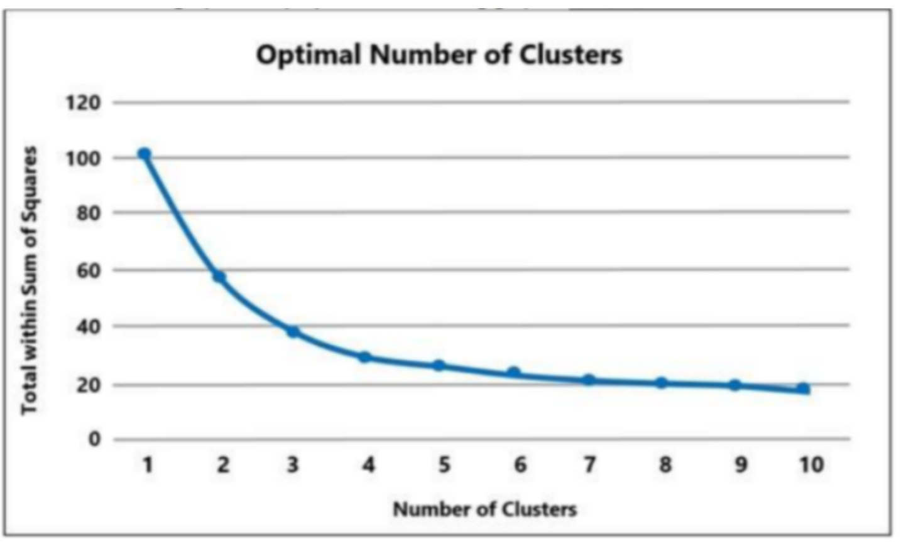
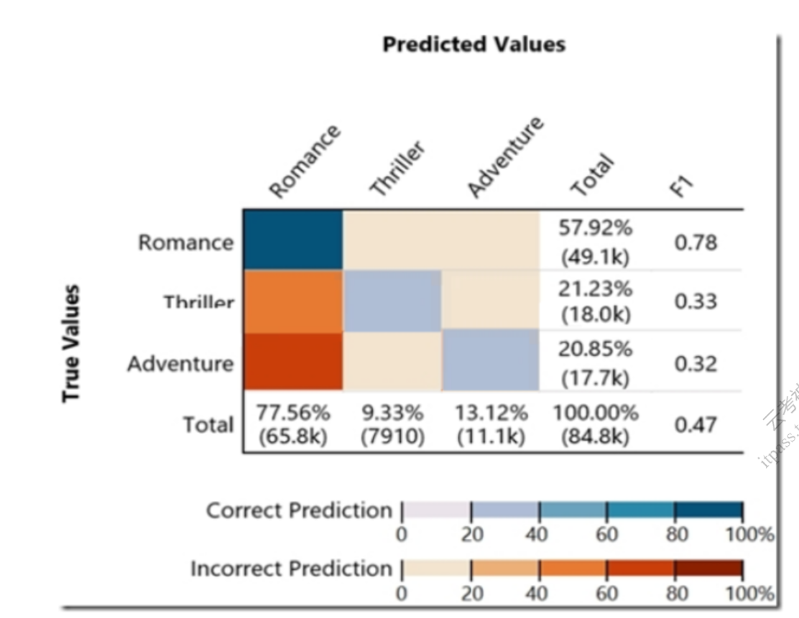

# AWS MLS 131-228

1. 一位数据科学家正在开发一个二进制分类器，以预测一个专利是否患有一系列测试结果中的特定疾病。该数据科学家拥有从人口中随机抽取的400名病人的数据。该疾病出现在3%的人口中。该数据科学家应该采用哪种交叉验证策略？ A Data Scientist is developing a binary classier to predict whether a patent has a particular disease on a series of test results. The Data Scientist has data on 400 patients randomly selected from the population. The disease is seen in 3% of the population. Which cross-validation strategy should the Data Scientist adopt?
   - [ ] A. 一个k-fold交叉验证策略，`k=5`。 A k-fold cross-validation strategy with `k=5`.
   - [ ] B. 一个分层的k-折交叉验证策略，`k=5`。 A stratified k-fold cross-validation strategy with `k=5`.
   - [ ] C. 一个k-fold交叉验证策略，`k=5`和3次重复。 A k-fold cross-validation strategy with `k=5` and 3 repeats.
   - [ ] D. 训练和验证之间的80/20分层分割。 An 80/20 stratified split between training and validation.

   <details>
      <summary>Answer</summary>

      答案B。

   </details>

2. 一位机器赚钱专家准备了以下图表，显示k=[1...10]的k-means的结果。考虑到该图，对k的最佳选择的合理选择是什么？ A Machine earning Specialist prepared the following graph displaying the results of k-means for k=[1...10]: Considering the graph, what is a reasonable selection for the optimal choice of k?

   

   - [ ] A. 1.
   - [ ] B. 4.
   - [ ] C. 7.
   - [ ] D. 10.

   <details>
      <summary>Answer</summary>

      答案C。

   </details>

3. 一家媒体公司拥有非常大的无标签图像、文本、音频和视频片段档案，希望对其资产进行索引，以便研究团队能够快速识别相关内容。该公司希望使用机器学习来加速其内部研究人员的工作，因为他们的机器学习专业知识有限。哪种方法是为资产建立索引的最快捷的途径？ A media company with a very large archive of unlabeled images, text, audio and video footage wishes to index its assets to allow rapid identification of relevant content by the Research team. The company wants to use machine learning to accelerate the efforts of its in-house researchers who have limited machine learning expertise. Which is the FASTEST route to index the assets?
   - [ ] A. 使用Amazon Rekognition、Amazon Comprehend和Amazon Transcribe，将数据标记为不同的类别/类。 Use Amazon Rekognition, Amazon Comprehend, and Amazon Transcribe to tag data into distinct categories/classes.
   - [ ] B. 创建一套Amazon Mechanical Turk Human Intelligence Tasks来标记所有录像。 Create a set of Amazon Mechanical Turk Human Intelligence Tasks to label all footage.
   - [ ] C. 使用亚马逊Transcribe将语音转换为文本。使用Amazon SageMaker神经主题模型（NTM）和物体检测算法，将数据标记为不同的类别/类。 Use Amazon Transcribe to convert speech to text. Use the Amazon SageMaker Neural Topic Model (NTM) and Object Detection algorithms to tag data into distinct categories/classes.
   - [ ] D. 使用AWS深度学习AMI和亚马逊EC2 GPU实例，为音频转录和主题建模创建自定义模型，并使用对象检测将数据标记为不同的类别/类。 Use the AWS Deep Learning AMI and Amazon EC2 GPU instances to create custom models for audio transcription and topic modeling, and use object detection to tag data into distinct categories/classes.

   <details>
      <summary>Answer</summary>

      答案A。

   </details>

4. 一家公司正在使用亚马逊机器学习作为一个医疗软件应用的一部分。该应用将根据其他各种临床测试来预测病人最可能的血型，这些测试在血型知识不可用时是可用的。对于这个问题，合适的模型选择和属性组合是什么？ A company is using Amazon Machine Learning as part of a medical software application. The application will predict the most likely blood type for a patient based on a variety of other clinical tests that are available when blood type knowledge is unavailable. What is the appropriate model choice and are attribute combination for this problem?
   - [ ] A. 具有分类目标属性的多类分类模型。 Multi-class classification model with a categorical target attribute.
   - [ ] B. 带有数字目标属性的回归模型。 Regression model with a numeric target attribute.
   - [ ] C. 具有分类目标属性的二元分类。 Binary Classification with a categorical target attribute.
   - [ ] D. 具有多类目标属性的K-近邻模型。 K-nearest Neighbors model with a multi-class target attribute.

   <details>
      <summary>Answer</summary>

      答案A。

   </details>

5. 一家数字报纸拥有大量的文章和人工撰写的相关文章摘要。这些摘要被用作在线发布的每篇文章的标题，报纸的编辑们希望找到一种方法来自动生成这些摘要。一个机器学习专家需要应用机器学习来自动生成摘要的过程。哪种解决方案可以满足这一需求？ A digital newspaper owns a large collection of articles and human-written associated article summaries. The summaries are used as headers for each article posted online, and the newspaper editors would like to find a way to produce the summaries automatically. A Machine Learning Specialist needs to apply machine learning to automate the summary-generation process. Which solution addresses this need?
   - [ ] A. 在格式化为词包的原始文章序列上应用一个神经主题模型。 Apply a neural topic model on the raw article sequence formatted as a bag of words.
   - [ ] B. 通过文章词的平均字2维嵌入，将文章投射到一个低维的、紧凑的表示。 Project articles to a low-dimensional, compact representation by average word2vec embeddings of article words.
   - [ ] C. 将文章词的样本缩小到所需的摘要大小，词的放弃概率与词的术语频率-反文档频率（TF-IDF）相反。 Down sample article words to a desired summary size with the word dropout probability inverse to the word term frequency-inverse document frequency (TF-IDF).
   - [ ] D. 在编码器-解码器框架下应用seg2seg递归神经网络（RNNs）。 Apply seg2seg recurrent neural networks (RNNs) under the encoder-decoder framework.

   <details>
      <summary>Answer</summary>

      答案C。

   </details>

6. 一个机器学习模型在实验过程中表现良好，但当放在生产环境中时，立即就无法普及了。机器学习专家应该怎么做来解决这个问题？ A machine learning model performed well during experiments, but immediately failed to generalize when placed in a production environment. What should a Machine Learning Specialist do to address this issue?
   - [ ] A. 应用降维 Apply dimensionality reduction
   - [ ] B. 增加额外的特征 Add additional features
   - [ ] C. 增加正则化 Add regularization
   - [ ] D. 修改学习率 Modify the learning rate

    <details>
      <summary>Answer</summary>

      答案C。

   </details>

7. 一位机器学习专家正在决定为一个分类问题建立一个天真贝叶斯模型还是一个完全贝叶斯网络。该专家计算了每个特征之间的皮尔逊相关系数，发现它们的绝对值在0.1到0.95之间。在这种情况下，哪个模型能描述基础数据？ A Machine Learning Specialist is deciding between building a naive Bayesian model or a full Bayesian network for a classification problem. The Specialist computes the Pearson correlation coefficients between each feature and finds that their absolute values range between 0.1 to 0.95. Which model describes the underlying data in this situation?
   - [ ] A. 一个天真贝叶斯模型，因为这些特征都是有条件独立的。 A naive Bayesian model, since the features are all conditionally independent.
   - [ ] B. 一个全贝叶斯网络，因为特征都是有条件独立的。 A full Bayesian network, since the features are all conditionally independent.
   - [ ] C. 一个天真贝叶斯模型，因为一些特征在统计上是独立的。 A naive Bayesian model, since some of the features are statistically dependent.
   - [ ] D. 一个完整的贝叶斯网络，因为有些特征在统计上是依赖的。 A full Bayesian network, since some of the features are statistically dependent.

    <details>
      <summary>Answer</summary>

      答案C。

   </details>

8. 一位数据科学家正在建立一个模型，使用100个连续数字特征的数据集来预测客户的流失。营销团队没有提供任何关于哪些特征与客户流失预测相关的见解。市场营销团队希望解释该模型并看到相关特征对模型结果的直接影响。在训练逻辑回归模型时，数据科学家观察到训练和验证集的准确性之间存在很大的差距。数据科学家可以使用哪些方法来改善模型的性能并满足市场团队的需求？(选择两个) A Data Scientist is building a model to predict customer churn using a dataset of 100 continuous numerical features. The Marketing team has not provided any insight about which features are relevant for churn prediction. The Marketing team wants to interpret the model and see the direct impact of relevant features on the model outcome. While training a logistic regression model, the Data Scientist observes that there is a wide gap between the training and validation set accuracy. Which methods can the Data Scientist use to improve the model performance and satisfy the Marketing team’s needs? (Choose two)
   - [ ] A. 在分类器中加入L1正则化 Add L1 regularization to the classifier
   - [ ] B. 向数据集添加特征 Add features to the dataset
   - [ ] C. 进行递归特征消除 Perform recursive feature elimination
   - [ ] D. 执行t分布式随机邻居嵌入（t-SNE） Perform t-distributed stochastic neighbor embedding(t-SNE)
   - [ ] E. 执行线性判别分析 Perform linear discriminant analysis

   <details>
      <summary>Answer</summary>

      - [x] A. 正确。L1正则化=特征选择/降维，解决过拟合问题，解释很容易，x和y之间有直接关系。
      - [ ] B: 错。更多的特征，过拟合情况会更严重。
      - [x] C. 正确。递归特征消除=特征选择/降维，解决过拟合问题，解释容易，x和y之间有直接关系。
      - [ ] D. 进行t分布的随机邻居嵌入（t-SNE）=亚马逊最喜欢的降维技术，经常出现在问题中。然而，与PCA一样，可解释性较差。你将无法看到相关特征对模型结果的直接影响。
      - [ ] E. 错了。如果你有两个以上的类，那么线性判别分析是首选的线性分类技术。

   </details>

9. 一位机器学习专家想为一个终端自动扩展配置确定适当的`SageMakerVariantInvocationsPerInstance`设置。该专家在单个实例上进行了负载测试，并确定在不降低服务的情况下，每秒峰值请求（RPS）约为20 RPS。由于这是第一次部署，专家打算将调用安全系数设置为0.5。根据所述参数，并考虑到每个实例的调用设置是以每分钟为基础来衡量的，专家应该将 `SageMakerVariantInvocationsPerInstance`设置为多少？ A Machine Learning Specialist wants to determine the appropriate `SageMakerVariantInvocationsPerInstance` setting for an endpoint automatic scaling configuration. The Specialist has performed a load test on a single instance and determined that peak requests per second (RPS) without service degradation is about 20 RPS. As this is the first deployment, the Specialist intends to set the invocation safety factor to 0.5. Based on the stated parameters and given that the invocations per instance setting is measured on a per-minute basis, what should the Specialist set as the `SageMakerVariantInvocationsPerInstance` setting?
   - [ ] A. 10
   - [ ] B. 30
   - [ ] C. 600
   - [ ] D. 2400

   <details>
      <summary>Answer</summary>

      答案C。

   </details>

10. 一家公司使用一个长短期记忆（STM）模型来评估某个能源部门的风险因素。该模型审查多页文本文件，分析文本的每一句话，并将其归类为潜在风险或无风险。尽管数据科学家已经试验了许多不同的网络结构，并调整了相应的超参数，但该模型的表现并不理想 哪种方法能提供最大的性能提升？ A company uses a long short-term memory (STM) model to evaluate the risk factors of a particular energy sector. The model reviews multi-page text documents to analyze each sentence of the text and categorize it as either a potential risk or no risk. The model is not performing well, even though the Data Scientist has experimented with many different network structures and tuned the corresponding hyperparameters Which approach will provide the MAXIMUM performance boost?
    - [ ] A. 通过术语频率-反文档频率（TF-IDF）向量来初始化单词，该向量在与能源部门相关的大量新闻文章上进行了预训练。 Initialize the words by term frequency-inverse document frequency (TF-IDF) vectors pretrained on a large collection of news articles related to the energy sector.
    - [ ] B. 使用门控递归单元（GRUS）而不是LSTM，并运行训练过程直到验证损失停止下降。 Use gated recurrent units (GRUS) instead of LSTM and run the training process until the validation loss stops decreasing.
    - [ ] C. 降低学习率，运行训练过程，直到训练损失停止下降。 Reduce the learning rate and run the training process until the training loss stops decreasing.
    - [ ] D. 通过在与能源部门相关的大量新闻文章上预训练的word2vec嵌入来初始化单词。 Initialize the words by word2vec embeddings pretrained on a large collection of news articles related to the energy sector.

    <details>
       <summary>Answer</summary>

       答案D。

    </details>

11. 一个机器学习专家需要移动和转换数据，为训练做准备。有些数据需要在近乎实时的情况下处理，其他数据可以每小时移动一次。有现有的Amazon EMR MapReduce作业需要清理，并对数据进行特征工程处理。以下哪个服务可以为MapReduce工作提供数据？(选择两个) A Machine Learning Specialist needs to move and transform data in preparation for training. Some of the data needs to be processed in near-real time, and other data can be moved hourly. There are existing Amazon EMR MapReduce jobs to clean and feature engineering to perform on the data. Which of the following services can feed data to the MapReduce jobs? (Choose two)
    - [ ] A. AWS DMS
    - [ ] B. Amazon Kinesis
    - [ ] C. AWS Data Pipeline
    - [ ] D. Amazon Athena
    - [ ] E. Amazon ES

    <details>
       <summary>Answer</summary>

       答案BC。

    </details>

12. 一个机器学习专家之前在本地机器上用scikit-learn训练了一个逻辑回归模型，专家现在想把它部署到生产中，只用于推理，应该采取什么步骤来确保Amazon SageMaker可以托管本地训练的模型？ A Machine Learning Specialist previously trained a logistic regression model using scikit-learn on a local machine, and the Specialist now wants to deploy it to production for inference only What steps should be taken to ensure Amazon SageMaker can host a model that was trained locally?
    - [ ] A. 用推理代码建立Docker镜像，用注册处的主机名标记Docker镜像，并将其上传到Amazon ECR。 Build the Docker image with the inference code Tag the Docker image with the registry hostname and upload it to Amazon ECR。
    - [ ] B. 将训练好的模型序列化，使其格式被压缩以便部署。用注册处的主机名标记Docker镜像，并将其上传到Amazon S3。 Serialize the trained model so the format is compressed for deployment. Tag the Docker image with the registry hostname and upload it to Amazon S3.
    - [ ] C. 将训练好的模型序列化，使其格式被压缩以便部署。构建镜像并将其上传到Docker Hub。 Serialize the trained model so the format is compressed for deployment. Build the image and upload it to Docker Hub.
    - [ ] D. 用推理代码构建Docker镜像，配置Docker Hub并将镜像上传到Amazon ECR。 Build the Docker image with the inference code, Configure Docker Hub and upload the image to Amazon ECR.

    <details>
       <summary>Answer</summary>

       答案A。

    </details>

13. 一家卡车运输公司正在收集来自其全球卡车车队的实时图像数据。这些数据正在迅速增长，每天大约有100GB的新数据产生。该公司希望探索机器学习的使用案例，同时确保数据只被特定的IAM用户访问。哪种存储方案能提供最大的处理灵活性，并允许用IAM进行访问控制？ A trucking company is collecting live image data from its fleet of trucks across the globe. The data is growing rapidly and approximately 100 GB of new data is generated every day. The company wants to explore machine learning uses cases while ensuring the data is only accessible to specific IAM users. Which storage option provides the most processing flexibility and will allow access control with IAM?
    - [ ] A. 使用一个数据库，如Amazon DynamoDB，来存储图像，并设置IAM策略，以限制只有所需的IAM用户才能访问。 Use a database, such as Amazon DynamoDB, to store the images, and set the IAM policies to restrict access to only the desired IAM users.
    - [ ] B. 使用Amazon S3支持的数据湖来存储原始图像，并使用桶策略设置权限。 Use an Amazon S3-backed data lake to store the raw images and set up the permissions using bucket policies.
    - [ ] C. 用Hadoop分布式文件系统（HDFS）设置亚马逊EMR来存储文件，并使用IAM策略限制对EMR实例的访问。 Setup up Amazon EMR with Hadoop Distributed File System (HDFS) to store the files, and restrict access to the EMR instances using IAM policies.
    - [ ] D. 用AM策略配置亚马逊EFS，使数据对IAM用户拥有的亚马逊EC2实例可用。 Configure Amazon EFS with AM policies to make the data available to Amazon EC2 instances owned by the IAM users.

    <details>
       <summary>Answer</summary>

       答案C。

    </details>

14. 一位机器学习专家为一家信用卡处理公司工作，他需要近乎实时地预测哪些交易可能是欺诈性的，具体而言，该专家必须训练一个模型，以返回一个特定交易可能是欺诈性的概率。该专家应该如何构建这个商业问题？ A Machine Learning Specialist works for a credit card processing company and needs to predict which transactions may be fraudulent in near-real time Specifically, the Specialist must train a model that returns the probability that a given transaction may fraudulent. How should the Specialist frame this business problem?
    - [ ] A. 流式分类 Streaming classification
    - [ ] B. 二元分类 Binary classification
    - [ ] C. 多类别分类 Multi-category classification
    - [ ] D. 回归分类 Regression classification

    <details>
       <summary>Answer</summary>

       答案D。

    </details>

15. 一家房地产公司希望创建一个机器学习模型，用于预测基于历史数据集的住房价格。该数据集包含32个特征，哪个模型能满足业务要求？ A real estate company wants to create a machine learning model for predicting housing prices based on a historical dataset. The dataset contains 32 features Which model will meet the business requirement?
    - [ ] A. Logistic回归 Logistic regression
    - [ ] B. 线性回归 Linear regression
    - [ ] C. K-means
    - [ ] D. 主成分分析（PCA） Principal component analysis (PCA)

    <details>
       <summary>Answer</summary>

       答案B。

    </details>

16. Given the following confusion matrix for a movie classification model, what is the true class frequency for Romance and the predicted class frequency for Adventure?
    
    - [ ] A. The true class frequency for Romance is 77. 56% and the predicted class frequency for Adventure is 20.85%.
    - [ ] B. The true class frequency for Romance is 57.92% and the predicted class frequency for Adventure is 13. 12%.
    - [ ] C. The true class frequency for Romance is 0.78% and the predicted class frequency for Adventure is (0. 47-0.32).
    - [ ] D. The true class frequency for Romance is 77.56*0.78% and the predicted class frequency for Adventure is 20.85%*0.32.

    <details>
       <summary>Answer</summary>

       答案B。

    </details>

17. 一位机器学习专家希望将一个自定义算法引入Amazon SageMaker。该专家在Amazon SageMaker支持的Docker容器中实现该算法，该专家应该如何打包Docker容器，以便Amazon SageMaker能够正确启动训练？ A Machine Learning Specialist wants to bring a custom algorithm to Amazon SageMaker. The Specialist implements the algorithm in a Docker container supported by Amazon SageMaker How should the Specialist package the Docker container so that Amazon SageMaker can launch the training correctly?
    - [ ] A. 修改容器中的bash配置文件，添加一个bash命令来启动训练程序。 Modify the bash profile file in the container and add a bash command to start the training program.
    - [ ] B. 在Docker文件中使用CMD配置，将培训程序添加为镜像的CMD。 Use CMD config in the Docker file to add the training program as a CMD of the image.
    - [ ] C. 将训练程序配置为一个名为train的ENTRYPOINT。 Configure the training program as an ENTRYPOINT named train.
    - [ ] D. 将训练程序复制到`/opt/ml/train`目录。 Copy the training program to directory `/opt/ml/train`.

    <details>
       <summary>Answer</summary>

       答案B。

    </details>

18. 一家公司希望使用自动机器学习（ML）的随机切割森林（RCF）算法来可视化复杂的实词场景，例如检测季节性和趋势，排除外在因素，以及估算缺失值。从事这个项目的团队是非技术性的，他们正在寻找一个开箱即用的解决方案，需要最少的管理开销。哪种解决方案可以满足这些要求？ A company wants to use an automatic machine learning (ML) Random Cut Forest (RCF) algorithm to visualize complex real-word scenarios, such as detecting seasonality and trends, excluding outers, and imputing missing values. The team working on this project is non-technical and is looking for an out-of-the-box solution that will require the LEAST amount of management overhead. Which solution will meet these requirements?
    - [ ] A. 使用AWS Glue ML转换来创建一个预测，然后使用Amazon QuickSight来可视化数据。 Use an AWS Glue ML transform to create a forecast and then use Amazon QuickSight to visualize the data.
    - [ ] B. 使用亚马逊QuickSight来可视化数据，然后使用ML驱动的预测来预测关键业务指标。 Use Amazon QuickSight to visualize the data and then use ML-powered forecasting to forecast the key business metrics.
    - [ ] C. 使用来自AWS市场的预构建ML AMI来创建预测，然后使用Amazon QuickSight来可视化数据。 Use a pre-build ML AMI from the AWS Marketplace to create forecasts and then use Amazon QuickSight to visualize the data.
    - [ ] D. 使用计算字段来创建一个新的预测，然后使用Amazon QuickSight来可视化数据。 Use calculated fields to create a new forecast and then use Amazon QuickSight to visualize the data.

    <details>
       <summary>Answer</summary>

       答案B。

    </details>

19. 一家媒体公司希望对其Amazon S3数据湖中的数据进行机器学习和分析。有两个数据转换要求，将使公司内部的消费者能够创建报告。在预定的时间内，对300GB的不同文件格式的数据进行日常转换，并登陆到Amazon S3。对驻留在S3数据湖中的数千兆字节的归档数据进行一次性转换 哪种解决方案的组合能经济有效地满足该公司对数据转换的要求？(选择三个) A media company wants to perform machine learning and analytics on the data residing in its Amazon S3 data lake. There are two data transformation requirements that will enable the consumers within the company to create reports: Daily transformations of 300 GB of data with different file formats landing in Amazon S3 at a scheduled time. One-time transformations of terabytes of archived data residing in the S3 data lake Which combination of solutions cost-effectively meets the company’s requirements for transforming the data? (Choose three)
    - [ ] A. 对于每日传入的数据，使用AWS Glue爬虫来扫描和识别模式。 For daily incoming data, use AWS Glue crawlers to scan and identify the schema.
    - [ ] B. 对于每日传入的数据，使用Amazon Athena来扫描和识别模式。 For daily incoming data, use Amazon Athena to scan and identify the schema.
    - [ ] C. 对于每日传入的数据，使用Amazon Redshift来执行转换。 For daily incoming data, use Amazon Redshift to perform transformations.
    - [ ] D. 对于每日传入的数据，使用AWS Glue工作流与AWS Glue作业来执行转换。 For daily incoming data, use AWS Glue workflows with AWS Glue jobs to perform transformations.
    - [ ] E. 对于归档数据，使用亚马逊EMR来执行数据转换。 For archived data, use Amazon EMR to perform data transformations.
    - [ ] F. 对于存档的数据，使用Amazon SageMaker来执行数据转换。 For archived data, use Amazon SageMaker to perform data transformations.

    <details>
       <summary>Answer</summary>

       答案ADE。

    </details>

20. 一家公司正计划使用Amazon SageMaker做一个机器学习（ML）项目的概念验证，该项目使用公司3TB数据仓库中托管的现有企业内部数据子集。对于项目的一部分，AWS Direct Connect已经建立并测试。为了准备ML的数据，数据分析员正在进行数据整理。数据分析员希望执行多个步骤，包括映射、删除空字段、解决选择和 分割字段。该公司需要最快的解决方案来策划这个项目的数据 哪种解决方案符合这些要求？ A company is planning to do a proof of concept for a machine learning (ML) project using Amazon SageMaker with a subset of existing on-premises data hosted in the company’s 3 TB data warehouse. For part of the project AWS Direct Connect is established and tested. To prepare the data for ML, data analysts are performing data curation. The data analysts want to perform multiple steps, including mapping, dropping null fields, resolving choice, and splitting fields. The company needs the fastest solution to curate the data for this project Which solution meets these requirements?
    - [ ] A. 使用AWS DataSync将数据输入Amazon S3，并使用Apache Spark scrips在Amazon EMR集群中策划数据。将策划好的数据存储在Amazon S3中进行ML处理。 Ingest data into Amazon S3 using AWS DataSync and use Apache Spark scrips to curate the data in an Amazon EMR cluster. Store the curated data in Amazon S3 for ML processing.
    - [ ] B. 在企业内部创建自定义ETL作业来策划数据 使用AWS DMS将数据摄入Amazon S3进行ML处理。 Create custom ETL jobs on-premises to curate the data Use AWS DMS to ingest data into Amazon S3 for ML processing.
    - [ ] C. 使用AWS DMS将数据摄取到Amazon S3。使用AWS Glue来执行数据整理，并将数据存储在Amazon S3中进行ML处理。 Ingest data into Amazon S3 using AWS DMS. Use AWS Glue to perform data curation and store the data in Amazon S3 for ML processing.
    - [ ] D. 对数据存储进行全面备份，并使用AWS Snowball运送备份文件。将Snowball数据上传到Amazon S3，并使用AWS Batch安排数据整理工作，为ML准备数据。 Take a full backup of the data store and ship the backup files using AWS Snowball. Upload Snowball data into Amazon S3 and schedule data curation jobs using AWS Batch to prepare the data for ML.

    <details>
       <summary>Answer</summary>

       答案C: 原因是最快的机制多个步骤，包括映射，放弃空字段，解决选择，以及分割字段，Glue提供的DMS支持在S3中加载数据的子集。

    </details>

21. 一位机器学习专家被分配到一个欺诈检测团队，他必须调整一个XGBboost模型，该模型对测试数据的工作是适当的。但是，对于未知的数据，它不能像预期那样工作。现有的参数提供如下。该专家应该遵循哪些参数调整准则来避免过度拟合？ A Machine Learning Specialist is assigned to a Fraud Detection team and must tune an XGBboost model, which is working appropriately for test data. However, with unknown data, it is not working as expected. The existing parameters are provided as follows. Which parameter tuning guidelines should the Specialist follow to avoid overfitting?

    ```javascript
    param = {
       'eta': 0.05, // The training step for each interation
       'silent': 1, // Logging mode - quite
       'n_estimators': 2000,
       'max_depth': 30,
       'min_child weight': 3,
       'gamma': 0,
       'subsample': 0.8,
       'objective': 'multi: softprob', // Error evaluation for multiclass training
       'num_class': 201
    };
    num_round = 60; // The number of training iteration
    ```

    - [ ] A. 增加`max_depth`参数值。 Increase the `max_depth` parameter value.
    - [ ] B. 降低`max_depth`参数值。 Lower the `max_depth` parameter value.
    - [ ] C. 将目标更新为`binary：logistic`。 Update the objective to `binary: logistic`.
    - [ ] D. 降低`min_child_weight`的参数值。 Lower the `min_child_weight` parameter value.

    <details>
       <summary>Answer</summary>

       答案B。

    </details>

22. 一位数据科学家收到了一组保险记录，每条记录包括一个记录ID，200个类别中的最终结果，以及最终结果的日期。还提供了一些关于索赔内容的部分信息，但只针对200个类别中的几个。对于每个结果类别，有数百条记录分布在过去三年中。数据科学家希望提前几个月预测每个类别的索赔数量。提前几个月。应该使用哪种类型的机器学习模型？ A Data Scientist received a set of insurance records, each consisting of a record ID, the final outcome among 200 categories, and the date of the final outcome. Some partial information on claim contents is also provided, but only for a few of the 200 categories. For each outcome category, there are hundreds of records distributed over the past three years. The Data Scientist wants to predict how many claims to expect in each category from month to month a few months in advance. What type of machine learning model should be used?
    - [ ] A. 使用基于索赔内容的200个类别的监督学习，按月分类。 Classification month-to-month using supervised learning of the 200 categories based on claim contents.
    - [ ] B. 使用索赔ID和时间戳的强化学习，代理将识别每个类别中的索赔数量，以期望从月到月。 Reinforcement learning using claim IDs and timestamps where the agent will identify how many claims in each category to expect from month to month.
    - [ ] C. 使用索赔ID和时间戳进行预测，以确定每个类别中每个月会有多少索赔。 Forecasting using claim IDs and timestamps to identify how many claims in each category to expect from month to month.
    - [ ] D. 通过监督学习对提供部分索赔内容信息的类别进行分类，并使用索赔D和时间戳对所有其他类别进行预测。 Classification with supervised learning of the categories for which partial information on claim contents is provided, and forecasting using claim Ds and timestamps for all other categories.
  
    <details>
       <summary>Answer</summary>

       答案D。

    </details>

23. 一家通过提供云连接设备促进健康睡眠模式的公司目前在AWS上托管了一个睡眠跟踪应用程序。该应用从设备用户那里收集设备使用信息。公司的数据科学团队正在建立一个机器学习模型，以预测用户是否以及何时会停止使用公司的设备。这个模型的预测被一个下游应用使用，该应用确定了联系用户的最佳方法。数据科学团队正在建立多个版本的机器学习模型，根据公司的业务目标评估每个版本。为了衡量长期有效性，该团队希望长期平行运行多个版本的模型，并能够控制模型所提供的推断部分。哪种解决方案能以最小的努力满足这些要求？ A company that promotes healthy sleep patterns by providing cloud-connected deices currently hosts a sleep tracking application on AWS. The application collects device usage information from device users. The company Data Science team is building a machine learning model to predict if and when a user will stop utilizing the company’s devices. Predictions from this model are used by a downstream application that determines the best approach for contacting users. The Data Science team is building multiple versions of the machine learning model to evaluate each version against the company’s business goals. To measure long-term effectiveness, the team wants to run multiple versions of the model in parallel for long periods of time, with the ability to control the portion of inferences served by the models. Which solution satisfies these requirements with MINIMAL effort?
    - [ ] A. 在Amazon SageMaker中建立和托管多个模型。创建多个 Amazon SageMaker 端点，每个模型一个。在应用层以编程方式控制调用租用模型进行推理。 Build and host multiple models in Amazon SageMaker. Create multiple Amazon SageMaker endpoints, one for each model. Programmatically control invoking rent models for inference at the application layer.
    - [ ] B. 在 Amazon SageMaker 中构建和托管多个模型。创建一个具有多个生产变体的 Amazon SageMaker 端点配置。通过更新端点配置，以编程方式控制由多个模型提供的推理部分。 Build and host multiple models in Amazon SageMaker. Create an Amazon SageMaker endpoint configuration with multiple production variants. Programmatically control the portion of the inferences served by the multiple models by updating the endpoint configuration.
    - [ ] C. 在Amazon SageMaker Neo中构建和托管多个模型，以考虑到不同类型的医疗设备。根据医疗设备类型，以编程方式控制哪个模型被调用进行推理。 Build and host multiple models in Amazon SageMaker Neo to take into account different types of medical devices. Programmatically control which model is invoked for inference based on the medical device type.
    - [ ] D. 在Amazon SageMaker中建立并托管多个模型。创建一个访问多个模型的单一端点。使用Amazon SageMaker批处理转换来控制通过单一端点调用不同的模型。 Build and host multiple models in Amazon SageMaker. Create a single endpoint that accesses multiple models. Use Amazon SageMaker batch transform to control invoking the different models through the single endpoint.

    <details>
       <summary>Answer</summary>

       答案B

    </details>

24. 一家农业公司有兴趣使用机器学习来检测一块100英亩的草地上的特定类型的杂草。目前，该公司使用安装在拖拉机上的相机捕捉田地的多个图像，作为10个网格。该公司还拥有一个大型训练数据集，由阔叶和非阔叶坞等流行杂草类别的注释图像组成。该公司希望建立一个杂草检测模型，以检测特定类型的杂草和每种类型在田间的位置。一旦模型准备就绪，它将被托管在亚马逊SageMaker终端。该模型将使用摄像机拍摄的图像进行实时推理。机器学习专家应该采取哪种方法来获得准确的预测？ An agricultural company is interested in using machine learning to detect specific types of weeds in a 100-acre grassland field. Currently, the company uses tractor-mounted cameras to capture multiple images of the field as 10 grids. The company also has a large training dataset that consists of annotated images of popular weed classes like broadleaf and non-broadleaf docks The company wants to build a weed detection model that will detect specific types of weeds and the location of each type within the field. Once the model is ready, it will be hosted in Amazon SageMaker endpoints. The model will perform real-time inferencing using the images captured by the cameras. Which approach should a Machine Learning Specialist take to obtain accurate predictions?
    - [ ] A. 准备好RecordIO格式的图像，并将其上传到Amazon S3。使用Amazon SageMaker来训练、测试和验证模型，使用图像分类算法将图像归类到各种杂草类别。 Prepare the images in RecordIO format and upload them to Amazon S3. Use Amazon SageMaker to train, test, and validate the model using an image classification algorithm to categorize images into various weed classes.
    - [ ] B. 准备好Apache Parquet格式的图像，并将其上传到Amazon S3。使用Amazon SageMaker训练测试和验证模型，使用对象检测的单次多本检测器（SSD）算法。 Prepare the images in Apache Parquet format and upload them to Amazon S3. Use Amazon SageMaker to train test and validate the model using an object-detection single-shot multibook detector (SSD) algorithm.
    - [ ] C. 准备好RecordIO格式的图像，并将其上传到Amazon S3。使用Amazon SageMaker来训练、测试和验证使用物体检测单张多本检测器（SSD）算法的模型。 Prepare the images in RecordIO format and upload them to Amazon S3. Use Amazon SageMaker to train, test, and validate the model using an object-detection singe-shot multibook detector (SSD) algorithm.
    - [ ] D. 准备好Apache Parquet格式的图像，并上传到Amazon S3。使用Amazon SageMaker训练、测试和验证模型，使用图像分类算法将图像归类为各种杂草类。 Prepare the images in Apache Parquet format and upload them to Amazon S3. Use Amazon SageMaker to train, test, and validate the model using an image classification algorithm to categorize images into various weed classes.

    <details>
       <summary>Answer</summary>

       答案A。

    </details>

25. 一位机器学习专家正在为Amazon SageMaker设计一个可扩展的数据存储解决方案。有一个现有的基于TensorFlow的模型被实现为`train.py`脚本，它依赖于目前存储为TFRecords的静态训练数据。哪种向Amazon SageMaker提供训练数据的方法可以满足业务需求，而且开发开销最小？ A Machine Learning Specialist is designing a scalable data storage solution for Amazon SageMaker. There is an existing TensorFlow-based model implemented as a `train.py` script that relies on static training data that is currently stored as TFRecords. Which method of providing training data to Amazon SageMaker would meet the business requirements with the LEAST development overhead?
    - [ ] A. 使用Amazon SageMaker脚本模式，并使用`train.py`，不改变。将Amazon SageMaker的训练调用指向数据的本地路径，而不对训练数据进行重新格式化。 Use Amazon SageMaker script mode and use `train.py` unchanged. Point the Amazon SageMaker training invocation to the local path of the data without reformatting the training data.
    - [ ] B. 使用Amazon SageMaker脚本模式，使用`train.py`，不做任何改变。将TFRecords数据放入Amazon S3桶。将Amazon SageMaker的训练调用指向S3桶，而不对训练数据进行重新格式化。 Use Amazon SageMaker script mode and use `train.py` unchanged. Put the TFRecords data into an Amazon S3 bucket. Point the Amazon SageMaker training invocation to the S3 bucket without reformatting the training data.
    - [ ] C. 重写`train.py`脚本，增加一个部分，将TFRecords转换为protobuf，并摄入protobuf数据而不是TFRecords。 Rewrite the `train.py` script to add a section that converts TFRecords to protobuf and ingests the protobuf data instead of TFRecords.
    - [ ] D. 将数据准备成Amazon SageMaker接受的格式。使用AWS Glue或AWS Lambda来重新格式化并将数据存储在Amazon S3桶中。 Prepare the data in the format accepted by Amazon SageMaker. Use AWS Glue or AWS Lambda to reformat and store the data in an Amazon S3 bucket.

    <details>
       <summary>Answer</summary>

       答案B。

    </details>

26. 一个产品目录的主编希望研发团队建立一个机器学习系统，用来检测图像集合中的个人是否穿着该公司的零售品牌。该团队有一组训练数据。研究人员应该使用哪种机器学习算法来最好地满足他们的要求？ The chief editor for a product catalog wants the research and development team to build a machine learning system that can be used to detect whether or not individuals in a collection of images are wearing the company retail brand. The team has a set of training data. Which machine learning algorithm should the researchers use that BEST meets their requirements?
    - [ ] A. Latent Dirichlet Allocation (LDA)
    - [ ] B. Recurrent neural network (RNN)
    - [ ] C. K-means
    - [ ] D. Convolutional neural network (CNN)

    <details>
       <summary>Answer</summary>

       答案D。

    </details>

27. 一家零售公司正在使用Amazon Personalize在营销活动中为其客户提供个性化的产品推荐。该公司在部署新的解决方案版本后，立即看到向现有客户推荐的商品的销售量大幅增加，但这些销售量在部署后不久就减少了。只有营销活动之前的历史数据可用于训练。一个数据科学家应该如何调整解决方案？ A retail company is using Amazon Personalize to provide personalized product recommendations for its customers during a marketing campaign. The company sees a significant increase in sales of recommended items to existing customers immediately after deploying a new solution version, but these sales decrease a short time after deployment. Only historical data from before the marketing campaign is available for training. How should a data scientist adjust the solution?
    - [ ] A. 使用Amazon Personalize中的事件追踪器，以包括实时的用户互动。 Use the event tracker in Amazon Personalize to include real-time user interactions.
    - [ ] B. 添加用户元数据并使用Amazon Personalize中的HRNN-metadata配方。 Add user metadata and use the HRNN-metadata recipe in Amazon Personalize.
    - [ ] C. 使用Amazon SageMaker中的内置因数机（FM）算法实现一个新的解决方案。 Implement a new solution using the built-in factorization machines (FM) algorithm in Amazon SageMaker.
    - [ ] D. 在Amazon Personalize中向交互数据集添加事件类型和事件值字段。Add event type and event value fields to the interactions dataset in Amazon Personalize.

    <details>
       <summary>Answer</summary>

       答案D。

    </details>

28. 一位机器学习（ML）专家希望保护对Amazon SageMaker服务API的调用。该专家已将Amazon PC配置为Amazon SageMaker服务API的PC接口端点，并试图确保来自特定实例集和IAM用户的流量。该PC被配置为一个单一的公共子网。ML专家应该采取哪种步骤组合来保护流量？(选择两个) A machine learning (ML) specialist wants to secure calls to the Amazon SageMaker Service API. The specialist has configured Amazon PC with a PC interface endpoint for the Amazon SageMaker Service API and is attempting to secure traffic from specific sets of instances and IAM users. The PC is configured with a single public subnet. Which combination of steps should the ML specialist take to secure the traffic? (Choose two)
    - [ ] A. 添加一个VPC端点策略，允许访问IAM用户。 Add a VPC endpoint policy to allow access to the IAM users.
    - [ ] B. 修改用户的IAM策略，只允许访问Amazon SageMaker服务API调用。 Modify the users' IAM policy to allow access to Amazon SageMaker Service API calls only.
    - [ ] C. 修改端点网络接口上的安全组，限制对实例的访问。 Modify the security group on the endpoint network interface to restrict access to the instances.
    - [ ] D. 修改端点网络接口上的ACI，限制对实例的访问。 Modify the ACI on the endpoint network interface to restrict access to the instances.
    - [ ] E. 在VPC中添加一个SageMaker Runtime VPC端点接口。 Add a SageMaker Runtime VPC endpoint interface to the VPC.

    <details>
       <summary>Answer</summary>

       答案AC: [ref](https://aws.amazon.com/cn/blogs/machine-learning/private-package-installation-in-amazon-sagemaker-running-in-internet-free-mode/)。

    </details>

29. 一家电子商务公司希望为其网络应用程序推出一个新的基于云的产品推荐功能。由于数据本地化的规定，任何敏感数据都不能离开其内部的数据中心，而且产品推荐模型必须只使用非敏感数据进行训练和测试。到云端的数据传输必须使用IPsec。网络应用程序被托管在一个包含所有数据的PostgreSQL数据库上。数据。该公司希望每天将数据安全地上传到Amazon S3，以便进行模型再训练。一个机器学习专家应该如何满足这些要求？ An e commerce company wants to launch a new cloud-based product recommendation feature for its web application. Due to data localization regulations, any sensitive data must not leave its on-premises data center, and the product recommendation model must be trained and tested using non-sensitive data only. Data transfer to the cloud must use IPsec. The web application is hosted on premises with a PostgreSQL database that contains all the data. The company wants the data to be uploaded securely to Amazon S3 each day for model retraining. How should a machine learning specialist meet these requirements?
    - [ ] A. 创建一个AWS Glue作业，连接到PostgreSQL数据库实例。通过AWS站点到站点的VPN连接将没有敏感数据的表直接输入到Amazon S3。 Create an AWS Glue job to connect to the PostgreSQL DB instance. Ingest tables without sensitive data through an AWS Site-to-site VPN connection directly into Amazon S3.
    - [ ] B. 创建一个AWS Glue工作来连接到PostgreSQL数据库实例。通过AWS站点到站点的VPN连接将所有的数据输入到Amazon S3，同时使用PySpark作业删除敏感数据。 Create an AWS Glue job to connect to the PostgreSQL DB instance. Ingest all data through an AWS Site-to-site VPN connection into Amazon S3 while removing sensitive data using a PySpark job.
    - [ ] C. 使用AWS数据库迁移服务（AWS DMS）与表映射，通过SSL连接选择没有敏感数据的PostgreSQL表。将数据直接复制到Amazon S3。 Use AWS Database Migration Service (AWS DMS) with table mapping to select PostgreSQL tables with no sensitive data through an SSL connection. Replicate data directly into Amazon S3.
    - [ ] D. 使用PostgreSQL逻辑复制，通过AWS直接连接与VPN连接，将所有数据复制到亚马逊EC2的PostgreSQL。使用AWS Glue将数据从Amazon EC2转移到Amazon S3。 Use PostgreSQL logical replication to replicate all data to PostgreSQL in Amazon EC2 through AWS Direct Connect with a VPN connection. Use AWS Glue to move data from Amazon EC2 to Amazon S3.

    <details>
       <summary>Answer</summary>

       答案C。

    </details>

30. 一位机器学习专家正在运行Amazon SageMaker端点，使用P3实例上的内置对象检测算法，在公司的生产应用中进行实时预测。在评估模型的资源利用率时，该专家注意到模型只使用了GPU的一小部分。哪种架构的变化可以确保配置的资源得到有效利用？ A machine learning specialist is running an Amazon SageMaker endpoint using the built-in object detection algorithm on a P3 instance for real-time predictions in a company’s production application. When evaluating the model’s resource utilization, the specialist notices that the model is using only a fraction of the GPU. Which architecture changes would ensure that provisioned resources are being utilized effectively?
    - [ ] A. 将模型重新部署为M5实例上的一个批处理转换作业。 Redeploy the model as a batch transform job on an M5 instance.
    - [ ] B. 在M5实例上重新部署该模型。将Amazon Elastic Inference附加到该实例上。 Redeploy the model on an M5 instance. Attach Amazon Elastic Inference to the instance.
    - [ ] C. 在P3dn实例上重新部署该模型。 Redeploy the model on a P3dn instance.
    - [ ] D. 使用P3实例将模型部署到Amazon Elastic Container Service（Amazon ECS）集群上。 Deploy the model onto an Amazon Elastic Container Service (Amazon ECS) cluster using a P3 instance.

    <details>
       <summary>Answer</summary>

       答案B。

    </details>

31. 一家物流公司需要一个预测模型来预测下个月10个仓库中单一物品的库存需求。一位机器学习专家使用Amazon Forecast从3年的月度数据中开发了一个预测模型。没有缺失的数据。该专家选择DeepAR算法来训练一个预测器。该预测器的平均绝对百分比误差（MAPE）比目前人类预测者产生的MAPE大得多。对`CreatePredictor` API调用的哪些修改可以改善MAPE？(选择两个) A logistics company needs a forecast model to predict next month‘’s inventory requirements for a single item in 10 warehouses. A machine learning specialist uses Amazon Forecast to develop a forecast model from 3 years of monthly data. There is no missing data. The specialist selects the DeepAR algorithm to train a predictor. The predictor means absolute percentage error (MAPE) is much larger than the MAPE produced by the current human forecasters. Which changes to the `CreatePredictor` API call could improve the MAPE? (Choose two)
    - [ ] A. Set `PerformAutoML` to true.
    - [ ] B. Set `ForecastHorizon` to 4.
    - [ ] C. Set `ForecastFrequency` to W for weekly.
    - [ ] D. Set `PerformHPO` to true.
    - [ ] E. Set `FeaturizationMethodName` to filling.
  
    <details>
       <summary>Answer</summary>

       答案CD：[ref](https://docs.aws.amazon.com/forecast/latest/dg/forecast.dg.pdf)

    </details>

32. 一位数据科学家希望使用Amazon Forecast为一家零售公司建立一个库存需求预测模型。该公司提供了一个产品历史库存需求的数据集，作为`a.csv`文件存储在Amazon S3桶中。下表显示了该数据集的一个样本。数据科学家应该如何转换该数据？ A data scientist wants to use Amazon Forecast to build a forecasting model for inventory demand for a retail company. The company has provided a dataset of historic inventory demand for its products as `a.csv` file stored in an Amazon S3 bucket. The table below shows a sample of the dataset. How should the data scientist transform the data?

    |timestamp|item_id|demand|category|lead_time|
    |---------|-------|------|--------|---------|
    |2019-12-14|uni_000736|120|hardware|90|
    |2020-01-31|uni_003429|98|hardware|30|
    |2020-03-04|uni_000211|234|accessories|10|

    - [ ] A. 在AWS Glue中使用ETL作业，将数据集分成一个目标时间序列数据集和一个项目元数据集 将两个数据集`a.csv`文件上传到Amazon S3。 Use ETL jobs in AWS Glue to separate the dataset into a target time series dataset and an item metadata dataset Upload both datasets `a.csv` files to Amazon S3
    - [ ] B. 使用Amazon SageMaker中的Jupyter笔记本，将数据集分成一个相关的时间序列数据集和一个项目元数据集 将这两个数据集作为表格上传到Amazon Aurora中。 Use a Jupyter notebook in Amazon SageMaker to separate the dataset into a related time series dataset and an item metadata dataset Upload both datasets as tables in Amazon Aurora.
    - [ ] C. 使用AWS批处理作业将数据集分成一个目标时间序列数据集、一个相关时间序列数据集和一个项目元数据集 从本地机器直接上传到Forecast。 Use AWS Batch jobs to separate the dataset into a target time series dataset, a related time series dataset, and an item metadata dataset Upload them directly to Forecast from a local machine
    - [ ] D. 使用Amazon SageMaker中的Jupyter笔记本，将数据转化为优化的protobuf RecordIO格式 将此格式的数据集上传至Amazon S3。 Use a Jupyter notebook in Amazon SageMaker to transform the data into the optimized protobuf RecordIO format Upload the dataset in this format to Amazon S3.
  
    <details>
       <summary>Answer</summary>

       答案A：目标文件必须位于两个文件并且从S3载入。

    </details>

33. 一个数据科学家需要为一个公司的电子商务平台识别欺诈性的用户账户。该公司希望能够确定一个新创建的账户是否与之前已知的欺诈性用户有关。该数据科学家正在使用AWS Glue在摄取过程中清理该公司的应用程序日志。哪种策略可以让数据科学家识别欺诈性账户？ A data scientist needs to identify fraudulent user accounts for a company ecommerce platform. The company wants the ability to determine if a newly created account is associated with a previously known fraudulent user. The data scientist is using AWS Glue to cleanse the company’s application logs during ingestion. Which strategy will allow the data scientist to identify fraudulent accounts?
    - [ ] A. 执行内置的Find Duplicates Amazon Athena查询。 Execute the built-in Find Duplicates Amazon Athena query.
    - [ ] B. 在AWS Glue中创建一个FindMatches机器赚钱的转换。 Create a FindMatches machine earning transform in AWS Glue.
    - [ ] C. 创建一个AWS Glue爬行器来推断源数据中的重复账户。 Create an AWS Glue crawler to infer duplicate accounts in the source data.
    - [ ] D. 在AWS Glue数据目录中搜索重复的账户。 Search for duplicate accounts in the AWS Glue Data Catalog.
  
    <details>
       <summary>Answer</summary>

       答案B。

    </details>

34. 一位数据科学家通过使用Amazon SageMaker的内置seq2seq算法，用500.000个对齐的句子对开发了一个英语到日语的机器学习翻译模型。在用样本句子进行测试时，该数据科学家发现，对于短至5个字的例子，翻译质量是合理的。然而，如果句子长到100个字，质量就变得不可接受了。哪种行动可以解决这个问题？ A data scientist has developed a machine learning translation model for English to Japanese by using Amazon SageMaker’s built-in seq2seq algorithm with 500.000 aligned sentence pairs. While testing with sample sentences, the data scientist finds that the translation quality is reasonable for an example as short as five words. However, the quality becomes unacceptable if the sentence is 100 words long. Which action will resolve the problem?
    - [ ] A. 改变预处理方法，使用n-grams。 Change preprocessing to use n-grams.
    - [ ] B. 向循环神经网络（RNN）添加比最大句子字数更多的节点。 Add more nodes to the recurrent neural network (RNN) than the largest sentence's word count.
    - [ ] C. 调整与注意力机制有关的超参数。 Adjust hyperparameters related to the attention mechanism.
    - [ ] D. 选择一个不同的权重初始化类型。 Choose a different weight initialization type.

    <details>
       <summary>Answer</summary>

       答案B。

    </details>

35. 一位机器学习专家正在为主要关注安全的政府用户开发一个概念验证。该专家正在使用Amazon SageMaker来训练一个卷积神经网络（CNN）模型，用于照片分类器应用。该专家希望保护数据，使其不能被意外安装在训练容器上的恶意代码访问并传输到远程主机。哪种操作将提供最安全的保护？ A machine learning specialist is developing a proof of concept for government users whose primary concern is security. The specialist is using Amazon SageMaker to train a convolutional neural network (CNN) model for a photo classifier application. The specialist wants to protect the data so that it cannot be accessed and transferred to a remote host by malicious code accidentally installed on the training container. Which action will provide the MOST secure protection?
    - [ ] A. 从SageMaker执行角色中删除Amazon S3的访问权限。 Remove Amazon S3 access permissions from the SageMaker execution role.
    - [ ] B. 加密CNN模型的权重。 Encrypt the weights of the CNN model.
    - [ ] C. 加密训练和验证数据集。 Encrypt the training and validation dataset.
    - [ ] D. 启用训练工作的网络隔离。 Enable network isolation for training jobs.

    <details>
       <summary>Answer</summary>

       答案D。

    </details>

36. 一家医疗成像公司希望训练一个计算机视觉模型，以检测病人CT扫描中的关注区域。该公司有一大批未标记的CT扫描件，这些扫描件与每个病人都有联系，并存储在Amazon S3桶中。这些扫描片必须只有授权用户才能访问。一个机器学习工程师需要建立一个标签管道。该工程师应该采取哪一组步骤，以最小的努力建立标签管道？ A medical imaging company wants to train a computer vision model to detect areas of concern on patients CT scans. The company has a large collection of unlabeled CT scans that are linked to each patient and stored in an Amazon S3 bucket. The scans must be accessible to authorized users only. A machine learning engineer needs to build a labeling pipeline. Which set of steps should the engineer take to build the labeling pipeline with the LEAST effort?
    - [ ] A. 用IAM创建一个工作团队。在Amazon EC2上建立一个标签工具。通过使用亚马逊SQS来排队贴标。编写标签说明。 Create a workforce with IAM. Build a labeling tool on Amazon EC2. Queue mages for labeling by using Amazon SQS. Write the labeling Instructions.
    - [ ] B. 创建一个Amazon Mechanical Turk工作团队和清单文件。通过使用Amazon SageMaker Ground Truth中内置的mage分类任务类型创建一个标签工作。编写贴标说明。 Create an Amazon Mechanical Turk workforce and manifest file. Create a labeling job by using the built-in mage classification task type in Amazon SageMaker Ground Truth. Write the labeling instructions.
    - [ ] C. 创建一个私人劳动力和清单文件。通过使用Amazon SageMaker Ground Truth中内置的边界框任务类型来创建一个标签工作。编写标签说明。 Create a private workforce and manifest file. Create a labeling job by using the built-in bounding box task type in Amazon SageMaker Ground Truth. Write the labeling instructions.
    - [ ] D. 用Amazon Cognito创建一个工作团队。用AWS Amplify建立一个贴标网络应用。使用AWS Lambda建立一个标签工作流后端。编写标签说明。 Create a workforce with Amazon Cognito. Build a labeling web application with AWS Amplify. Build a labeling workflow backend using AWS Lambda. Write the labeling instructions.

    <details>
       <summary>Answer</summary>

       答案B。

    </details>

37. 一家公司正在使用Amazon Textract，每天从数千份扫描过的文字密集的法律文件中提取文本数据。该公司使用这些信息来自动处理贷款申请。一些文件未能通过商业验证，被退回给人类审查员，由他们调查错误。这种活动增加了处理贷款申请的时间。该公司应该做什么来减少贷款申请的处理时间？ A company is using Amazon Textract to extract textual data from thousands of scanned text-heavy legal documents daily. The company uses this information to process loan applications automatically. Some of the documents fail business validation and are returned to human reviewers, who investigate the errors. This activity increases the time to process the loan applications. What should the company do to reduce the processing time of loan applications?
    - [ ] A. 配置Amazon Textract，将低置信度的预测结果路由到Amazon SageMaker Ground Truth。在执行业务验证之前，对这些词进行人工审查。 Configure Amazon Textract to route low-confidence predictions to Amazon SageMaker Ground Truth. Perform a manual review on those words before performing a business validation.
    - [ ] B. 使用Amazon Textract的同步操作而不是异步操作。 Use an Amazon Textract synchronous operation instead of an asynchronous operation.
    - [ ] C. 配置Amazon Textract，将低置信度的预测结果路由到Amazon A2I。在执行业务验证之前，对这些词进行人工审查。 Configure Amazon Textract to route low-confidence predictions to Amazon A2I. Perform a manual review on those words before performing a business validation
    - [ ] D. 使用Amazon Rekognition的功能来检测图像中的文字，从扫描的图像中提取数据。使用这些信息来处理贷款申请。 Use Amazon Rekognition's feature to detect text in an image to extract the data from scanned images. Use this information to process the loan applications.

    <details>
       <summary>Answer</summary>

       答案C。

    </details>

38. 一家公司将来自网络广告点击的机器学习（ML）数据摄入到Amazon S3数据湖。通过使用Kinesis Producer Library（KLI），点击数据被添加到Amazon Kinesis数据流中。通过使用Amazon Kinesis Data Firehose交付流，将数据从数据流加载到S3数据湖。随着数据量的增加，一个ML专家注意到，摄入Amazon S3的数据速度是相对稳定的。同时，Kinesis数据流和Kinesis Data Firehose也有越来越多的积压数据需要被摄取。哪一个下一步最有可能提高Amazon S3的数据摄取率？ A company ingests machine learning (ML) data from web advertising clicks into an Amazon S3 data lake. Click data is added to an Amazon Kinesis data stream by using the Kinesis Producer Library (KLI). The data is loaded into the S3 data lake from the data stream by using an Amazon Kinesis Data Firehose delivery stream. As the data volume increases, an ML specialist notices that the rate of data ingested into Amazon S3 is relatively constant. There also is an increasing backlog of data for Kinesis Data Streams and Kinesis Data Firehose to ingest. Which next step is MOST likely to improve the data ingestion rate into Amazon S3?
    - [ ] A. 增加交付流写入的S3前缀的数量。 Increase the number of S3 prefixes for the delivery stream to write to.
    - [ ] B. 减少数据流的保留期。 Decrease the retention period for the data stream.
    - [ ] C. 增加数据流的分片数量。 Increase the number of shards for the data stream.
    - [ ] D. 使用Kinesis客户端库（KCL）添加更多的消费者。 Add more consumers using the Kinesis Client Library (KCL).

    <details>
       <summary>Answer</summary>

       答案C。

    </details>

39. 一位数据科学家必须在Amazon SageMaker中为一家在线零售公司建立一个定制的推荐模型。由于该公司产品的性质，客户每5-10年才购买4-5件产品。因此，该公司依赖于稳定的新客户流。当一个新客户注册时，公司会收集客户的喜好数据。下面是数据科学家可用的数据样本。对于这个用例，数据科学家应该如何将数据集分成训练集和测试集？ A data scientist must build a custom recommendation model in Amazon SageMaker for an online retail company. Due to the nature of the company’s products, customers buy only 4-5 products every 5-10 years. So, the company relies on a steady stream of new customers. When a new customer signs up, the company collects data on the customers preferences. Below is a sample of the data available to the data scientist. How should the data scientist split the dataset into a training and test set for this use case?

    |timestamp|user_id|product_id|preference_1|...|preference_10|
    |---------|-------|------|--------|---------|---|
    |2020-03-04|90|25|0|...|0.374|
    |2020-03-04|90|61|0|...|0.374|
    |2020-02-21|203|56|1|...|0.098|

    - [ ] A. 对所有的交互数据进行洗牌。将最后10%的交互数据分割出来作为测试集。 Shuffle all interaction data. Split off the last 10% of the interaction data for the test set.
    - [ ] B. 识别每个用户最近的10%的互动。将这些交互数据分割出来作为测试集。 Identify the most recent 10% of interactions for each user. Split off these interactions for the test set.
    - [ ] C. 识别具有最少交互数据的10%的用户。将这些用户的所有交互数据分割出来作为测试集。 Identify the 10% of users with the least interaction data. Split off all interaction data from these users for the test set.
    - [ ] D. 随机选择10%的用户。从这些用户中分离出所有的交互数据作为测试集。 Randomly select 10% of the users. Split off all interaction data from these users for the test set.

    <details>
       <summary>Answer</summary>

       答案D。

    </details>

40. 一家金融服务公司希望采用Amazon SageMaker作为其默认的数据科学环境。该公司的数据科学家在机密金融数据上运行机器学习（ML）模型。该公司担心数据的流出，希望ML工程师能保证环境的安全。ML工程师可以使用哪些机制来控制SageMaker的数据流出？(选择三个) A financial services company wants to adopt Amazon SageMaker as its default data science environment. The company’s data scientists run machine learning (ML) models on confidential financial data. The company is worried about data egress and wants an ML engineer to secure the environment. Which mechanisms can the ML engineer use to control data egress from SageMaker? (Choose three)
    - [ ] A. 通过使用由AWS PrivateLink提供的VPC接口端点连接到SageMaker。 Connect to SageMaker by using a VPC interface endpoint powered by AWS PrivateLink.
    - [ ] B. 使用SCP来限制对SageMaker的访问。   Use SCPs to restrict access to SageMaker.
    - [ ] C. 禁用SageMaker笔记本实例上的root访问。 Disable root access on the SageMaker notebook instances.
    - [ ] D. 为训练作业和模型启用网络隔离。 Enable network isolation for training jobs and models.
    - [ ] E. 将笔记本辞职的URL限制在公司使用的特定IP上。 Restrict notebook resigned URLs to specific IPs used by the company.
    - [ ] F. 在休息和传输中用加密保护数据。使用AWS密钥管理服务（AWS KMS）来管理加密密钥。 Protect data with encryption at rest and in transit. Use AWS Key Management Service (AWS KMS) to manage encryption keys.

    <details>
       <summary>Answer</summary>

       答案BDF。

    </details>

41. 一位数据科学家正在使用Amazon SageMaker笔记本实例，需要安全地访问存储在特定Amazon S3桶中的数据。该数据科学家应该如何完成这一任务？ A data scientist is using an Amazon SageMaker notebook instance and needs to securely access data stored in a specific Amazon S3 bucket. How should the data scientist accomplish this?
    - [ ] A. 添加一个S3桶策略，允许`GetObject`、`PutObject`和`ListBucket`权限到Amazon SageMaker笔记本ARN作为主控。 Add an S3 bucket policy allowing `GetObject`, `PutObject`, and `ListBucket` permissions to the Amazon Sage Maker notebook ARN as principal.
    - [ ] B. 用一个自定义的AWS密钥管理服务（AWS KMS）密钥对Bucket中的对象进行加密，只有笔记本所有者可以访问。 Encrypt the objects in the Bucket with a custom AWS Key Management Service (AWS KMS) key that only the notebook owner has access to.
    - [ ] C. 给与笔记本相关的IAM角色附加一个策略，允许对特定的S3桶进行`GetObject`、`PutObect`和`ListBucket`操作。Attach a policy to the IAM role associated with the notebook that allows `GetObject`, `PutObect`, and `ListBucket` operations to the specific S3 bucket.
    - [ ] D. 在生命周期配置中使用脚本，在实例上配置AWS CLI的访问密钥ID和秘密。 Use a script in a lifecycle configuration to configure the AWS CLI on the instance with an access key ID and secret.

    <details>
       <summary>Answer</summary>

       答案C。

    </details>

42. 一个客户有一个机器学习的工作流程，包括在Amazon S3上读-写-读的多个快速循环。客户需要在EMR上运行该工作流程，但担心后续周期的读取会错过对前几个周期的机器学习至关重要的新数据。客户应该如何完成这个任务？ A customer has a machine learning workflow that consists of multiple quick cycles of reads-writes-reads on Amazon S3. The customer needs to run the workflow on EMR but is concerned that the reads in subsequent cycles will miss new data critical to the machine learning from the prior cycles. How should the customer accomplish this?
    - [ ] A. 在配置EMR集群时，打开EMRFS一致视图。 Turn on EMRFS consistent view when configuring the EMR cluster.
    - [ ] B. 使用AWS数据管线来协调数据处理周期。 Use AWS Data Pipeline to orchestrate the data processing cycles.
    - [ ] C. 在`core-site.xml`文件中设置`hadoop.data.consistent = true`。 Set `hadoop.data.consistency = true` in the `core-site.xml` file.
    - [ ] D. 在`core-site.xml`文件中设置`hadoop.s3.consistent = true`。 Set `hadoop.s3.consistency = true` in the `core-site.xml` file.

    <details>
       <summary>Answer</summary>

       答案A。

    </details>

43. 一家公司正在将大量的非结构化纸质收据转换为图像。该公司希望建立一个基于Flag的自然语言处理（NLP）模型，以找到相关的实体，如日期、地点和注释，以及一些自定义的实体，如收据编号。该公司正在使用光学字符识别（OCR）来提取数据标签的文本。然而，文件的结构和格式各不相同，该公司在为每种文件类型设置人工工作流程方面面临挑战。此外，该公司使用小规模的样本训练了一个命名实体识别（NER）模型，用于自定义实体检测。这个模型的置信度很低，需要用一个大的数据集重新训练。哪种文本提取和实体检测的解决方案需要最少的努力？ A company is converting a large number of unstructured paper receipts into images. The company wants to create a model based on Flag for natural language processing (NLP) to find relevant entities such as date, location and notes, as well as some custom entities such as receipt numbers. The company is using optical character recognition (OCR) to extract text for data labeling. However, documents are in different structures and formats, and the company is facing challenges with setting up the manual workflows for each document type. Additionally, the company trained a named entity recognition (NER) model for custom entity detection using a small sample size. This model has a very low confidence score and will require retraining with a large dataset. Which solution for text extraction and entity detection will require the LEAST amount of effort?
    - [ ] A. 通过使用Amazon Textract从收据图像中提取文本。使用Amazon SageMaker Blazing Text算法来训练实体和自定义实体的文本。 Extract text from receipt images by using Amazon Textract. Use the Amazon SageMaker Blazing Text algorithm to train on the text for entities and custom entities.
    - [ ] B. 通过使用AWS市场上的深度学习OCR模型从收据图像中提取文本。使用NER深度学习模型来提取实体。 Extract text from receipt images by using a deep learning OCR model from the AWS Marketplace. Use the NER deep learning model to extract entities.
    - [ ] C. 通过使用Amazon Textract从收据图像中提取文本。使用Amazon Comprehend进行实体检测，并使用Amazon Comprehend自定义实体识别进行自定义实体检测。 Extract text from receipt images by using Amazon Textract. Use Amazon Comprehend for entity detection, and use Amazon Comprehend custom entity recognition for custom entity detection.
    - [ ] D. 通过使用AWS市场上的深度学习OCR模型从收据图像中提取文本。使用Amazon Comprehend进行实体检测，并使用Amazon Comprehend自定义实体识别进行自定义实体检测。 Extract text from receipt images by using a deep learning OCR model from the AWS Marketplace. Use Amazon Comprehend for entity detection, and use Amazon Comprehend custom entity recognition for custom entity detection.

    <details>
       <summary>Answer</summary>

       答案A。

    </details>

44. 一个管理员在Amazon EMR上部署Spark，用于两个不同的用例：机器学习算法和临时查询 Al数据将被存储在Amazon S3。将为每个用例部署两个单独的集群。Amazon S3上的数据量小于10GB。管理员应该如何使实例类型与集群的目的一致？ An administrator s deploying Spark on Amazon EMR for two distinct use cases: machine learning algorithms and ad-hoc querying Al data will be stored in Amazon S3. Two separate clusters for each use case will be deployed. The data volumes on Amazon S3 are less than 10 GB. How should the administrator align instance types with the clusters purpose?
    - [ ] A. 在C实例类型的机器学习和R实例类型的临时查询。 Machine Learning on C instance types and ad-hoc queries on R instance types.
    - [ ] B. 在R实例类型上进行机器学习，在G2实例类型上进行临时查询。 Machine Learning on R instance types and ad-hoc queries on G2 instance types.
    - [ ] C. 对T实例类型的机器学习和对M实例类型的临时查询。 Machine Learning on T instance types and ad-hoc queries on M instance types.
    - [ ] D. 对D实例类型的机器学习和对I实例类型的临时查询。 Machine Learning on D instance types and ad-hoc queries on I instance types.

    <details>
       <summary>Answer</summary>

       答案A。

    </details>

45. 一家全球金融公司正在使用机器学习来自动化其贷款审批流程。该公司拥有客户信息的数据集。该数据集包含一些分类字段，如客户所在城市和住房状况。该数据集还包括不同单位的财务字段，如账户余额为美元，月利息为美分。该公司的数据科学家正在使用梯度提升回归模型来推断每个客户的信用评分。该模型的训练精度为99%，测试精度为75%。数据科学家希望提高模型的测试准确率，哪一个过程可以最大限度地提高测试准确率？ A global financial company is using machine learning to automate its loan approval process. The company has dataset of customer information. The dataset contains some categorical fields, such as customer location by city and housing status. The dataset also includes financial fields in different units, such as account balances in Us dollars and monthly interest in US cents. The company’s data scientists are using a gradient boosting regression model to infer the credit score for each customer. The model has a training accuracy of 99% and a testing accuracy of 75%. The data scientists want to improve the model’s testing accuracy Which process will improve the testing accuracy the MOST?
    - [ ] A. 对数据集中的分类字段使用一次性编码器。对数据集中的财务字段进行标准化处理。对数据应用L1正则化。 Use a one-hot encoder for the categorical fields in the dataset. Perform standardization on the financial fields in the dataset. Apply L1 regularization to the data.
    - [ ] B. 对数据集中的分类字段使用标记化。对数据集中的财务字段进行分档。通过使用z-score删除数据中的离群值。 Use tokenization of the categorical fields in the dataset. Perform binning on the financial fields in the dataset. Remove the outliers in the data by using the z-score.
    - [ ] C. 对数据集中的分类字段使用一个标签编码器。对数据集中的金融字段进行L1正则化。对数据应用L2正则化。 Use a label encoder for the categorical fields in the dataset. Perform L1 Regularization on the financial fields in the dataset. Apply L2 regularization to the data.
    - [ ] D. 在数据集中的分类字段上使用对数转换。对数据集中的财务字段进行分档。使用归因法来填充数据集中的缺失值。 Use a logarithm transformation on the categorical fields in the dataset. Perform binning on the financial fields in the dataset. Use imputation to populate missing values in the dataset.

    <details>
       <summary>Answer</summary>

       答案B。

    </details>

46. 一家公司在俄勒冈州、北弗吉尼亚州、爱尔兰和悉尼AWS地区托管了一个电子商务网站组合。每个网站都保留了捕捉用户行为的日志文件。该公司建立了一个应用程序，在俄勒冈州用协作过滤法生成成批的产品推荐。之所以选择俄勒冈州，是因为旗舰网站托管在这里，并提供了最大的数据收集来训练机器学习模型。其他地区没有足够的历史数据来训练准确的机器学习模型。哪一组数据处理步骤可以改善每个地区的建议？ A company hosts a portfolio of e-commerce websites across the Oregon, N.Virginia, Ireland, and Sydney AWS region. Each site keeps log files that capture user behavior. The company has built an application that generates batches of product recommendations with collaborative filtering in Oregon. Oregon was selected because the flagship site is hosted here and provides the largest collection of data to train machine learning models against. The other regions do NOT have enough historic data to train accurate machine learning models. Which set of data processing steps improves recommendations for each region?
    - [ ] A. 使用俄勒冈州的电子商务应用程序，在其他每个地区写入复制的日志文件。 Use the e-commerce application in Oregon to write replica log files in each other region.
    - [ ] B. 使用Amazon S3桶复制来整合日志条目，并在俄勒冈州建立一个单一的模型。 Use Amazon S3 bucket replication to consolidate log entries and build a single model in Oregon.
    - [ ] C. 使用Kinesis作为网络日志的缓冲区，并将日志复制到邻近地区的Kinesis流中。 Use Kinesis as a buffer for web logs and replicate logs to the Kinesis stream of a neighboring region.
    - [ ] D. 使用云观察日志代理，将日志合并到一个云观察日志组。 Use the Cloud Watch Logs agent to consolidate logs into a single Cloud Watch Logs group.

    <details>
       <summary>Answer</summary>

       答案D。

    </details>

47. 一家公司正在建立一个机器学习（ML）模型，对植物的图片进行分类。一位ML专家使用Amazon SageMaker内置的图像分类算法训练了该模型。该模型使用SageMaker端点托管在`ml.m5.large`实例上，用于实时推理。当研究人员在现场使用时，推断的延迟大于可接受的范围。当多个研究人员在他们的设备上同时进行推理时，延迟会变得更糟。使用Amazon CloudWatch指标，ML专家注意到模型延迟指标显示出一个很高的值，是造成大部分响应延迟的原因。ML专家需要解决这个性能问题，以便研究人员在从他们的设备上进行推理时可以体验更少的延迟。该ML专家应该采取哪种措施来满足这一要求？ A company is building a machine learning (ML) model to classify mages of plants. An ML specialist has trained the model using the Amazon SageMaker built-in Image Classification algorithm. The model is hosted using a SageMaker endpoint on an `ml.m5.large` instance for real-time inference. When used by researchers in the field the inference has greater latency than is acceptable. The latency gets worse when multiple researchers perform inference at the same time on their devices. Using Amazon CloudWatch metrics, the ML specialist notices that the Model Latency metric shows a high value and is responsible for most of the response latency. The ML specialist needs to fix the performance issue so that researchers can experience less latency when performing inference from their devices. Which action should the ML specialist take to meet this requirement?
    - [ ] A. 将端点实例改为`ml t3'可爆发的实例，其vCPU数量与`ml.m5.xlarge'实例相同。 Change the endpoint instance to an `ml t3` burstable instance with the same vCPU number as the `ml.m5.xlarge` instance has.
    - [ ] B. 将Amazon Elastic Inference `ml.eia2.medium`加速器附加到端点实例。 Attach an Amazon Elastic Inference `ml.eia2.medium` accelerator to the endpoint instance.
    - [ ] C. 启用Amazon SageMaker Autopilot来自动调整模型的性能。 Enable Amazon SageMaker Autopilot to automatically tune performance of the model.
    - [ ] D. 改变端点实例以使用一个内存优化的ML实例。 Change the endpoint instance to use a memory optimized ML instance.

    <details>
       <summary>Answer</summary>

       答案B。

    </details>

48. 一家制造公司从在客户现场运行的机器上捕捉数据。目前，数以千计的机器每5分钟发送一次数据，预计在不久的将来会增加到数十万台机器。这些数据被记录下来，目的是为了在将来根据需要进行分析。什么是最简单的方法来存储这种大规模的流数据？ A manufacturing company captures data from machines running at customer sites. Currently, thousands of machines send data every 5 minutes, and this is expected to grow to hundreds of thousands of machines in the near future. The data is logged with the intent to be analyzed in the future as needed. What is the SIMPLEST method to store this streaming data at scale?
    - [ ] A. 创建一个Amazon Kinesis Firehouse交付流，将数据存储在Amazon S3中。 Create an Amazon Kinesis Firehouse delivery stream to store the data in Amazon S3
    - [ ] B. 在ELB后面创建一个亚马逊EC2服务器的自动扩展组，将数据写入亚马逊RDS中。 Create an Auto Scaling group of Amazon EC2 servers behind ELBs to write the data into Amazon RDS.
    - [ ] C. 创建一个亚马逊SQS队列，并让机器写到队列中。 Create an Amazon SQS queue, and have the machines write to the queue.
    - [ ] D. 在ELB后面创建一个Amazon EC2服务器群，将数据存储在Amazon EBS Cold HDD卷中。 Create an Amazon EC2 server farm behind an ELB to store the data in Amazon EBS Cold HDD volumes.

    <details>
       <summary>Answer</summary>

       答案A。

    </details>

49. 一家银行想推出一个低利率的信贷促销活动。该银行位于一个最近经历了经济困难的城镇。只有部分银行客户受到危机的影响，所以银行的信贷团队必须确定哪些客户是促销的目标。然而，信贷团队希望确保在做出决定时考虑到忠诚客户的全部信用记录。银行的数据科学团队开发了一个模型，对账户交易进行分类并了解信贷资格。数据科学团队使用XGBboost算法来训练这个模型。该团队使用7年的银行交易历史数据进行训练，并在几天内进行了超参数调整。该模型的准确性是足够的，但信贷团队正在努力准确解释为什么该模型拒绝向一些客户提供信贷。信贷团队几乎没有数据科学方面的技能。数据科学团队应该怎样做才能以最有效的方式解决这个问题？ A bank wants to launch a low-rate credit promotion. The bank is located in a town that recently experienced economic hardship. Only some of the bank’s customers were affected by the crisis, so the bank’s credit team must identify which customers to target with the promotion. However, the credit team wants to make sure that loyal customers full credit history is considered when the decision is made. The bank’s data science team developed a model that classifies account transactions and understands credit eligibility. The data science team used the XGBboost algorithm to train the model. The team used 7 years of bank transaction historical data for training and hyperparameter tuning over the course of several days. The accuracy of the model is sufficient, but the credit team is struggling to explain accurately why the model denies credit to some customers. The credit team has almost no skill in data science. What should the data science team do to address this issue in the MOST operationally efficient manner?
    - [ ] A. 使用Amazon SageMaker Studio来重建模型。创建一个笔记本，使用提升训练容器来执行模型训练。在端点上部署模型，启用Amazon SageMaker Model Monitor来存储推论。使用推论来创建 Shapley 值，以帮助解释模型行为。创建一个显示特征和Shapley Additive解释（SHAP）值的图表，向信贷团队解释特征如何影响模型结果。 Use Amazon SageMaker Studio to rebuild the model. Create a notebook that uses the boost training container to perform model training. Deploy the model at an endpoint Enable Amazon SageMaker Model Monitor to store inferences. Use the inferences to create Shapley values that help explain model behavior. Create a chart that shows features and Shapley Additive explanations (SHAP) values to explain to the credit team how the features affect the model outcomes.
    - [ ] B. 使用Amazon SageMaker Studio来重建模型。创建一个笔记本，使用XGBoost训练容器来执行模型训练。激活Amazon SageMaker Debugger，并配置它来计算和收集Shapley值。创建一个显示特征和Shapley Additive解释（SHAP）值的图表，向信贷团队解释特征如何影响模型结果。 Use Amazon SageMaker Studio to rebuild the model. Create a notebook that uses the XGBoost training container to perform model training. Activate Amazon SageMaker Debugger and configure it to calculate and collect Shapley value. Create a chart that shows features and Shapley Additive explanations (SHAP) values to explain to the credit team how the features affect the model outcomes.
    - [ ] C. 创建一个Amazon SageMaker笔记本实例。使用笔记本实例和XGBoost库来本地重新训练模型。使用`plot_imporance`（Python XGBoost接口中的方法）创建一个特征重要性图表。使用该图表向信贷团队解释特征如何影响模型的结果。 Create an Amazon SageMaker notebook instance. Use the notebook instance and the XGBoost library to locally retrain the model. Use the `plot_imporance` (method in the Python XGBoost interface) to create a feature importance chart. Use that chart to explain to the credit team how the features affect the model outcomes.
    - [ ] D. 使用Amazon SageMaker Studio来重建模型。创建一个笔记本，使用XGBoost训练容器来执行模型训练。在一个端点上部署该模型。使用Amazon SageMaker Processing对模型进行后期分析，并为信贷团队自动创建一个特征重要性解释图。 Use Amazon SageMaker Studio to rebuild the model. Create a notebook that uses the XGBoost training container to perform model training. Deploy the model at an endpoint. Use Amazon SageMaker Processing to post analyze the model and create a feature importance explainability chart automatically for the credit team.

    <details>
       <summary>Answer</summary>

       答案B。

    </details>

50. 你要创建一个亚马逊机器学习模型，根据历史降雨数据，预测一个地区会有多少英寸的降雨。你将使用什么类型的建模？ You to create an Amazon Machine Learning model to predict how many inches of rain will fall in an area based on the historical rainfall data. What type of modeling will you use?
    - [ ] A. 分类法 Categorial
    - [ ] B. 回归 Regression
    - [ ] C. 无监督的 Unsupervised
    - [ ] D. 二进制 Binary

    <details>
       <summary>Answer</summary>

       答案B: 回归会提供范围数据。

    </details>

51. 一位机器学习（ML）专家必须为一家金融服务公司开发一个分类模型。一位领域专家提供了数据集，该数据集是表格式，有10,000行和1,020个特征。在探索性的数据分析中，专家发现没有缺失的值和一小部分的重复行。有200个特征对的相关分值大于0.9。每个特征的平均值与它的第50百分位数相似。该ML专家应该使用Amazon SageMaker的哪个特征工程策略？ A machine learning (ML) specialist must develop a classification model for a financial services company. A domain expert provides the dataset, which is tabular with 10,000 rows and 1,020 features. During exploratory data analysis, the specialist finds no missing values and a small percentage of duplicate row. There are correlation scores of >0.9 for 200 feature pairs. The mean value of each feature is similar to its 50th percentile. Which feature engineering strategy should the ML specialist use with Amazon SageMaker?
    - [ ] A. 使用主成分分析（PCA）算法应用降维。 Apply dimensionality reduction oy using the principal component analysis (PCA) algorithm.
    - [ ] B. 通过使用Jupyter笔记本丢弃相关分数低的特征。 Drop the features with low correlation scores by using a Jupyter notebook.
    - [ ] C. 通过使用随机切割森林（RCF）算法进行异常检测。 Apply anomaly detection by using the Random Cut Forest (RCF) algorithm.
    - [ ] D. 通过使用Jupyter笔记本，将具有高相关分数的特征串联起来。 Concatenate the features with high correlation scores by using a Jupyter notebook.
  
    <details>
       <summary>Answer</summary>

       答案A。

    </details>

52. 一位管理员决定使用亚马逊机器学习服务，将提到你公司的社交媒体帖子分为两类：需要回应的帖子和不需要回应的帖子。10.000个帖子的训练数据集包含每个帖子的细节，包括时间戳、作者和帖子的全文 你缺少训练所需的目标标签。哪两个选项可以创建有效的目标标签数据？（选择两项） An administrator decides to use the Amazon Machine Learning service to classify social media posts that mention your company into two categories: posts that require a response and posts that do not. The training dataset of 10.000 posts contains the details of each post, including the timestamp, author, and full text of the post You are missing the target labels that are required for training. Which two options will create valid target label data? (Choose TWO)
    - [ ] A. 要求社交媒体处理团队审查每一个帖子并提供标签。 Ask the social media handling team to review each post and provide the label.
    - [ ] B. 使用情感分析NLP库来确定一个帖子是否需要回应。 Use the sentiment analysis NLP library to determine whether a post requires a response.
    - [ ] C. 使用亚马逊Mechanical Turk网络服务，发布人类智能任务，要求Turk工人为帖子贴上标签。 Use the Amazon Mechanical Turk web service to publish Human Intelligence Tasks that ask Turk workers to label the posts.
    - [ ] D. 使用两个类别的先验概率分布，使用蒙特卡洛模拟来生成标签。 Using the a priori probability distribution of the two classes, use Monte-Carlo simulation to generate the labels.

    <details>
       <summary>Answer</summary>

       答案AC：你需要准确的数据来训练服务，并从未来的数据中获得准确的结果。B和D中描述的选项最终会使用不同机器学习模型的输出来训练MI模型，因此会大大增加可能的错误率。在你的训练集中有一个非常低的错误率（如果有的话！）是极其重要的，因此，经过人工验证或保证的标签是必不可少的。在编写移动应用程序时，你必须考虑到应用程序的安全性。

    </details>

53. 一位数据科学家正在使用Amazon SageMaker内置的Blazing Text算法来训练一个文本分类模型。数据集中有5个类别，A类有300个样本，B类有292个样本，C类有240个样本，D类有258个样本，E类有310个样本。训练完模型后，数据科学家为数据科学家洗牌的训练和测试集生成混淆矩阵。训练数据混淆矩阵。数据科学家可以从这些结果中得出什么结论？ A data scientist is training a text classification model by using the Amazon SageMaker built-in Blazing Text algorithm. There are 5 classes in the dataset, with 300 samples for category A, 292 samples for category B, 240 samples for category C, 258 samples for category D, and 310 samples for category E. The data scientist shuffles the data and splits off 10% for testing. After training the model, the data scientist generates confusion matrices for the data scientist shuffles training and test sets. Training data confusion matrix. What could the data scientist conclude from these results?

    | |A|B|C|D|E|Total|
    |-|-|-|-|-|-|-|
    |A|270|0|0|0|0|270|
    |B|1|260|0|0|2|263|
    |C|0|0|111|100|5|216|
    |D|4|3|132|92|1|232|
    |E|0|0|2|3|274|279|
    |Total|275|263|245|195|282|1260|

    | |A|B|C|D|E|Total|
    |-|-|-|-|-|-|-|
    |A|9|1|0|0|0|10|
    |B|2|25|0|2|0|29|
    |C|10|2|11|10|1|34|
    |D|1|0|12|14|0|27|
    |E|9|1|4|1|25|40|
    |Total|31|29|27|27|26|140|

    - [ ] A. C类和D类过于相似。 Classes C and D are too similar.
    - [ ] B. 数据集对于保持交叉验证来说太小了。 The dataset is too small for holdout cross-validation.
    - [ ] C. 数据分布是倾斜的。 The data distribution is skewed.
    - [ ] D. 模型对B类和E类过度拟合。 The model is overfitting for classes B and E.

    <details>
       <summary>Answer</summary>

       答案B。

    </details>

54. 一家公司正在使用亚马逊机器学习作为一个医疗软件应用的一部分。该应用将根据其他各种临床测试来预测一个专利最可能的血型，而这些测试在血型知识不可用时是可用的。对于这个问题，合适的模型选择和目标属性组合是什么？ A company is using Amazon Machine Learning as part of a medical software application. The application will predict the most likely blood type for a patent based on a variety of other clinical tests that are available when blood type knowledge is unavailable. What is the appropriate model choice and target attribute combination for this problem?
    - [ ] A. 具有分类目标属性的多类分类模型。 Multi-class classification model with a categorical target attribute.
    - [ ] B. 带有数字目标属性的回归模型。 Regression model with a numeric target attribute.
    - [ ] C. 具有分类目标属性的二元分类。 Binary Classification with a categorical target attribute.
    - [ ] D. 具有多类目标属性的K-近邻模型。 K-nearest Neighbors model with a multi-class target attribute.

    <details>
       <summary>Answer</summary>

       答案A。

    </details>

55. 一个图书馆正在开发一个使用亚马逊Rekognition的自动借书系统。图书馆成员的脸部图像被存储在Amazon S3桶中。当会员借书时，Amazon Rekognition的 "CompareFaces "API操作将真实面孔与Amazon S3中存储的面孔进行比较。图书馆需要提高安全性，确保图像在静止状态下也被加密。然后图像被用于Amazon Rekognition，它们需要在运输过程中被加密。图书馆还必须确保这些图像不被用来改进Amazon Rekognition的服务。一个机器学习专家应该如何构建解决方案以满足这些要求？ A library is developing an automatic book-borrowing system that uses Amazon Rekognition. Images of library members faces are stored in an Amazon S3 bucket. When members borrow books, the Amazon Rekognition `CompareFaces` API operation compares real faces against the stored faces in Amazon S3. The library needs to improve security by making sure that images are encrypted at rest also. then the images are used with Amazon Rekognition, they need to be encrypted in transit. The library also must ensure that the images are not used to improve Amazon Rekognition as a service. How should a machine learning specialist architect the solution to satisfy these requirements?
    - [ ] A. 在S3桶上启用服务器端加密。提交AWS支持票，选择不允许图像被用于改进服务，并遵循AWS支持提供的流程。 Enable server-side encryption on the S3 bucket. Submit an AWS Support ticket to opt out of allowing images to be used for improving the service, and follow the process provided by AWS Support.
    - [ ] B. 转为使用Amazon Rekognition集合来存储图像。使用 Index Faces 和 `SearchFacesBylmage` API操作，而不是`CompareFaces` API操作。 Switch to using an Amazon Rekognition collection to store the images. Use the Index Faces and `SearchFacesBylmage` API operations instead of the `CompareFaces` API operation.
    - [ ] C. 转而使用AWS Govcloud (US) Region for Amazon S3来存储图像，并使用Amazon Rekognition来比较人脸。建立VPN连接，只通过VPN调用Amazon Rekognition的API操作。 Switch to using the AWS Govcloud (US) Region for Amazon S3 to store images and for Amazon Rekognition to compare faces. Set up a VPN connection and only call the Amazon Rekognition API operations through the VPN.
    - [ ] D. 在S3桶上启用客户端加密。建立一个VPN连接，并且只通过VPN调用Amazon Rekognition的API操作。 Enable client-side encryption on the S3 bucket. Set up a VPN connection and only call the Amazon Rekognition API operations through the VPN.

    <details>
       <summary>Answer</summary>

       答案B。

    </details>

56. 一位管理员试图使用亚马逊机器学习服务，将提到管理员公司的社交媒体帖子分类为需要回应的帖子和不需要回应的帖子。10,000个帖子的训练数据集包含每个帖子的细节，包括时间戳、作者和帖子的全文。管理员缺少训练所需的目标标签。哪个亚马逊机器学习模型最适合这项任务？ An administrator tries to use the Amazon Machine Learning service to classify social media posts that mention the administrator’s company into posts that require a response and posts that do not. The training dataset of 10,000 posts contains the details of each post including the timestamp, author and full text of the post. The administrator is missing the target labels that are required for training. Which Amazon Machine Learning model is the most appropriate for the task?
    - [ ] A. 二元分类模型，其中目标类是需要回应的帖子。 Binary classification model, where the target class is the require-response post.
    - [ ] B. 二元分类模型，其中的两个类是需要回应的帖子和不需要回应的帖子。 Binary classification model, where the two classes are the require-response post and does-not-require-response.
    - [ ] C. 多类预测模型，其中两个类是：require-response post和does-not-require-response。 Multi-class prediction model, with two classes: require-response post and does-not-require-response.
    - [ ] D. 回归模型，预测值是帖子需要回应的概率。 Regression model where the predicted value is the probability that the post requires a response.

    <details>
       <summary>Answer</summary>

       答案A。

    </details>

57. 一位机器学习专家需要分析一个用户遍布全球的新闻网站的评论。该专家必须在评论中找到讨论最多的话题，这些话题要么是英语，要么是西班牙语。可以用哪些步骤来完成这项任务？(选择两个) A machine learning specialist needs to analyze comments on a news website with users across the globe. The specialist must find the most discussed topics in the comments that are in either English or Spanish. What steps could be used to accomplish this task? (Select TWO)
    - [ ] A. 使用Amazon SageMaker Blazingtext算法来找到独立于语言的话题，并进行分析。 Use an Amazon SageMaker Blazingtext algorithm to find the topics independently from the language Proceed with the analysis.
    - [ ] B. 使用Amazon SageMaker seg2seq算法将西班牙语翻译成英语，如果需要的话。使用SageMaker Latent Dirichlet Allocation (LDA)算法来寻找主题。 Use an Amazon SageMaker seg2seq algorithm to translate from Spanish to English, if necessary. Use a SageMaker Latent Dirichlet Allocation (LDA) algorithm to find the topics.
    - [ ] C. 如有必要，使用Amazon Translate将西班牙语翻译成英语。使用Amazon Comprehend主题建模来寻找主题。 Use Amazon Translate to translate from Spanish to English, if necessary. Use Amazon Comprehend topic modeling to find the topics.
    - [ ] D. 如有必要，使用亚马逊翻译将西班牙语翻译成英语。使用Amazon Lex从内容中提取主题。 Use Amazon Translate to translate from Spanish to English, if necessary. Use Amazon Lex to extract the topics from the content.
    - [ ] E. 如果有必要，使用Amazon Transcribe将西班牙语翻译成英语。使用Amazon SageMaker神经主题模型（NTM）来寻找主题。 Use Amazon Transcribe to translate from Spanish to English, if necessary. Use Amazon SageMaker Neural Topic model (NTM) to find the topics.

    <details>
       <summary>Answer</summary>

       答案BC。

    </details>

58. 你必须使用亚马逊机器学习来识别潜在的欺诈性信用卡交易。你已经得到了历史标记的数据，你可以用它来创建你的模型。你还需要有能力调整你所选择的模型。你应该使用哪种模型类型？ You have to identify potential fraudulent credit card transactions using Amazon Machine Learning. You have been given historical labeled data that you can use to create your model. You will also need to the ability to tune the model you pick. Which model type should you use?
    - [ ] A. 不能用亚马逊机器学习完成。 Cannot be done using Amazon Machine Learning.
    - [ ] B. 回归。 Regression.
    - [ ] C. 二进制。 Binary.
    - [ ] D. 分类。 Categorical.

    <details>
       <summary>Answer</summary>

       答案C。

    </details>

59. 一个公司需要快速了解大量的数据并从中获得洞察力。这些数据采用不同的格式，模式经常变化，并且定期添加新的数据源。该公司希望使用AWS服务来探索多个数据源，建议模式，并丰富和转换数据。该解决方案应该需要尽可能少的数据流编码工作和尽可能少的基础设施管理。哪种AWS服务的组合可以满足这些要求？ A company needs to quickly make sense of a large amount of data and gain insight from it. The data is in different formats, the schemas change frequently, and new data sources are added regularly. The company wants to use AWS services to explore multiple data sources, suggest schemas, and enrich and transform the data. The solution should require the least possible coding effort for the data flows and the least possible infrastructure management. Which combination of AWS services will meet these requirements?
    - [ ] A. 亚马逊EMR用于数据发现、充实和转换。Amazon Athena用于查询和分析Amazon S3中使用标准SQL的结果。亚马逊Quick Sight用于报告和获得洞察力。 Amazon EMR for data discovery, enrichment, and transformation. Amazon Athena for querying and analyzing the results in Amazon S3 using standard SQL. Amazon Quick Sight for reporting and getting insights
    - [ ] B. 亚马逊Kinesis数据分析用于数据摄取。Amazon EMR用于数据发现、丰富和转换。Amazon Redshift用于查询和分析Amazon S3中的结果。 Amazon Kinesis Data Analytics for data ingestion. Amazon EMR for data discovery, enrichment, and transformation. Amazon Redshift for querying and analyzing the results in Amazon S3.
    - [ ] C. AWS Glue用于数据发现、充实和转换。Amazon Athena用于查询和分析Amazon S3中的结果，使用标准SQL。Amazon QuickSight用于报告和获得洞察力。 AWS Glue for data discovery, enrichment and transformation. Amazon Athena for querying and analyzing the results in Amazon S3 using standard SQL. Amazon QuickSight for reporting and getting insights.
    - [ ] D. 用于数据传输的AWS Data Pipeline 用于协调AWS Lambda作业的AWS Step Functions，用于数据发现、丰富和转换。Amazon Athena用于查询和分析Amazon S3中使用标准SQL的结果。亚马逊Quick Sight用于报告和获得洞察力。 AWS Data Pipeline for data transfer AWS Step Functions for orchestrating AWS Lambda jobs for data discover, enrichment, and transformation. Amazon Athena for querying and analyzing the results in Amazon S3 using standard SQL. Amazon Quick Sight for reporting and getting insights.

    <details>
       <summary>Answer</summary>

       答案C。

    </details>

60. 一家大型石油和天然气公司需要在其管道系统中超过峰值阈值时提供近乎实时的警报。该公司开发了一个系统，使用数以百万计的传感器捕捉管道指标，如流速、压力和温度。这些传感器提供给AWS物联网。什么是具有成本效益的方式来提供管道指标的近实时警报？ A large oil and gas company needs to provide near real-time alerts when peak thresholds are exceeded in its pipeline system. The company has developed a system to capture pipeline metrics such as flow rate, pressure, and temperature using millions of sensors. The sensors deliver to AWS IoT. What is a cost-effective way to provide near real-time alerts on the pipeline metrics?
    - [ ] A. 创建一个AWS IoT规则，生成一个Amazon SNS通知。 Create an AWS IoT rule to generate an Amazon SNS notification.
    - [ ] B. 将数据点存储在Amazon DynamoDB表中，如果从Amazon EC2应用程序中获取峰值指标数据，则进行轮询。 Store the data points in an Amazon DynamoDB table and poll if for peak metrics data from an Amazon EC2 application.
    - [ ] C. 创建一个亚马逊机器学习模型，并用AWS Lambda调用它。 Create an Amazon Machine Learning model and invoke it with AWS Lambda.
    - [ ] D. 使用Amazon Kinesis Streams和部署在AWS Elastic Beanstalk上的基于KCL的应用程序。 Use Amazon Kinesis Streams and a KCL-based application deployed on AWS Elastic Beanstalk.

    <details>
       <summary>Answer</summary>

       答案A。

    </details>

61. 一家公司在一个公共网站上销售数千种产品，希望自动识别有潜在耐久性问题的产品。该公司有1000条评论，有日期、星级、评论文本、评论摘要和客户电子邮件字段，但许多评论是不完整的，有空字段。每条评论都已经被贴上了正确的耐久性结果的标签。一个机器学习专家必须训练一个模型来识别对产品耐久性表示担忧的评论。第一个模型需要在2天内完成训练并准备好进行审查。在2天内解决这个问题的最直接方法是什么？ A company sells thousands of products on a public website and wants to automatically identify products with potential durability problems. The company has 1,000 reviews with date, star rating, review text, review summary and customer email fields, but many reviews are incomplete and have empty elds. Each review has already been labeled with the correct durability result. A machine learning specialist must train a model to identify reviews expressing concerns over product durability. The first model needs to be trained and ready to review in 2 days. What is the Most direct approach to solve this problem within 2 days?
    - [ ] A. 通过使用Amazon Comprehend训练一个自定义分类器。 Train a custom classifier by using Amazon Comprehend.
    - [ ] B. 通过使用Gluon和Apache MXNet在Amazon SageMaker中建立循环神经网络（RNN）。 Build recurrent neural network (RNN) in Amazon SageMaker by using Gluon and Apache MXNet.
    - [ ] C. 在Amazon SageMaker中使用Word2Vec模式训练一个内置的Blazing Text模型。 Train a built-in Blazing Text model using Word2Vec mode in Amazon SageMaker.
    - [ ] D. 在Amazon SageMaker中使用内置的seg2seq模型。 Use a built-in seg2seq model in Amazon SageMaker.

    <details>
       <summary>Answer</summary>

       答案A。

    </details>

62. 一家公司使用Amazon Redshift作为其企业数据仓库。一个新的内部PostgreSQL OLTP数据库必须被集成到数据仓库中。PostgreSQL数据库中的每个表都有一个索引的时间戳列。数据仓库有一个暂存层，将源数据加载到数据最后修改的仓库环境中进行进一步处理。源PostgreSQL DB和Amazon Redshift暂存层之间的数据滞后不应超过4小时。满足这些要求的最有效技术是什么？ A company uses Amazon Redshift for its enterprise data warehouse. A new on-premises PostgreSQL OLTP DB must be integrated into the data warehouse. Each table in the PostgreSQL DB has an indexed timestamp column. The data warehouse has a staging layer to load source data into the data last modified warehouse environment for further processing. The data lag between the source PostgreSQL DB and the Amazon Redshift staging layer should NOT exceed four hours. What is the most efficient technique to meet these requirements?
    - [ ] A. 在源数据库上创建一个DBLINK，连接到Amazon Redshift。在源表上使用一个PostgreSQL触发器来捕获新的插入更新/删除事件，并在Amazon Redshift暂存表上执行该事件。 Create a DBLINK on the source DB to connect to Amazon Redshift. Use a PostgreSQL trigger on the source table to capture the new insert update/delete event and execute the event on the Amazon Redshift staging table.
    - [ ] B. 在源表上使用PostgreSQL触发器来捕获新的插入/更新/删除事件并将其写入Amazon Kinesis Streams。使用KCL应用程序在Amazon Redshift暂存表上执行该事件。 Use a PostgreSQL trigger on the source table to capture the new insert/update/delete event and write it to Amazon Kinesis Streams. Use a KCL application to execute the event on the Amazon Redshift staging table.
    - [ ] C. 使用SQL查询定期提取增量变化。将变化上传到多个亚马逊简单存储服务对象，并运行COPY命令，加载到亚马逊Redshift暂存层。 Extract the incremental changes periodically using an SQL query. Upload the changes to multiple Amazon Simple Storage Service objects and run the COPY command to load to the Amazon Redshift staging layer.
    - [ ] D. 使用SQL查询定期提取增量变化。将更改上传到一个单一的亚马逊简单存储服务对象，并运行COPY命令来加载到亚马逊Redshift暂存层。 Extract the incremental changes periodically using a SQL query. Upload the changes to a single Amazon Simple Storage Service object and run the COPY command to load to the Amazon Redshift staging layer.

    <details>
       <summary>Answer</summary>

       答案C。

    </details>

63. 一位机器学习（ML）专家正在管理一个配置了模型监控的Amazon SageMaker生产端点，Amazon SageMaker模型监控器检测到SageMaker端点上的违规行为，所以ML专家用最新的数据集重新训练模型。这个数据集在统计学上代表了当前的生产流量。ML 专家注意到，即使在部署了新的 SageMaker 模型并运行了第一个监控任务后，SageMaker 端点仍有违规行为。ML专家应该做什么来解决这些违规行为？ A machine learning (ML) specialist is administering a production Amazon SageMaker endpoint with model monitoring configured Amazon SageMaker Model Monitor detects violations on the SageMaker endpoint, so the ML specialist retrains the model with the latest dataset. This dataset is statistically representative of the current production traffic. The ML specialist notices that even after deploying the new SageMaker model and running the first monitoring job. the SageMaker endpoint still has violations. What should the ML specialist do to resolve the violations?
    - [ ] A. 手动触发监控作业，重新评估 SageMaker 端点流量样本。 Manually trigger the monitoring job to re-evaluate the SageMaker endpoint traffic sample.
    - [ ] B. 在新的训练集上再次运行 Model Monitor 基线作业 配置 Model Monitor 以使用新的基线。 Run the Model Monitor baseline job again on the new training set Configure Model Monitor to use the new baseline.
    - [ ] C. 删除端点并以原始配置重新创建它。 Delete the endpoint and recreate it with the original configuration.
    - [ ] D. 通过使用原始训练集和新训练集的组合，再次重新训练模型。 Retrain the model again by using a combination of the original training set and the new training set.

    <details>
       <summary>Answer</summary>

       答案B。

    </details>

64. 一家电信公司需要预测客户的流失（即决定转投竞争对手的客户）。该公司有每个客户的历史记录，包括每月的消费模式，给客户服务的电话，以及客户是否最终退出服务。所有这些数据都存储在Amazon S3中。该公司需要知道哪些客户可能很快就会流失，以便他们能够赢回客户的忠诚度。满足这些要求的最佳方法是什么？ A telecommunications company needs to predict customer churn (i.e., customers who decide to switch to a competitor). The company has historic records of each customer, including monthly consumption patterns, calls to customer service, and whether the customer ultimately quit the service. All of this data is stored in Amazon S3. The company needs to know which customers are likely going to churn soon so that they can win back their loyalty. What is the optimal approach to meet these requirements?
    - [ ] A. 使用亚马逊机器学习服务，根据存储在Amazon S3的数据集建立二进制分类模型。该模型将被定期用于预测现有客户的流失属性。 Use the Amazon Machine Learning service to build the binary classification model based on the dataset stored in Amazon S3. The model will be used regularly to predict churn attribute for existing customers.
    - [ ] B. 使用AWS QuickSight将其连接到存储在Amazon S3中的数据，以获得必要的业务洞察力。绘制流失趋势图来推断现有客户的流失可能性。 Use AWS QuickSight to connect it to data stored in Amazon S3 to obtain the necessary business insight. Plot the churn trend graph to extrapolate churn likelihood for existing customers.
    - [ ] C. 使用EMR来运行Hive查询，以建立一个流失客户的档案。对现有的客户应用档案，以确定客户流失的可能性。 Use EMR to run the Hive queries to build a profile of a churning customer. Apply a profile to existing customers to determine the likelihood of churn.
    - [ ] D. 使用Redshift集群从Amazon S3复制数据。在Redshift中创建一个用户定义的函数来计算客户流失的可能性。 Use a Redshift cluster to COPY the data from Amazon S3. Create a User Defined Function in Redshift that computes the likelihood of churn.

    <details>
       <summary>Answer</summary>

       答案B。

    </details>

65. 一个数据科学团队正计划建立一个自然语言处理（NLP）应用程序。该应用程序的文本预处理阶段将包括部分语音标签和关键短语提取。预处理后的文本将被输入到一个定制的分类算法中，该数据科学团队已经使用Apache MXNet编写和训练了该算法。该团队可以最快速地建立哪个解决方案来满足这些要求？ A data science team is planning to build a natural language processing (NLP) application. The applications text preprocessing stage will include part-of-speech tagging and key phrase extraction. The preprocessed text will be input to a custom classification algorithm that the data science team has already written and trained using Apache MXNet. Which solution can the team build MOST quickly to meet these requirements?
    - [ ] A. 使用Amazon Comprehend进行部分语音标记、关键短语提取和分类任务。 Use Amazon Comprehend for the part-of-speech tagging, key phrase extraction, and classification task.
    - [ ] B. 使用Amazon SageMaker中的NLP库来进行部分语音标记。使用Amazon Comprehend进行关键短语提取。使用AWS深度学习容器与Amazon SageMaker来构建自定义分类器。 Use an NLP library in Amazon SageMaker for the part-of-speech tagging. Use Amazon Comprehend for key phrase extraction. Use AWS Deep Learning Containers with Amazon SageMaker to build the custom classifier.
    - [ ] C. 使用Amazon Comprehend进行语篇标签和关键短语提取任务。使用Amazon SageMaker内置的Latent Dirichlet Allocation（LDA）算法来构建自定义分类器。 Use Amazon Comprehend for the part-of-speech tagging and key phrase extraction tasks. Use the Amazon SageMaker built-in Latent Dirichlet Allocation (LDA) algorithm to build the custom classifier.
    - [ ] D. 使用Amazon Comprehend进行部分语音标签和关键短语提取任务。使用AWS深度学习容器与Amazon SageMaker来构建自定义分类器。 Use Amazon Comprehend for the part-of-speech tagging and key phrase extraction tasks. Use AWS Deep Learning Containers with Amazon SageMaker to build the custom classifier.

    <details>
       <summary>Answer</summary>

       答案B。

    </details>

66. 一家在线游戏公司使用DynamoDB来存储用户活动日志，并在该公司的DynamoDB表上遇到了节流写入的问题。该公司并没有消耗接近规定的容量。该表包含大量的项目，按用户分区，并按日期排序。该表有200GB，目前的配置是10K WCU和20K RCU。要确定节流的原因，需要哪两个额外的信息？(选择两个) An online gaming company uses DynamoDB to store user activity logs and is experiencing throttled writes on the company s DynamoDB table. The company is NOT consuming close to the provisioned capacity. The table contains a large number of items and is partitioned on user and sorted by date. The table s 200GB and is currently provisioned at 10K WCU and 20K RCU. Which two additional pieces of information are required to determine the cause of the throttling? (Choose two)
    - [ ] A. 该表上定义的任何GSI的结构。 The structure of any GSIs that have been defined on the table.
    - [ ] B. 当写入被节制时，显示消耗和配置的写入容量的云观察数据。 Cloud Watch data showing consumed and provisioned write capacity when writes are being throttled.
    - [ ] C. 显示每个属性的平均项目大小和峰值更新率的应用程序级指标。 Application-level metrics showing the average item size and peak update rates for each attribute.
    - [ ] D. 表上已经定义的任何ISIS的结构。 The structure of any ISIS that have been defined on the table.
    - [ ] E. 该表的最大历史WCU和RCU。 The maximum historical WCU and RCU for the table.

    <details>
       <summary>Answer</summary>

       答案AD。

    </details>

67. 一家公司已经建立了机器学习（ML）模型并将其部署到生产中，其终端使用Amazon SageMaker托管服务。ML团队已经为其SageMaker实例配置了自动缩放功能，以支持工作负载的变化。在测试过程中，该团队注意到，在新的实例准备好之前，就已经启动了额外的实例。这种行为需要尽快改变。ML团队如何解决这个问题？ A company has set up and deployed its machine learning (ML) model into production with an endpoint using Amazon SageMaker hosting service. The ML team has configured automatic scaling for its SageMaker instances to support workload changes. During testing, the team notices that additional instances are being launched before the new instances are ready. This behavior needs to change as soon as possible. How can the ML team solve this issue?
    - [ ] A. 减少scale-in活动的冷却期 增加实例的配置最大容量。 Decrease the cooldown period for the scale-in activity Increase the configured maximum capacity of instances.
    - [ ] B. 用SageMaker的多模型端点替换当前的端点。 Replace the current endpoint with a multi-model endpoint using SageMaker.
    - [ ] C. 设置Amazon API Gateway和AWS Lambda来触发SageMaker推理端点。 Set up Amazon API Gateway and AWS Lambda to trigger the SageMaker inference endpoint.
    - [ ] D. 增加scale-out活动的冷却期。 Increase the cooldown period for the scale-out activity.

    <details>
       <summary>Answer</summary>

       答案D。

    </details>

68. 一个城市在过去三年里一直在收集其公共自行车共享项目的数据。5PB数据集目前驻留在Amazon S3上。该数据包含以下数据点。自行车出发点。自行车目的地点。各点之间的里程数。车站可用的自行车车位数量（根据车站位置而变化）。在某一特定时间内，可用和使用的车位数量。该计划已获得额外资金，以增加可用的自行车站数量。所有的数据都会定期存档到亚马逊冰川 新的自行车站的位置必须为最多的乘客提供自行车的使用。应该如何执行这项任务？ A city has been collecting data on its public bicycle share program for the past three years. The 5PB dataset currently resides on Amazon S3. The data contains the following datapoints: Bicycle origination points. Bicycle destination points. Mileage between the points. Number of bicycle slots available at the station (which is variable based on the station location). Number of slots available and taken at a given time. The program has received additional funds to increase the number of bicycle stations available. All data is regularly archived to Amazon Glacier The new bicycle stations must be located to provide the most riders access to bicycles. How should this task be performed?
    - [ ] A. 将数据从Amazon S3转移到Amazon EBS支持的卷中，并使用一个基于EC-2的Hadoop集群，用现货实例运行一个Spark作业，执行随机梯度下降优化。 Move the data from Amazon S3 into Amazon EBS-backed volumes and use an EC-2 based Hadoop cluster with spot instances to run a Spark job that performs a stochastic gradient descent optimization.
    - [ ] B. 使用Amazon Redshift COPY命令将数据从Amazon S3移动到Redshift，并执行一个SQL查询，输出最受欢迎的自行车站。 Use the Amazon Redshift COPY command to move the data from Amazon S3 into Redshift and perform a SQL query that outputs the most popular bicycle stations.
    - [ ] C. 将数据保存在Amazon S3上，并使用一个有现货实例的瞬时EMR集群来运行Spark流作业，将数据移入Amazon Kinesis。 Persist the data on Amazon S3 and use a transient EMR cluster with spot instances to run a Spark streaming job that will move the data into Amazon Kinesis.
    - [ ] D. 将数据保留在Amazon S3上，并使用基于Amazon EMR的Hadoop集群与现货实例来运行一个Spark作业，在EMRFS上执行随机梯度下降优化。 Keep the data on Amazon S3 and use an Amazon EMR-based Hadoop cluster with spot instances to run a Spark job that performs a stochastic gradient descent optimization over EMRFS.

    <details>
       <summary>Answer</summary>

       答案B。

    </details>

69. 一家新闻公司正在为其编辑开发一个文章搜索工具。这个搜索工具应该在历史新闻文件的语料库中寻找与特定词汇最相关、最有代表性的文章。编辑们测试了该工具的第一个版本，并报告说，该工具似乎在寻找一般的词语匹配。编辑们不得不花额外的时间来过滤结果，以寻找那些被查询的词最重要的文章。一组数据科学家必须重新设计这个工具，使其能够分离出文件中最常用的词。该工具还必须捕获语料库中每个文档的相关度和重要性。哪种解决方案符合这些要求？ A news company is developing an article search tool for its editors. The search tool should look for the articles that are most relevant and representative for particular words that are queried among a corpus of historical news documents. The editors test the first version of the tool and report that the tool seems to look for word matches in general. The editors have to spend additional time to filter the results to look for the articles where the queried words are most important. A group of data scientists must redesign the tool so that it isolates the most frequently used words in a document. The tool also must capture the relevance and importance of words for each document in the corpus. Which solution meets these requirements?
    - [ ] A. 通过使用Latent Dirichlet Allocation（LDA）主题建模，从每篇文章中提取主题。通过为文章中的每个词分配主题计数的总和作为分数来创建特异性表格。 配置工具以检索该主题计数分数较高的文章中的被查询词。 Extract the topics from each article by using Latent Dirichlet Allocation (LDA) topic modeling. Create atopic table by assigning the sum of the topic counts as a score for each word in the articles Configure the tool to retrieve the articles where this topic count score is higher for the queried words.
    - [ ] B. 为文章中的每个词建立一个词频，该词频是根据文章的长度加权的。为每个词建立一个反文档频率，该频率由语料库中的所有文章加权计算。将最终的高亮分数定义为这两个频率的乘积。对工具进行配置，以检索那些高亮分数较高的文章。 Build a term frequency for each word in the articles that is weighted with the article’s length. Build an inverse document frequency for each word that is weighted with all articles in the corpus. Define a final highlight score as the product of both of these frequencies. Configure the tool to retrieve the articles where this highlight score is higher for the queried words.
    - [ ] C. 下载一个预先训练好的词嵌入查询表。通过对语料库中每篇文章的标题词嵌入进行平均，创建一个标题-嵌入表。为每个词定义一个高亮分数，与它的嵌入和标题嵌入之间的距离成反比。配置工具来检索那些高亮分数较高的文章。 Download a pretrained word-embedding lookup table. Create a titles-embedding table by averaging the titles word embedding for each article in the corpus. Define a highlight score for each word as inversely proportional to the distance between its embedding and the title embedding. Configure the tool to retrieve the articles where this highlight score is higher for the queried words.
    - [ ] D. 为语料库中每篇文章的每个词建立一个词频评分表。给所有的停止词分配一个零分。对于任何其他的词，按照该词在文章中的频率分配一个分数。配置该工具，以检索该频率得分较高的文章中的查询词。 Build a term frequency score table for each word in each article of the corpus. Assign a score of zero to all stop words. For any other words, assign a score as the words frequency in the article. Configure the tool to retrieve the articles where this frequency score is higher for the queried words.

    <details>
       <summary>Answer</summary>

       答案A。

    </details>

70. 你的任务是将一个传统的应用程序从你的数据中心内运行的虚拟机转移到亚马逊VPC上。不幸的是，这个应用程序需要访问一些企业内部的服务，而且配置这个应用程序的人都不在你们公司工作。更糟糕的是，没有相关的文档。怎样才能让在VPC内运行的应用程序在不被重新配置的情况下，回过头来访问它的内部依赖关系？(选择3个答案) You are tasked with moving a legacy application from a virtual machine running inside your datacenter to an Amazon VPC. Unfortunately, this app requires access to a number of on-premises services and no one who configured the app still works for your company. Even worse, there’s no documentation for it. What will allow the application running inside the VPC to reach back and access its internal dependencies without being reconfigured? (Choose 3 answers)
    - [ ] A. 当前虚拟机的一个虚拟机导入。 A VM Import of the current virtual machine.
    - [ ] B. 一个互联网网关，允许VPN连接。 An Internet Gateway to allow a VPN connection.
    - [ ] C. 亚马逊Route 53中的条目，允许实例解决其依赖的IP地址。 Entries in Amazon Route 53 that allow the instance to resolve its dependencies’ IP addresses.
    - [ ] D. 一个与企业内部不冲突的IP地址空间。 An IP address space that does not conflict with the one on-premises.
    - [ ] E. VPC实例上的一个弹性IP地址。 An Elastic IP address on the VPC instance.
    - [ ] F. 在VPC和容纳内部服务的网络之间有一个AWS直接连接链接。 An AWS Direct Connect link between the VPC and the network housing the internal services.

    <details>
       <summary>Answer</summary>

       答案ADF。

    </details>

71. 一位数据科学家正在使用Amazon SageMaker神经主题模式（NTM）算法来建立一个模型，从博客文章中推荐标签。原始博文数据以JSON格式存储在Amazon S3桶中。在模型评估过程中，数据科学家发现该模型推荐某些停顿词，如`a`、`an`和`the`作为某些博客文章的标签，还有一些只出现在某些博客条目中的罕见词汇。在与内容团队进行了几次反复的标签审查后，数据科学家注意到这些罕见的词是不寻常的，但却是可行的。数据科学家还必须确保生成的模型的标签建议不包括停止词。该数据科学家应该做什么来满足这些要求？ A data scientist is using the Amazon SageMaker Neural Topic Mode (NTM) algorithm to build a model that recommends tags from blog posts. The raw blog post data is stored in an Amazon S3 bucket in JSON format. During model evaluation, the data scientist discovered that the model recommends certain stop words such as `a, an` and `the` as tags to certain blog posts, along with a few rare words that are present only in certain blog entries. After a few iterations of tag review with the content team, the data scientist notices that the rare words are unusual but feasible. The data scientist also must ensure that the tag recommendations of the generated model do not include the stop words. What should the data scientist do to meet these requirements?
    - [ ] A. 使用Amazon Comprehend实体识别API操作。从博文数据中删除检测到的单词。替换S3桶中的博客文章数据源。 Use the Amazon Comprehend entity recognition API operations. Remove the detected words from the blog post data. Replace the blog post data source in the S3 bucket.
    - [ ] B. 以S3桶中的博客文章数据为数据源，运行SageMaker内置的主成分分析（PCA）算法。用训练工作的结果替换S3桶中的博文数据。 Run the SageMaker built-in principal component analysis (PCA) algorithm with the blog post data from the S3 bucket as the data source. Replace the blog post data in the S3 bucket with the results of the training job.
    - [ ] C. 使用 SageMaker 内置的对象检测算法而不是训练作业的 NTM 算法来处理博文数据。 Use the SageMaker built-in Object Detection algorithm instead of the NTM algorithm for the training job to process the blog post data.
    - [ ] D. 通过使用scikit-learn库中的Count Vectorizer函数来删除博文数据中的停止词。用矢量器的结果替换S3桶中的博文数据。 Remove the stop words from the blog post data by using the Count Vectorizer function in the scikit-learn library. Replace the blog post data in the S3 bucket with the results of the vectorizer.

    <details>
       <summary>Answer</summary>

       答案B。

    </details>

72. 一家公司正在AWS中开发一个新的机器学习模型解决方案。这些模型被开发成独立的微服务，在启动时从Amazon S3获取约1GB的模型数据，并将数据加载到内存中。用户通过一个异步API访问这些模型。用户可以发送一个请求或一批请求，并指定结果的发送地点。该公司向数百名用户提供模型。这些模型的使用模式是不规则的。有些模型可能几天或几周都没有使用。哪种解决方案符合这些要求？ A company is developing a new machine learning model solution in AWS. The models are developed as independent microservices that fetch about 1GB of model data from Amazon S3 at startup and load the data into memory. Users access the models through an asynchronous API. Users can send a request or a batch of requests and specify where the result should be sent. The company provides models to hundreds of users. The usage patterns for the models are `irregular.somes` models could be unused for days or `weeks.other` models could receive batches of thousands of requests at a time. Which solution meets these requirements?
    - [ ] A. 来自API的请求被发送到一个应用负载平衡器（ALB）。模型被部署为AWS lambda函数，由ALB调用。 The requests from the API are sent to an Application Load Balancer (ALB). Models are deployed as AWS lambda functions invoked by the ALB.
    - [ ] B. 来自API的请求被发送到模型的亚马逊简单队列服务（Amazon QS）队列中。模型被部署为由SQS事件触发的AWS Lambda函数。在Lambda上启用AWS自动缩放功能，以根据SQS队列的大小增加VCPUSS的数量。 The requests from the API are sent to the models Amazon Simple Queue service (Amazon QS) queue. Models are deployed as AWS Lambda functions triggered by SQS events. AWS auto scaling is enabled on Lambda to increase the number VCPUSS based on the SQS queue size.
    - [ ] C. 来自API的请求被发送到模型的亚马逊简单队列服务（Amazon SQS）队列中。模型被部署为亚马逊弹性容器服务（Amazon ECS）服务，从队列中读取。AWS App Mesh根据SQS队列的大小来扩展ECS集群的实例。 The requests from the API are sent to the model’s Amazon simple Queue service (Amazon SQS) queue. Models are deployed as Amazon Elastic container service (Amazon ECS) service reading from the queue. AWS App Mesh scales the instances of the ECS cluster based on the SQS queue size.
    - [ ] D. 来自API的请求被发送到模型的亚马逊简单队列服务（Amazon SQS）队列中。模型被部署为亚马逊Elastics容器服务（Amazon ECS）服务，从队列中读取。AWS自动扩展为集群启用ECS，并根据队列大小复制服务。 The requests from the API are sent to the models Amazon simple Queue service (Amazon SQS) queue. Models are deployed as Amazon Elastics container service (Amazon ECS) services reading from the queue. AWS Auto Scaling is enabled ECS for both the cluster and copies the service based on the queue size.

    <details>
       <summary>Answer</summary>

       答案D。

    </details>

73. 一家公司正在推出一个新产品，需要建立一个机制来监测社交媒体上对该公司及其新产品的评论。该公司需要能够评估社交媒体帖子中所表达的情绪，可视化趋势，并根据各种阈值配置警报。该公司需要快速实施这一解决方案，并希望尽量减少评估信息所需的基础设施和数据科学资源。该公司已经有一个解决方案来收集帖子并将其存储在Amazon S3桶内。数据科学团队应该使用什么服务来提供这个解决方案？ A company is launching a new product and needs to build a mechanism to monitor comments about the company and its new product on social media. The company needs to be able to evaluate the sentiment expressed in social media posts and visualize trends and configure alarms based on various thresholds. The company needs to implement this solution quickly and wants to minimize the infrastructure and data science resources needed to evaluate the messages. The company already has a solution in place to collect posts and store them within an Amazon S3 bucket. What services should the data science team use to deliver this solution?
    - [ ] A. 通过使用Blazing Text算法在Amazon SageMaker中训练一个模型，以检测社交媒体帖子语料库中的情感。暴露一个可以被AWS Lambda调用的端点。当帖子被添加到S3桶时，触发Lambda函数来调用端点，并在Amazon DynamoDB表和自定义Amazon CloudWatch指标中记录情感。使用CloudWatch警报来通知分析师的趋势。 Train a model in Amazon SageMaker by using the Blazing Text algorithm to detect sentiment in the corpus of social media posts. Expose an endpoint that can be called by AWS Lambda. Trigger a Lambda function when posts are added to the S3 bucket to invoke the endpoint and record the sentiment in an Amazon DynamoDB table and in a custom Amazon CloudWatch metric. Use CloudWatch alarms to notify analysts of trends.
    - [ ] B. 通过使用语义分割算法在Amazon SageMaker中训练一个模型，为社交媒体帖子的语料库中的语义内容建模。暴露一个可以被AWS Lambda调用的端点。当对象被添加到S3桶时，触发一个Lambda函数，以调用端点，并将情感记录在Amazon DynamoDB表中。安排第二个Lambda函数来查询最近添加的记录，并发送亚马逊简单通知服务（Amazon SNS）通知，以通知分析师的趋势。 Train a model in Amazon SageMaker by using the semantic segmentation algorithm to model the semantic content in the corpus of social media posts. Expose an endpoint that can be called by AWS Lambda. Trigger a Lambda function when objects are added to the S3 bucket to invoke the endpoint and record the sentiment in an Amazon DynamoDB table. Schedule a second Lambda function to query recently added records and send an Amazon Simple Notification Service (Amazon SNS) notification to notify analysts of trends.
    - [ ] C. 当社交媒体帖子被添加到S3桶时，触发AWS Lambda函数。为每个帖子调用Amazon Comprehend来捕捉消息中的情绪，并将情绪记录在Amazon DynamoDB表中。安排第二个Lambda函数来查询最近添加的记录，并发送亚马逊简单通知服务（Amazon SNS）通知，以通知分析师的趋势。 Trigger an AWS Lambda function when social media posts are added to the S3 bucket. Call Amazon Comprehend for each post to capture the sentiment in the message and record the sentiment in an Amazon DynamoDB table. Schedule a second Lambda function to query recently added records and send an Amazon Simple Notification Service (Amazon SNS) notification to notify analysts of trends.
    - [ ] D. 当社交媒体帖子被添加到桶中时，触发AWS Lambda函数。为每个帖子调用Amazon Comprehend，以捕获消息中的情绪，并将情绪记录在S3中的自定义Amazon CloudWatch指标Wand中。使用CloudWatch警报来通知分析师的趋势。 Trigger an AWS Lambda function when social media posts are added to the bucket. Call Amazon Comprehend for each post to capture the sentiment in the message and record the sentiment in a custom Amazon CloudWatch metric wand in S3. Use CloudWatch alarms to notify analysts of trends.

    <details>
       <summary>Answer</summary>

       答案C。

    </details>

74. 一家企业公司的数据科学团队希望提供一种安全、经济的方式来提供对Amazon SageMaker的便捷访问。数据科学家的AWS知识有限，需要能够启动一个Jupyter笔记本实例。笔记本实例需要有一个预先配置好的AWS KMS密钥来加密机器学习存储卷上的静态数据，而不暴露复杂的设置要求。哪种方法可以让该公司为数据科学家建立一个自助服务机制，在其AWS账户中启动Jupyter笔记本，并将操作费用降至最低？ An enterprise company’s data science team wants to provide a safe, cost-effective way to provide easy access to Amazon SageMaker. The data scientists have limited AWS knowledge and need to be able to launch a Jupyter notebook instance. The notebook instance needs to have a preconfigured AWS KMS key to encrypt data at rest on the machine learning storage volume without exposing the complex setup requirements. Which approach will allow the company to set up a self-service mechanism for the data scientists to launch Jupyter notebooks in its AWS accounts with the EAST amount of operational overhead?
    - [ ] A. 使用静态的Amazon S3网站创建一个无服务器的前端，让数据科学家通过填写表格来请求一个Jupyter笔记本实例。使用亚马逊API网关从S3网站接收任务，并触发一个中央AWS Lambda函数，对Amazon SageMaker进行API调用，这将为数据科学家启动一个带有预配置KMS密钥的笔记本实例。然后回调到前端网站，显示笔记本实例的URL。 Create a serverless front end using a static Amazon S3 website to allow the data scientists to request a Jupyter notebook instance by filling out a form. Use Amazon API Gateway to receiver quests from the S3 website and trigger a central AWS Lambda function to make an API call to Amazon SageMaker that will launch a notebook instance with a preconfigured KMS key for the data scientists. Then call back to the front-end website to display the URL to the notebook instance.
    - [ ] B. 创建一个AWS CloudFormation模板，使用`AWS:Sagemakerc:Notebooklnstance`资源类型启动一个Jupyter笔记本实例，并预先配置KMS密钥。为CloudFormation模板添加一个用户友好的名称。使用 "输出 "部分显示笔记本的URL。使用共享的Amazon S3桶将CloudFormation模板分发给数据科学家。 Create an AWS CloudFormation template to launch a Jupyter notebook instance using the `AWS:Sagemakerc:Notebooklnstance` resource type with a preconfigured KMS key. Add a user-friendly name to the CloudFormation template. Display the URL to the notebook using the Outputs section. Distribute the CloudFormation template to the data scientists using a shared Amazon S3 bucket.
    - [ ] C. 创建一个AWS CloudFormation模板，使用`AWS:Sagemaker:NotebookInstance`资源类型启动一个Jupyter笔记本实例，并预先配置KMS密钥 简化参数名称，如实例大小，通过使用CloudFormation中的Mappings部分将其映射为Small、Large和X-large。使用输出部分显示笔记本的URL，然后将模板上传到数据科学家的组合中的AWS服务目录产品中，并与数据科学家的IAM角色共享它。 Create an AWS CloudFormation template to launch a Jupyter notebook instance using the `AWS:Sagemaker:NotebookInstance` resource type with a preconfigured KMS key Simplify the parameter names, such as the instance size, by mapping them to Small, Large, and X-large using the Mappings section in CloudFormation. Display the URL to the notebook using the Outputs section, then upload the template into an AWS Service Catalog product in the data scientist’s portfolio and share it with the data scientist's IAM role.
    - [ ] D. 创建一个AWS CLI脚本，数据科学家可以在本地运行。提供关于执行AWS CLI脚本时要提供的参数的分步说明，以启动具有预配置KMS密钥的Jupyter笔记本 使用共享的Amazons S3桶将CLI脚本分发给数据科学家。 Create an AWS CLI script that the data scientists can run locally. Provide step by-step instructions about the parameters to be provided while executing the AWS CLI script to launch a Jupyter notebook with a preconfigured KMS key Distribute the CLI script to the data scientists using a shared Amazons S3 bucket.

    <details>
       <summary>Answer</summary>

       答案C。

    </details>

75. 一家汽车公司正计划开展一项营销活动，向之前的客户推销一款新车。该公司在过去曾提供过几次类似的促销活动，并拥有这些促销活动的结果，用于建立一个模型。该公司决定尝试向少数客户发送更昂贵的、有光泽的材料包。公司需要联系至少90%的先前购买者，同时尽量减少邮寄营销材料的成本。该公司已经使用Amazon SageMaker中的线性学习者算法训练了一个模型。该模型的调用分数为80%，精度为75%。该公司应该怎么做来改进这个模型以满足其要求？ A car company is planning to run a marketing campaign to market a new vehicle to prior customers. The company has offered several similar promotions in the past and has the results of those promotions for building a model. The company has decided to experiment with sending a more expensive, glossy package of materials to a smaller number of customers. The company needs to contact at least 90% of the prior purchasers while minimizing the cost of mailing the marketing packages. The company has trained a model using the linear learner algorithm in Amazon SageMaker. The model has been calling score of 80% and a precision of 75%. What should the company do to improve the model to meet its requirements?
    - [ ] A. 通过设置`target_recall`超参数为90%, `binary_classifier_model_selection_criteria`超参数为 `recallat_target_precision`，重新训练模型。 Retrain the model by setting the `target_recall` hyperparameter to 90% and the `binary_classifier_model_selection_criteria` hyperparameter to `recall_at_target_precision`.
    - [ ] B. 重新训练模型，将目标精度`target_precision`的超参数设置为90%，将`binary_classifier_model_selection_criteria`的超参数设置为精度`at_target_recall`。 Retrain the model by setting the target_precision hyperparameter to 90% and the `binary_classifier_model_selection_criteria` hyperparameter to precision `at_target_recall`.
    - [ ] C. 重新梳理输入数据，增加用于输入的历史数据份额。重新训练模型，将epochs的数量设置为20。 Reshuffle the input data to increase the share of historical data used for input. Retrain the model with the number of epochs set to 20.
    - [ ] D. 重新训练模型，将`normalize_label`超参数设置为true。 Retrain the model with the `normalize_label` hyperparameter set to true.

    <details>
       <summary>Answer</summary>

       答案A。

    </details>

76. 一家制造公司使用机器学习（ML）模型来检测质量问题。这些模型使用该公司产品在每个生产步骤结束时拍摄的图像。该公司在生产现场有数千台机器，平均每秒钟产生一张图像。该公司用一台制造机器进行了一次成功的试点。在试点中，ML专家使用了一台运行AWS IoT Greengrass的工业PC，它带有一个长期运行的AWS Lambda函数，将图像上传到Amazon S3。上传的图像调用了一个用Python编写的Lambda函数，通过使用运行自定义模型的Amazon SageMaker端点来执行推理。推理结果被转发回生产现场托管的网络服务，以防止有问题的产品被运出。该公司通过在每台生产设备上安装类似配置的工业PC，将该解决方案扩展到所有生产设备。然而，预测的延迟增加超过了可接受的限度。分析表明，互联网连接已达到其容量极限。该公司怎样才能最有效地解决这个问题？ A manufacturing company uses machine learning (ML) models to detect quality issues. The models use images that are taken of the company’s product at the end of each production step. The company has thousands of machines at the production site that generate one image per second on average. The company ran a successful pilot with a single manufacturing machine. For the pilot, ML specialists used an industrial PC that ran AWS IoT Greengrass with a long-running AWS Lambda function that uploaded the images to Amazon S3. The uploaded images invoked a Lambda function that was written in Python to perform inference by using an Amazon SageMaker endpoint that ran a custom model. The inference results were forwarded back to a web service that was hosted at the production site to prevent faulty products from being shipped. The company scaled the solution out to all manufacturing machines by installing similarly configure industrial PC on each production machine. However, laten for predictions increased beyond acceptable limits. Analysis shows that the internet connection is at its capacity limit. How can the company resolve this issue MOST cost-effectively?
    - [ ] A. 在生产现场和最近的AWS区域之间建立一个10Gbps的AWS直接连接。使用直接连接来上传图像。增加实例的大小和SageMaker端点使用的实例数量。 Set up a 10 Gbps AWS Direct Connect connection between the production site and the nearest AWS Region. Use the Direct Connect connection to upload the images. Increase the size of the instances and the number of instances that are used by the SageMaker endpoint.
    - [ ] B. 扩展在AWS IoT Greengrass上运行的长期运行的Lambda函数，以压缩图像并将压缩文件上传到Amazon S3。通过使用一个单独的Lambda函数来解压文件，该函数调用现有的Lambda函数来运行推理管道。 Extend the long-running Lambda function that runs on AWS IoT Greengrass to compress the images and upload the compressed files to Amazon S3. Decompress the files by using a separate Lambda function that invokes the existing Lambda function to run the inference pipeline.
    - [ ] C. 对SageMaker使用自动扩展。在生产站点和最近的AWS区域之间建立AWS直接连接。使用直接连接的连接来上传图像。 Use auto scaling for SageMaker. Set up an AWS Direct Connect connection between the production site and the nearest AWS Region. Use the Direct Connect connection to upload the images.
    - [ ] D. 将Lambda函数和ML模型部署到AWS IoT Greengrass核心上，该核心在安装在每台机器上的工业PC上运行。扩展在AWS IoT Greengrass上运行的长期运行的Lambda函数，用捕获的图像调用Lambda函数，并在边缘组件上运行推理，将结果直接转发给网络服务。 Deploy the Lambda function and the ML models onto the AWS IoT Greengrass core that is running on the industrial PCs that are installed on each machine. Extend the long-running Lambda function that runs on AWS IoT Greengrass to invoke the Lambda function with the captured images and run the inference on the edge component that forwards the results directly to the web service.

    <details>
       <summary>Answer</summary>

       答案D。

    </details>
